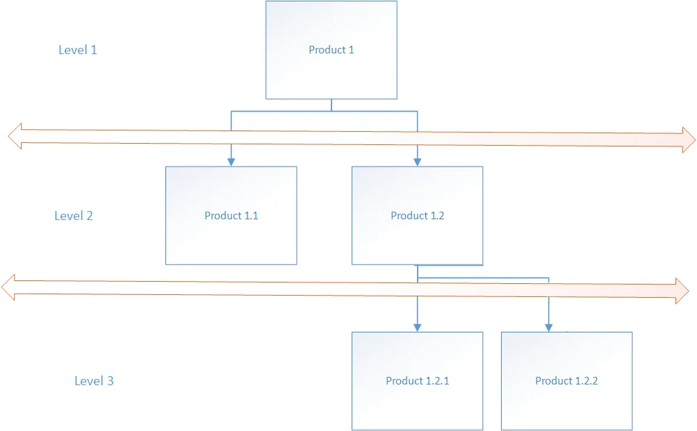

# Overview

In manufacturing, a Bill of Materials (BOM) can have a multi-level structure, meaning that an item within a BOM may have its own BOM. This hierarchical structure helps define how components and subassemblies come together to create a final product.

For example, in the diagram below:

- Product 1 is the final good.
- Its BOM consists of Product 1.1 and Product 1.2.
- Product 1.2 has its own BOM, which includes Item 1.2.1 and Item 1.2.2.

In ProcessForce, there are two ways of dealing with this situation:

1. **Semi-finished Items**:
  A semi-finished item is a component in the BOM that has its own Bill of Material and requires a separate Manufacturing Order (MO) before being used in the production of the final good. These items can also be produced independently and stored as inventory for future use.

2. **Phantom Item**:
  A phantom item exists within a BOM structure but is not manufactured or stored separately. Instead, its components and operations are directly incorporated into the Manufacturing Order of the final good, eliminating the need for a separate MO. Phantom items streamline the production process by simplifying BOM management.

---
