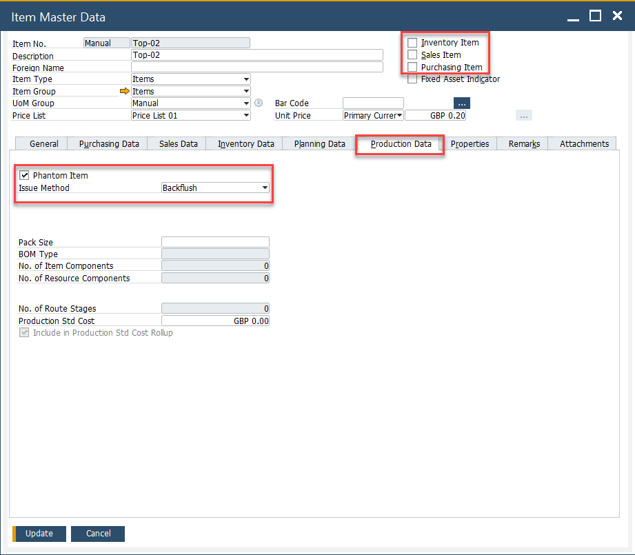
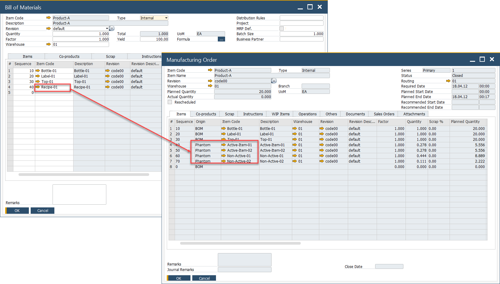
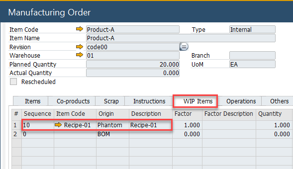
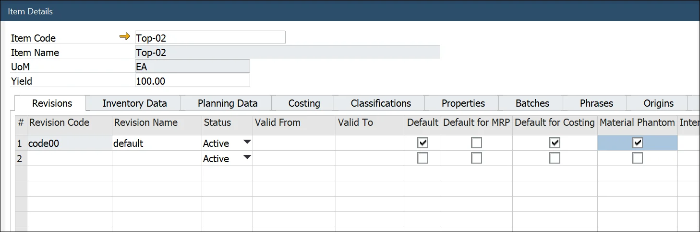

# Phantom Item

A Phantom Item is a Bill of Materials template that can be a part of another Bill of Materials. It is not an Inventory Item – any Warehouse never receives it. It serves only as a marking point in a master Bill of the Materials production process (Phantom Items do not create an inventory or financial transactions).

Phantom Item is an alternative to Semi-Finished products. You can use a Bill of Material Item on a master Bill of Materials, but in this case, a separate, linked Manufacturing Order is needed for each child BOM. Using Phantom on BOM does not create separate MOR: it explodes (adds its content) on Items Tab and Operations tab (adds operations defined in Phantom Production Process).

---

## Phantom Item

### Setting up

:::info Path
    Inventory → Item Master Data → Production Data tab
:::

To use a specific Item as Phantom, be sure to check the following settings:

- Phantom Item check box checked,
- Inventory, Sales, and Purchase Item fields un-checked,
- Issue Method set up to Backflush.

Also, note that a Phantom (as every Non-Inventory Item) cannot be managed by Batches or Serials (Item Master Data → General tab).

### Example

In a beverage production setup, consider Product-A, a finished beverage. Its Bill of Materials (BOM) consists of:

- Packaging materials – Bottle-01, Label-01, Top-01 (which can be purchased or stored in inventory).
- The drink itself – Recipe-01 (a separate BOM that defines the beverage formulation).

While the packaging materials can be stocked and retrieved from inventory, the drink (Recipe-01) is a Phantom Item. This means:

- It cannot be produced through a separate Manufacturing Order (MO).
- It does not exist in inventory or get stored in a warehouse.
- It is only created as part of the Product-A manufacturing process.

When a Manufacturing Order for Product-A is generated, the Recipe-01 automatically expands, adding its components and production steps directly into the MO.

In the screenshot above, the Phantom Item from the master Bill of Materials (BOM) has been expanded within the Manufacturing Order (MO). As a result, all components of Recipe-01 have been automatically added to the Items tab of the MO. This eliminates the need to create a separate Manufacturing Order for Recipe-01, as would be necessary for a Semi-finished Product. Additionally, any Operations defined for the Phantom in its Production Process are automatically included in the Operations tab.

To review which Phantom Items were used in a particular Manufacturing Order, you can check the WIP Items tab:

You can also add a Phantom manually to a Manufacturing Order. On adding a document after this, a communication form will pop up with information about Phantoms being present on a record and that it will be expanded automatically. It is required to confirm the communication before adding a document.

## Material Phantom

A Material Phantom is a hybrid between a standard inventory item and a phantom item. Unlike regular Phantom Items, which are never stocked, a Material Phantom can be an inventory item that is available for sale or purchase. It retains the flexibility of a Bill of Materials (BOM) component while also allowing for independent production and storage when needed. This approach enables manufacturers to avoid creating separate, linked Manufacturing Orders while still maintaining the option to produce and sell the item individually.

### Example

Consider a car manufacturing process where an engine is a critical component. Typically, the engine is assembled as part of the car production process, eliminating the need for a separate Engine Manufacturing Order. In this case, the engine is used as a Material Phantom in the car’s BOM, meaning it is not stored in inventory but is directly incorporated during production.

However, in some cases, the company may want to sell the engine separately as an independent product. When this occurs, a separate Manufacturing Order for the engine can be created.

### Setting up

Material Phantom option can be set up for specific revisions in Item Details. To do so, navigate to:

:::info
    Inventory → Item Details
:::

### Usage

When adding a Material Phantom Item to a Manufacturing Order, users can explode it via the context menu, breaking it down into its components.

If a Material Phantom Item has not been exploded, the system will prompt a message: "There are phantoms. All phantoms will expand automatically. Do you want to continue?" A Manufacturing Order cannot be finalized unless the Material Phantom Item is exploded.

:::tip
If an item needs to be used both as a regular inventory item (without a BOM) and as a Material Phantom (with an expandable BOM), two separate item revisions must be created:

    - One without the Material Phantom setting (acting as a standard inventory item).
    - One with the Material Phantom setting enabled (allowing BOM explosion on a master BOM).
:::

---

Click [here](https://www.youtube.com/playlist?list=PLtT6kgaz5YncGTk3VHFvmdRqY6O9DE3F5) to see related videos.
