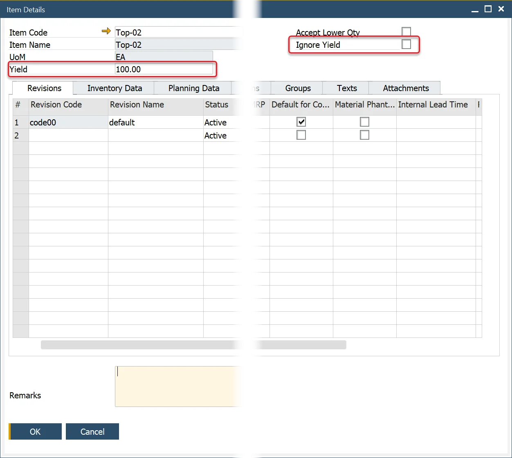
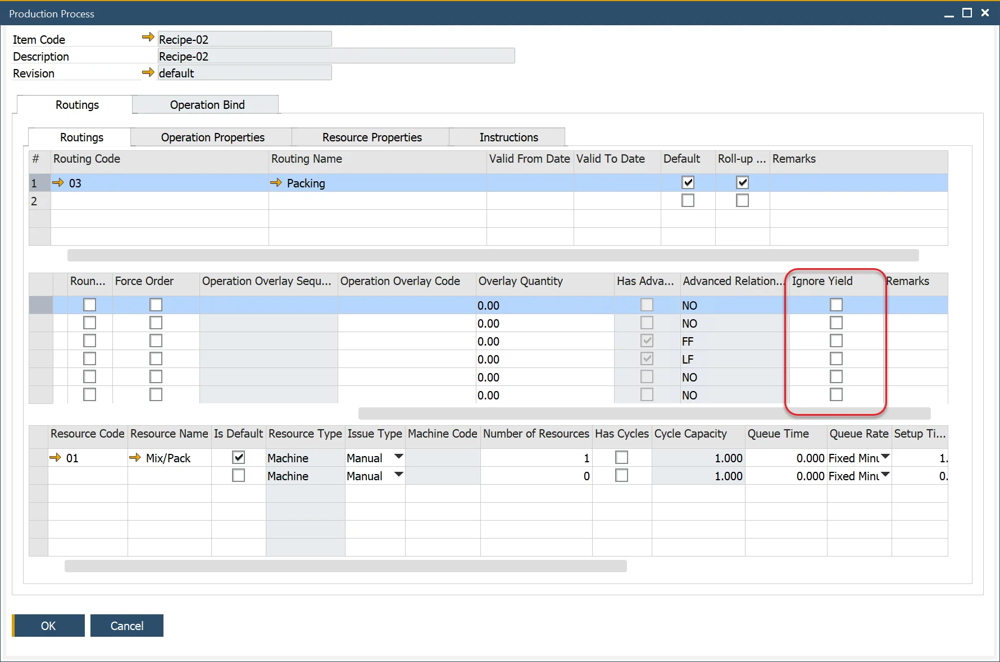
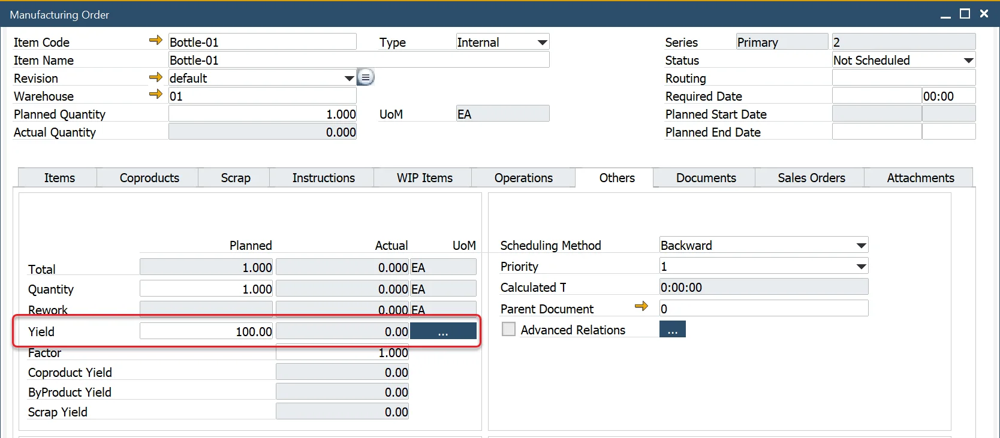
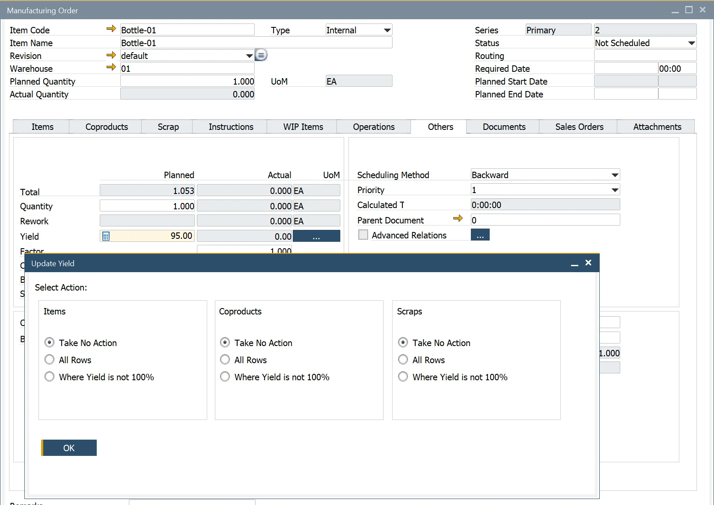

# Planned Yield Percentage

Planned Yield Percentage is a key concept in CompuTec ProcessForce that helps manufacturers account for material loss and production efficiency. By setting a planned yield, companies can:

- Increase the raw materials issued to compensate for expected material losses during production.
- Adjust production time to ensure the required output quantity is achieved.

This ensures better resource planning, accurate cost estimation, and optimized production processes.

---

## Item Details

Within the Item Details form, the Yield % field specifies the planned yield for the parent item in the Bill of Materials (BOM).

## Bill of Materials

The default planned yield is copied to the Bill of Material header and applied to each item added to the BOM.

- If using planned yield, it is recommended to modify the default Item, CoProduct, and Scrap formulas to factor in yield percentage.
- This results in increased material consumption to meet production requirements.
- If Scrap % is used, it will be added cumulatively to the total material quantity.

## Production Process

To prevent yield-based adjustments from affecting production time, select the Ignore Yield checkbox

:::note
    The additional time based on yield has not been implemented into costing.
:::

## Changing the Bill of Material Planned Yield

If the Yield % value is changed,  a window appears with the following options:

- **Take No Action**: change the header only
- **All Rows**: copy the value and updates all rows
- **Where Yield is not 100%**: copy the value and update all rows where yield % is not 100%.

## Manufacturing Order

When the Manufacturing Order is created, the Planned Quantity is increased by the planned Yield % to increase the number of items issued and the required resource time.

Select the Ignore Yield check box not to increase the operation/resource total time.

## Planned vs. Actual Yield

Based on the [Yield Formula](../production-process/yield-time-calculation.md), the Actual Yield is calculated when materials receipts and issues are created.

## Modifying Manufacturing Order Planned Yield

If the Yield% value is changed,  a window appears with these options:

- **Take No Action**: change the header only.
- **All Rows**: copy the value and updates all rows.
- **Where Yield is not 100%**: copy the value and update all rows where yield % is not 100%.

---
