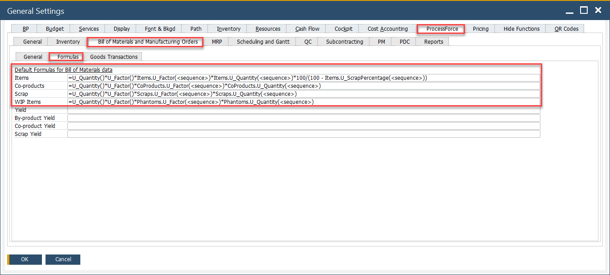
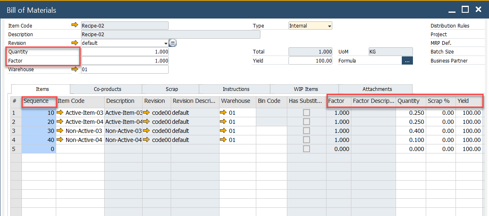
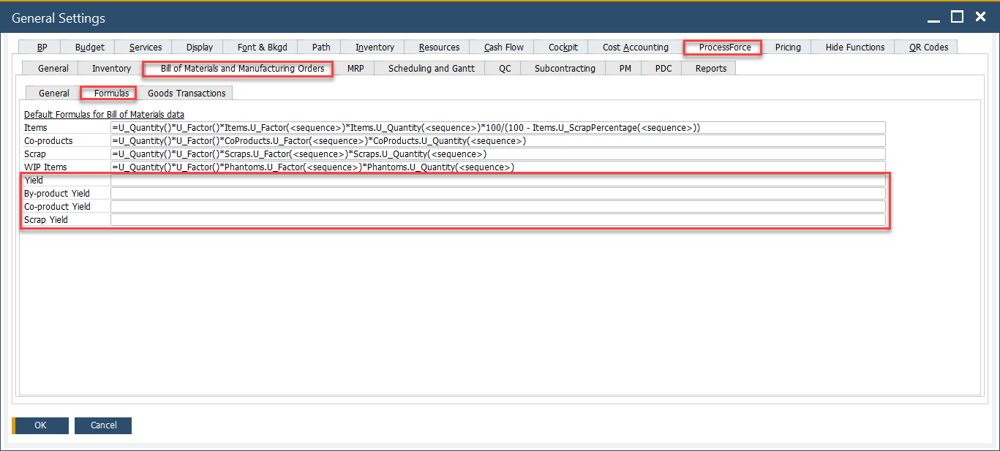
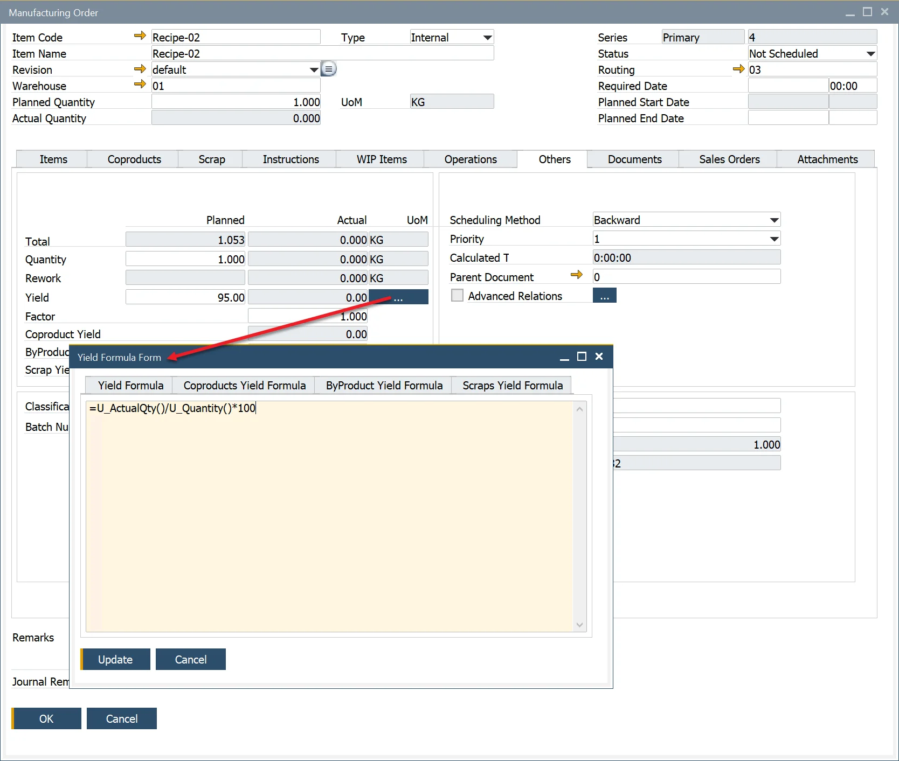

# Formula

Formulas are a powerful yet straightforward method for calculating quantity relationships between an item and its parent in manufacturing processes. They are primarily used within the Bill of Materials (BOM) and Manufacturing Order (MO) to ensure precise material usage and production efficiency.

To access
A default formula is pre-installed in the General Settings. To access default formula, navigate to:

:::info Path
:::info Path
Administration → System Initialization → General Settings → ProcessForce tab → Bill of Materials and Manufacturing Orders → Formulas
:::



Users can modify this default formula to align with specific operational needs. These formulas support calculations involving standard fields, user-defined fields, and values from other tabs, enhancing flexibility and accuracy in production planning.

Furthermore, all expressions that follow Microsoft Excel formula syntax can be used within these formulas, making them highly adaptable for various manufacturing requirements.

---

## Default formulas

These default formulas are automatically applied unless customized.

### Items

```sql
=U_Quantity()*U_Factor()*Items.U_Factor(<sequence>)*Items.U_Quantity(<sequence>)*100/(100 - Items.U_ScrapPercentage(<sequence>))
```

### Coproducts

```sql
=U_Quantity()*U_Factor()*CoProducts.U_Factor(<sequence>)*CoProducts.U_Quantity(<sequence>)
```

### Phantom

```sql
=U_Quantity()*U_Factor()*Phantoms.U_Factor(<sequence>)*Phantoms.U_Quantity(<sequence>)
```

---

## Formula Nomenclature

| Yield Type |                            Default Description                            |                                                                                    Default Formula                                                                                    |
| ---------- | ------------------------------------------------------------------------- | ------------------------------------------------------------------------------------------------------------------------------------------------------------------------------------- |
|   Yield    |     Item Parent Actual Quantity / Item Parent Planned Quantity \* 100     |                                                                           =U_ActualQty()/U_Quantity()\*100                                                                            |
| CoProduct  | Total CoProduct Actual Quantity / Total CoProduct Planned Quantity \* 100 |                                            =Coproducts.U_ActualQty.Sum()/if(Coproducts.U_Result.Sum()=0;1;Coproducts.U_Result.Sum())\*100                                             |
| ByProduct  | Total ByProduct Actual Quantity / Total ByProduct Planned Quantity \* 100 | =Scraps.U_ActualQty.Sum(equals(Scraps.U_Type();"Usefull"))/if(Scraps.U_Result.Sum(equals(Scraps.U_Type();"Usefull"))=0;1;Scraps.U_Result.Sum(equals(Scraps.U_Type();"Usefull")))\*100 |
|   Scrap    |     Total Scrap Actual Quantity / Total Scrap Planned Quantity \* 100     |                                                  =Scraps.U_ActualQty.Sum()/if(Scraps.U_Result.Sum()=0;1;Scraps.U_Result.Sum())\*100                                                   |

|                                                                               Scraps                                                                               |                                                                                 Phantoms                                                                                 |
| ------------------------------------------------------------------------------------------------------------------------------------------------------------------ | ------------------------------------------------------------------------------------------------------------------------------------------------------------------------ |
| Scraps.U_Factor() = Factor Value within Scraps Tab Scraps.U_Quantity() = Quantity Value within Scraps Tab Scraps.U_Results() = Results value within the Scraps Tab | Phantoms.U_Factor() = Factor Value within Phantoms Tab Phantoms.U_Quantity() = Factor Value within Phantoms Tab Phantoms.U_Results() = Results value within Phantoms Tab |

|                                          Other Variables                                          |
| ------------------------------------------------------------------------------------------------- |
| U_Factor() = Factor Value within form Header U_Quantity() = Quantity value within the form Header |



---

## Formula Functions

The following Excel-compatible functions can be used in formulas:

|        Syntax         |                                                                                                                                                          Description                                                                                                                                                           |    As in Excel     |
| --------------------- | ------------------------------------------------------------------------------------------------------------------------------------------------------------------------------------------------------------------------------------------------------------------------------------------------------------------------------ | ------------------ |
|        ABS(x)         |                                                                                                                                                Returns the absolute value of x.                                                                                                                                                | :heavy_check_mark: |
|        ACOS(x)        |                                                                                                                                            Returns the arc cosine of x in radians.                                                                                                                                             | :heavy_check_mark: |
|        ASIN(x)        |                                                                                                                                             Returns the arc sine of x in radians.                                                                                                                                              | :heavy_check_mark: |
|        ATAN(x)        |                                                                                                                                            Returns the arc tangent of x in radians.                                                                                                                                            | :heavy_check_mark: |
|      ATAN2(x;y)       |                                                                                                                                    Returns ATAN(y/x), taking signs of x and y into account.                                                                                                                                    | :heavy_check_mark: |
|   CEILING(x;signif)   |  Returns the nearest multiple of signif that is equal to or larger than x when signif is positive (that is, rounds towards plus infinity). It returns the nearest multiple of signif that is equal to or smaller than x when signif is negative (that is, rounds towards minus infinity). Returns NumError when signif is 0.0. <br/><details><summary>Using FLOOR for rounding down</summary><div>To achieve Round-Down, you can currently use the FLOOR(x;signif) function, where signif is multiple to use when rounding. Examples: </div></details> | Almost |
|        COS(x)         |                                                                                                                                          Returns the cosine of x, with x in radians.                                                                                                                                           | :heavy_check_mark: |
|        EXP(x)         |                                                                                                                                   Returns ex, that is, e = 2.71828... raised to the power x.                                                                                                                                   | :heavy_check_mark: |
|    FLOOR(x;signif)    | Returns the nearest multiple of signif that is equal to or smaller than x when signif is positive (that is, rounds towards minus infinity). It returns the nearest multiple of signif that is equal to or greater than x when signif is negative (that is, rounds towards plus infinity). Returns a NumError when signif is 0.0. |       Almost       |
|     IF(e1;e2;e3)      |                                                                                                     Evaluates e1; if e1 is true, evaluates e2 and returns the result; if e1 is false, evaluates e3 and returns the result.                                                                                                     | :heavy_check_mark: |
|         LN(x)         |                                                                                                                                   Returns the natural (base e = 2.71828...) logarithm of x.                                                                                                                                    | :heavy_check_mark: |
|        LOG(x)         |                                                                                                                                              Returns the base ten logarithm of x.                                                                                                                                              | :heavy_check_mark: |
|       LOG10(x)        |                                                                                                                                              Returns the base ten logarithm of x.                                                                                                                                              | :heavy_check_mark: |
|       MOD(x;y)        |                                                                                                             Returns the signed remainder of x by y, that is, x - FLOOR(x/y;1) \* y. Returns NumError if y is 0.0.                                                                                                              | :heavy_check_mark: |
|         PI()          |                                                                                                                       Returns π = 3.14159..., the ratio of the circumference to the diameter of a circle                                                                                                                       | :heavy_check_mark: |
|        RAND()         |                                                                                                                    Returns a pseudo-random number x from a uniform distribution such that 0 &lt;= x &lt; 1                                                                                                                     | :heavy_check_mark: |
|      ROUND(x;d)       |               Returns x rounded to d decimal digits. That is, rounds to the nearest integer when d is 0, to the nearest multiple of 0.1 when d is 1, to the nearest multiple of 10 when d is -1, and so on. In case of a tie, rounds away from zero. First, d is truncated (towards zero) to obtain an integer.                | :heavy_check_mark: |
|        SIN(x)         |                                                                                                                                           Returns the sine of x, with x in radians.                                                                                                                                            | :heavy_check_mark: |
|        SQRT(x)        |                                                                                                                                                 Returns the square root of x.                                                                                                                                                  | :heavy_check_mark: |
|        TAN(x)         |                                                                                                                                          Returns the tangent of x, with x in radians.                                                                                                                                          | :heavy_check_mark: |
| EQUALS(string;string) |                                                                                                                                               Returns true if strings are equal                                                                                                                                                | :heavy_check_mark: |

>💡 To round down, use FLOOR(x;signif) where signif is the rounding base.

---

## Using User-Defined Fields in Formulas

Formulas can include [User-Defined Fields (UDFs)](../../administrator-guide/udfs.md) from both the header and line levels.

:::note

- The formula result is a numeric value. Therefore any [User-Defined Fields](../../administrator-guide/udfs.md) used in the formula should be created with a Numeric data type.
- When a Bill of Materials is used to generate a Manufacturing Order, its structure is replicated in the order. To ensure UDFs function properly within formulas, identical UDFs must be created in both the Bill of Materials and the Manufacturing Order, maintaining consistency in headers and corresponding tables.

:::

---

## Yield Formulas

To calculate yield in BOMs and MOs, update your default formulas in General Settings as shown below.

### Updated Formulas

#### Items

  ```sql
  =U_Quantity()*U_Factor()*Items.U_Factor(<sequence>)*Items.U_Quantity(<sequence>)*100/(100 - Items.U_ScrapPercentage(<sequence>))*100/Items.U_Yield(<sequence>)
  ```

#### CoProducts

  ```sql
  =U_Quantity()*U_Factor()*CoProducts.U_Factor(<sequence>)*CoProducts.U_Quantity(<sequence>)*100/CoProducts.U_Yield(<sequence>)
  ```

#### Scrap

  ```sql
  =U_Quantity()*U_Factor()*Scraps.U_Factor(<sequence>)*Scraps.U_Quantity(<sequence>)*100/Scraps.U_Yield(<sequence>)
  ```

#### Phantoms

  ```sql
  =U_Quantity()*U_Factor()*Phantoms.U_Factor(<sequence>)*Phantoms.U_Quantity(<sequence>)
  ```

### Yield Output Fields in MOs

The following calculated fields are available in Manufacturing Orders:

- **Yield**: Represents the actual yield of the parent item.
- **CoProduct**: Represents the yield of coproducts (Coproduct Tab) generated during production.
- **ByProduct**: Represents the yield of byproducts (Scrap Tab) produced during production.
- **Scrap**: Represents the yield of scrap (Scrap Tab) generated during production.

  

Following standard formula behavior, the predefined formula is automatically copied to the Bills of Materials form. You can view it by clicking the yellow button.

If needed, the formula can be customized for a specific Bill of Materials.


Additionally, the formulas from the Yield Formula form are copied to the Manufacturing Order, where they can be modified as required.



---
