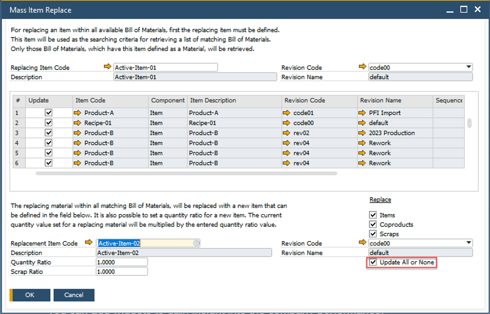

# Mass Item Replacement

The Mass Item Replacement feature streamlines the process of updating Bills of Materials (BOMs) by allowing users to efficiently search for, change, and replace one item with another across multiple Bill of Materials.

---

To access Mass Item Replacement, navigate to:

:::info Path
    Production → Bill of Materials → Mass Item Replacement
:::

**How It Works**:

This form allows the user to quickly search, change, and replace one Item with another.

- Navigate to Production → Bill of Materials → Mass Item Replacement.
- Select the Item to be replaced.
- Choose the Bill of Materials that needs updating.
- Check the update box and enter the replacement item.
- Optionally, adjust the quantity ratio and scrap ratio:
    The current quantity value for the replacement material is multiplied by the entered quantity ratio (default: 1.000).
- The scrap ratio field allows adjustments for material waste.

    

**Update All or None**: When this parameter is selected, the system rolls back all updates if an error occurs in any of the BOMs. If it is not selected, the system updates each BOM individually and commits the changes one by one.

:::info
    For extensive modifications to Bills of Materials, consider using the Bulk Change feature available in CompuTec AppEngine: [Bulk Change](/docs/appengine/plugins-user-guide/bulk-changes-on-bills-of-materials/overview).
:::

---
