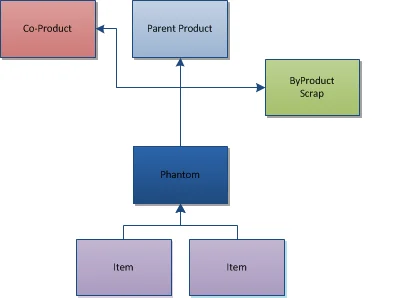

# Overview

The Bill of Materials (BOM) Form enables users to define the relationships between parent and child items within a manufacturing structure.

This functionality includes support for:

- Items,
- CoProducts,
- ByProducts,
- Scrap,
- Intermediates (currently called Phantoms),
- Phantoms (future release),
- Make vs. Buy,
- Manual vs. Backflushing,
- Factors, Yield values, and Scrap percentages,
- Quantities,
- UoM,
- Formulas.

    
