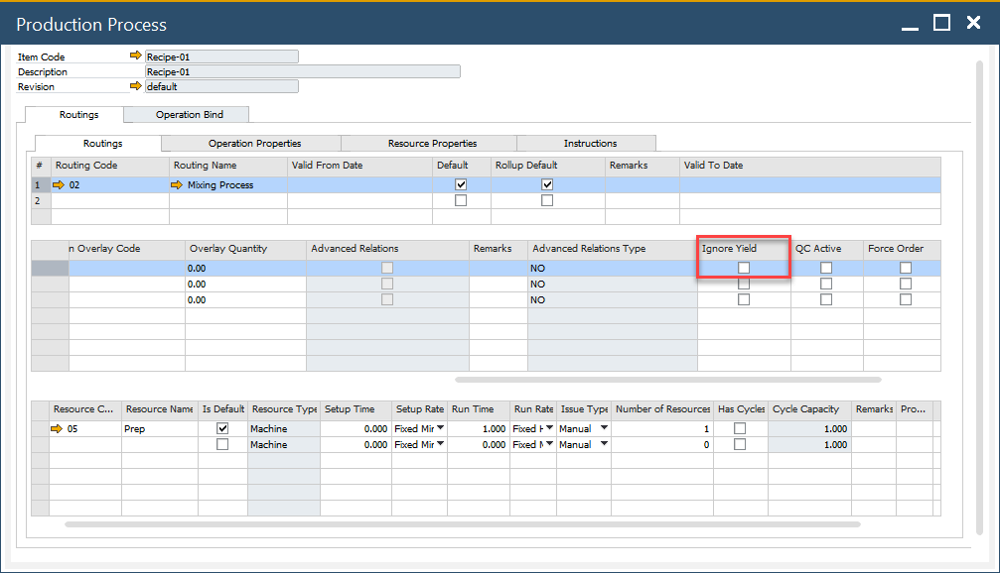
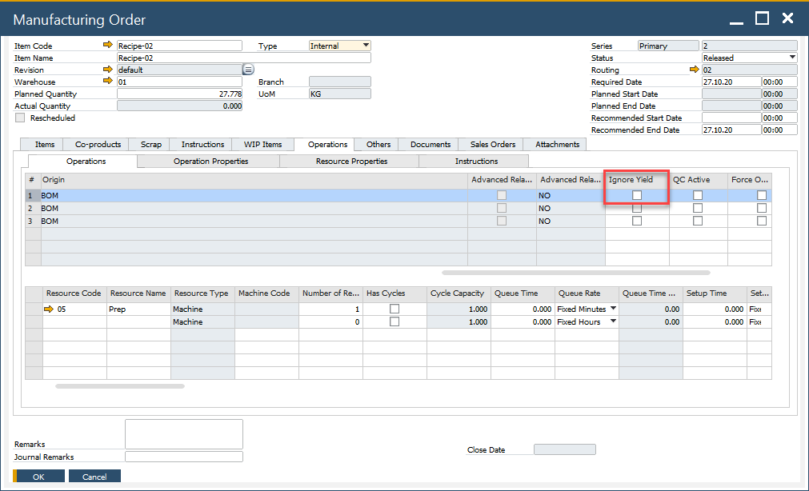

# Yield – Time calculation

In certain production processes, yield can impact production time.

- The yield value from the Bill of Materials (BOM) header is automatically factored into the planned resource quantity calculation.
- If the Ignore Yield checkbox is selected, ProcessForce will assume a default yield of 100%, ignoring the actual yield value.

Example Calculation:

If Yield = 80%, the system adjusts the planned resource quantity by 1.25 to meet the required output: (1/Yield% = 1/0.8 = 1.25). This ensures that additional resources are allocated to compensate for yield loss.

The default yield setting is copied to the manufacturing order.

---
