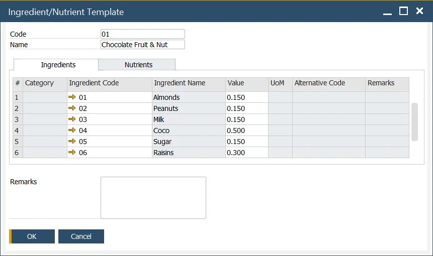
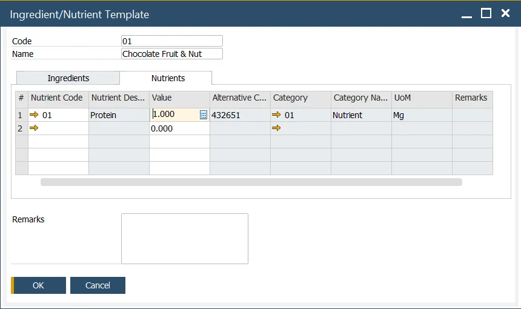

# Ingredient and Nutrient Template

The Ingredient and Nutrient Template form is designed to streamline the process of defining multiple ingredients and nutrients within a template. This feature enhances data entry efficiency, enabling users to quickly associate ingredients and nutrients with products.

---

:::info Path
    Inventory → Ingredients → Ingredient/Nutrient Template
:::

## Ingredient/Nutrient Template

This form allows users to define several ingredients/nutrients within a template to help with rapid data entry.

Ingredient/Nutrient Template can be used on the [Item Ingredient Master Data](./item-ingredient-master-data.md) form to simplify the management of ingredients and nutrients.

**Ingredients Tab**

Ingredients can be added by selecting the Ingredient Code. Only the value can be modified in this template. For further changes to ingredient attributes, users can navigate to the [Ingredient Master Data](./ingredient-master-data.md) form.

**Nutrients Tab**

Similarly, nutrients can be added by selecting the Nutrient Code, where only the value can be adjusted in this template. To modify other nutrient attributes, users can go to the [Nutrient Master Data](./nutrient-master-data.md) form.

---
By using the Ingredient and Nutrient Template, users can significantly reduce the time spent on data entry, ensuring consistency and accuracy in ingredient and nutrient management across products. This tool enhances workflow efficiency while maintaining precise data records.
