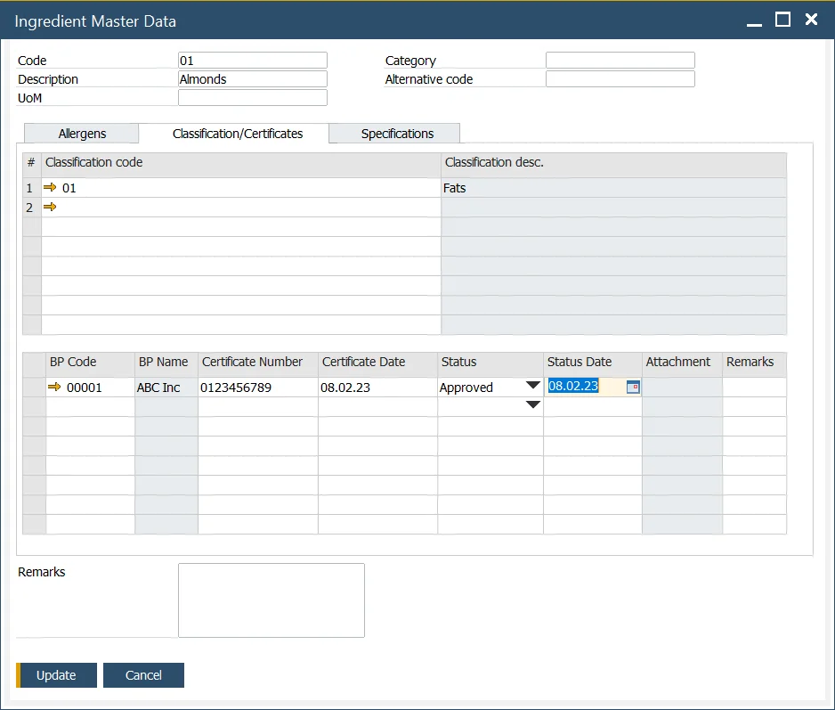
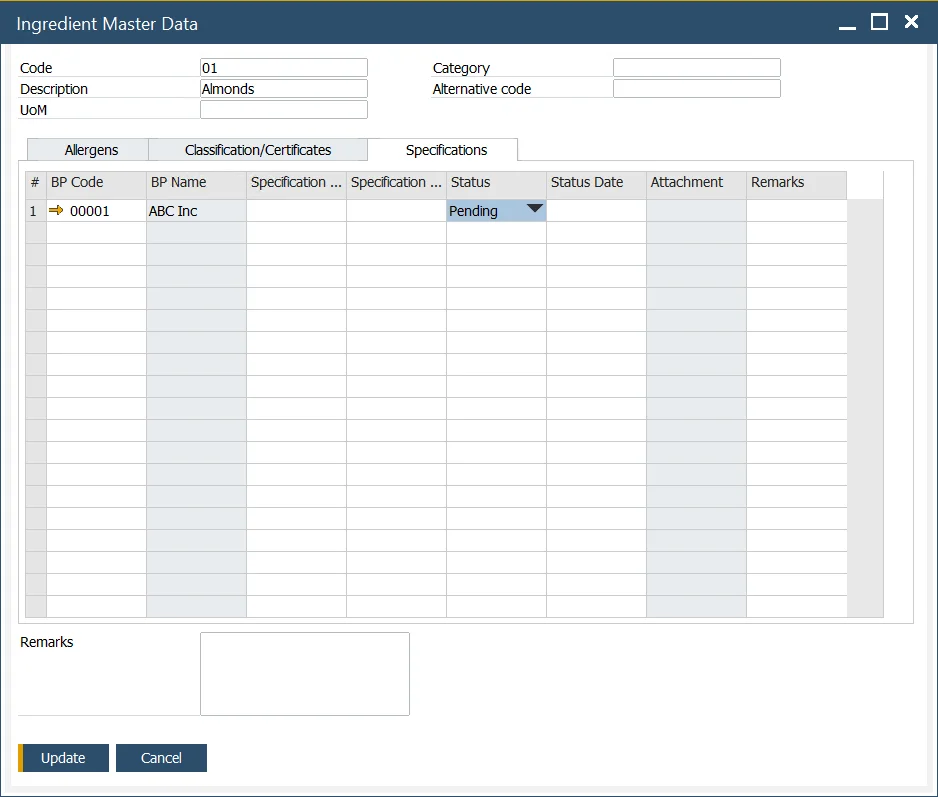

# Ingredient Master Data

In many cases, an ingredient also serves as an item within a product's Bill of Materials. For instance, in the production of fruit and nut chocolate bars, ingredients such as cocoa, milk, raisins, hazelnuts, and peanuts are treated as specific items. This approach provides users with the flexibility to define an item along with its detailed ingredient data.

The Ingredient Master Data form enables users to define and manage detailed ingredient information, which extends the product Master Data by including necessary details for declarations and ingredient listings required on product labels.

This form allows the user to define and modify information on ingredients used in products, their attributes, and related compliance details.

:::info Path
    Inventory → Ingredients → Ingredient Master Data
:::

---

## Form Header

The following details can be defined in the form header:

- **Code**: an alphanumeric code assigned to a specific ingredient.
- **Description**: a name or a short description of a specific ingredient.
- **UoM**: Unit of Measure, e.g., kilogram.
- **Category**: category of the ingredient. For more information, click [here](../ingredient-declarations/ingredient-settings/classifications.md).
- **Alternative code**: standard, scientific codes governed by law, e.,g. E number - codes assigned to substances that can be used as additives to food products within the European Union and Switzerland.

## Tabs

### Allergens

This tab allows users to add predefined allergens contained in a specific ingredient. The allergen code and description are displayed here. For more information on defining allergens, click [here](../ingredient-declarations/ingredient-settings/allergen.md).

### Classification/Certificates

In this tab, users can add predefined classifications and specify details of certificates that confirm compliance with those classifications. For more details on refining classifications, click [here](../ingredient-declarations/ingredient-settings/classifications.md).

### Specifications

This tab provides functionality for creating and modifying vendor or industry specifications for an ingredient. The following details can be specified:

- **BP Code**: a code assigned to the specific business partner
- **BP Name**: name of the business partner.
- **Specification Number**: a number assigned to a specific specification.
- **Specification Date**: date of the specification.
- **Status**: one of the three options may be set for a specification: Not Approved, Pending, or Approved.
- **Status Date**: the date when the status was last updated.
- **Attachment**: attach relevant documents.
- **Remarks**: additional notes or comments.

---
The Ingredient Master Data form plays a critical role in managing detailed information about ingredients, ensuring compliance with industry standards and regulatory requirements. By utilizing this tool, businesses can streamline the management of ingredient-related data, enhance traceability, and maintain high standards of quality and transparency for their products.
