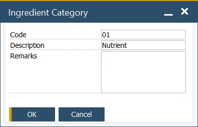

# Ingredients Category

The Ingredients Category form allows users to define categories for grouping similar ingredients or nutrients, such as sugars and oils. This categorization helps in organizing ingredients more efficiently and allows users to add remarks specific to each group for additional clarity or context.

This data is used within [Ingredient Master Data](../ingredient-master-data.md), [Nutrient Master Data](../nutrient-master-data.md), and [Item Ingredient Master Data](../ingredient-and-nutrient-template.md), facilitating consistent and organized ingredient management.

:::info Path
    Administration → Setup → Ingredients → Ingredient Categories
:::

---
The Ingredients Category form is a valuable tool for systematically managing ingredients and nutrients, streamlining their organization and documentation. By categorizing ingredients, businesses can improve efficiency in data management, enhance product labeling accuracy, and ensure better compliance with industry standards.
