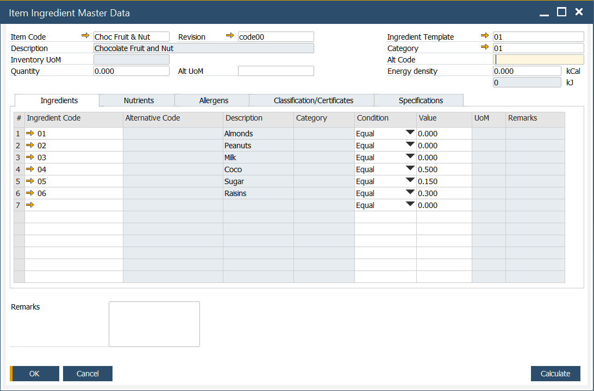

# Item Ingredient Master Data

The Item Ingredient Master Data form enables users to define the ingredient and nutrient details for a specific item. This form is crucial for managing product compositions, ensuring compliance with labeling requirements, and tracking ingredients and nutrients within products.

---

:::info Path
        Inventory → Ingredients → Item Ingredient Master Data
:::

## Form Header

In the form Header, the following information can be defined:

- **Item Code**: an alphanumeric code assigned to a specific item.
- **Description**: a description of an item.
- **Inventory UoM**: Unit of Measure, e.g., kilogram
- **Alt UoM**: an alternative Unit of Measure
- **Quantity**: quantity of the item.
- **Ingredient Template**: a predefined list of ingredients. To get more information, click [here](ingredient-and-nutrient-template.md)
- **Category**: category of the ingredient. To get more information, click [here](./ingredient-settings/ingredients-category.md)
- **Alt Code**: an alternative code that can be used as standard, scientific codes governed by law, e.,g. E number - codes assigned to substances that can be used as additives to food products within the European Union and Switzerland
- **Energy density**: measured in kCal (kilocalories) - a fixed value is automatically recalculated into kJ (kilojoules) units.

## Tabs

### Ingredients

In this tab, predefined ingredients can be chosen. To get more information on defining ingredient details, click [here](../ingredient-declarations/ingredient-master-data.md).

### Nutrients

In this tab, predefined nutrients can be defined. To get more information on defining nutrients, click [here](../ingredient-declarations/nutrient-master-data.md).

Daily Intake template can be added by choosing a desired Daily Intake Code. To get more information on defining Recommended Daily Intake, click [here](../ingredient-declarations/recommended-daily-intake.md).

### Allergens

In this tab, you can set a list of allergens assigned to a specific item. To get more information on defining allergens, click [here](../ingredient-declarations/ingredient-settings/allergen.md).

If cross-contamination is possible for a specific allergen, it can be checked in a Cross Contamination column.

### Classification/Certificates

In this tab, information on related certificates can be set. Certificates can be assigned to a specific classification. The certificate is a document confirming compliance with specific requirements for products of a company that holds the document. The following information can be set for a specific certificate:

- **BP Code**: Business Partner Code.
- **BP Name**: Name of the Business Partner.
- **Certificate Number**: the ID number of the certificate.
- **Certificate Date**: the date the certificate was issued.
- **Status**: one of three options may be set for a specification: Not Approved, Pending, or Approved.
- **Status Date**: date when the status was updated.
- **Attachment**: a file attached to a specific certificate, e.g., scanned document.
- **Remarks**: additional notes or comments.

### Specifications

This feature allows you to create and modify vendor or industry specifications for an ingredient. The following details can be defined:

- **BP Code**: a code assigned to the specific business partner.
- **BP Name**: name of the business partner.
- **Specification Number**: a unique number assigned to a specific specification.
- **Specification Date**: date of the specification
- **Status**: one of the three options may be set for a specification: Not Approved, Pending, or Approved.
- **Status Date**:  a date when the specification status was last updated.
- **Attachment**: attach relevant documents.
- **Remarks**: additional notes related to the specification.

---
The Item Ingredient Master Data form provides a comprehensive tool for managing and defining ingredient and nutrient details for each item. It helps maintain accurate records of ingredients, allergens, certifications, and specifications, which are vital for regulatory compliance, product management, and ensuring high product quality standards. By efficiently utilizing this form, businesses can streamline data management and improve their product tracking processes.
