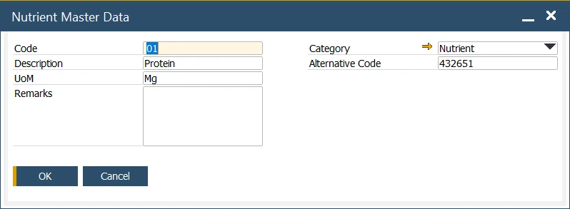

# Nutrient Master Data

The Nutrient Master Data form is used to define the specific details of individual nutrients that are part of a product's composition. These data describe the quantity of a particular nutrient present in a product and are crucial for processes like Ingredient Declaration.

---

:::info Path
    Inventory → Ingredients → Nutrient Master Data
:::

This form allows you to define specific nutrient master data, detailing the quantity of a particular nutrient in a given product. These nutrient details can be utilized in the Ingredient Declaration process.

Nutrient Master Data specified here can be used on the [Item Ingredient Master Data](./item-ingredient-master-data.md) form for consistent and accurate tracking.

The following data can be specified:

- **Code**: an alphanumeric code assigned to a specific nutrient.
- **Description**: a name or a short description of a specific nutrient.
- **UoM**: the unit used to measure the nutrient, e.g., mg.
- **Remarks**: individually assigned data containing significant information about a nutrient.
- **Category**: the category of ingredients the nutrient falls under. For more information, click [here](../ingredient-declarations/ingredient-settings/ingredients-category.md).

---
By effectively utilizing the Nutrient Master Data form, you can maintain accurate and comprehensive nutrient records, ensuring that product labeling and ingredient declarations are precise and meet regulatory standards.
