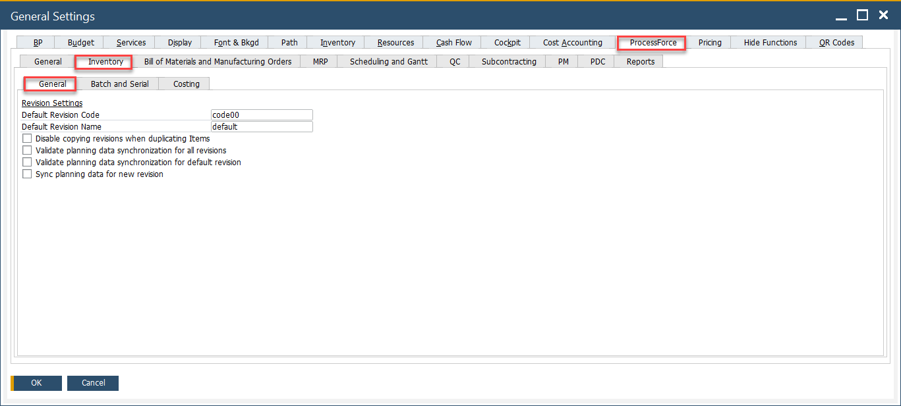

# Batch Control General Settings

Batch control settings define various batch-related functions, such as default batch statuses for different document types and batch templates. These settings provide flexibility and control over batch management and can be configured at three levels, depending on the scope of influence a user wants to apply:

- **General Settings**: applies system-wide to all new batches.
- **Item Group Settings**: applies to specific item groups unless overridden.
- **Item Details Settings**: applies to individual items when customized.

Click [here](/docs/processforce/user-guide/system-initialization/general-settings/inventory-tab/) to check detailed information about Batch configuration (based on the example of General Settings).

---

## General Settings

These settings apply globally to all newly created batches. Click [here](/docs/processforce/user-guide/system-initialization/general-settings/inventory-tab/) to find out more about these settings.

:::info Path
    Administration → System Initialization → General Settings → ProcessForce tab → Inventory tab
:::

## Item Groups Settings

If the Inherit from General Settings checkbox is unchecked, the settings defined at this level will apply only to the specific item group. This allows for more granular control over batch management within different product categories.

:::info Path
    Administration → Setup → Inventory → Item Groups
:::

## Item Details Settings

If the Inherit from Item Group checkbox is unchecked, the batch settings will apply only to the individual item. This level provides the highest level of customization, allowing specific batch control rules for selected products.

:::info Path
    Inventory → Item Details → Batches tab
:::

---
