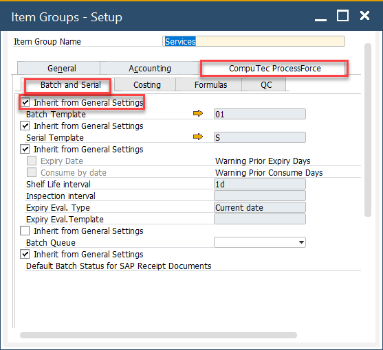

# Batch Control General Settings

Batch control settings define how batches are managed within the system, including default batch statuses for various document types and batch templates. These settings offer flexibility and can be configured at three levels, depending on how broadly or specifically you want to apply them:

- **General Settings**: Applies system-wide to all new batches.
- **Item Group Settings**: Applies to specific item groups unless overridden.
- **Item Details Settings**: Applies to individual items when customized.

➡️ Learn more about [Batch configuration](/docs/processforce/user-guide/system-initialization/general-settings/inventory-tab/) based on the example of General Settings.

---

## General Settings

These settings apply globally to all newly created batches.

➡️ Learn more about [General Settings](/docs/processforce/user-guide/system-initialization/general-settings/inventory-tab/).

To access Inventory tab, navigate to:

:::info Path
    Administration → System Initialization → General Settings → ProcessForce tab → Inventory tab
:::

## Item Groups Settings

When the **Inherit from General Settings** checkbox is unchecked, the system allows you to define batch control settings specific to that item group. This provides more granular control over batch behavior by product category.

To access Item Groups, navigate to:

:::info Path
    Administration → Setup → Inventory → Item Groups → ProcessForce tab → Batch and Serial
:::

## Item Details Settings

Unchecking the **Inherit from Item Group** checkbox enables you to configure batch settings at the individual item level. This is the most detailed level of customization, ideal for products with unique batch control requirements.

To access Batches tab, navigate to:

:::info Path
    Inventory → Item Details → Batches tab
:::

---
