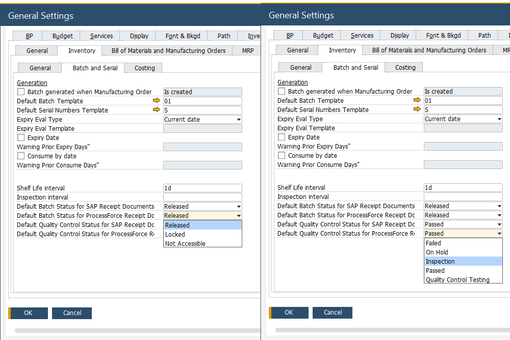
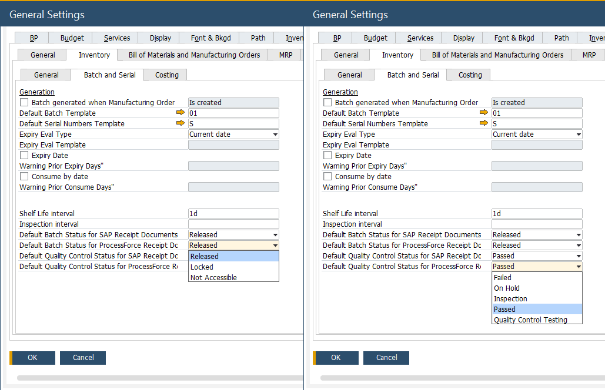
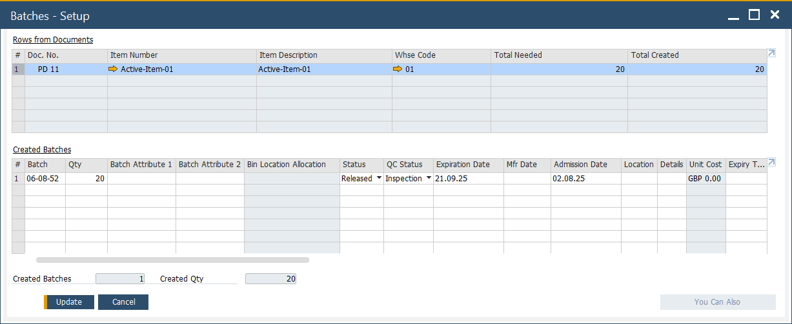
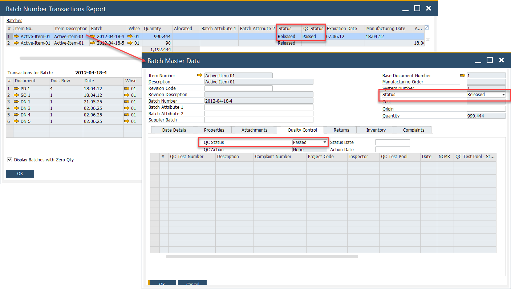

# Configuration Batch and Quality Control Status

Managing Batch and Quality Control status is crucial in SAP to ensure accurate tracking and compliance across various receipt documents. The configuration allows businesses to define default Batch and Quality Control (QC) statuses during the receipt process, improving efficiency and consistency. While batch statuses impact inventory and operations, QC statuses provide additional insights for informational purposes.

---

## What are Batch and QC Statuses?

- **Batch Status**: Indicates the usability or processing status of an inventory batch. It directly impacts inventory availability and operational workflows.
- **Quality Control (QC) Status**: Represents the quality condition of the batch. It does not affect inventory processing but serves as an informational flag for reporting and analysis.

**Purpose of Configuration**

This configuration enables setting default batch and QC statuses when batches are automatically generated during receipt processes. It ensures consistency in batch management and facilitates better quality tracking from the moment items are received.

---

## How-To

**Configure Default Batch & QC Statuses**: You can define default statuses that will automatically apply to system-generated batches in receipt documents.

1. **Navigate to General Settings**:

    :::info Path
    Administration → System Initialization → General Settings → Inventory → Batch & Serial No.
    :::

2. **Set Defaults**:

    - Choose the default Batch Status for new system-generated batches.
    - Choose the default Quality Control Status for informational tracking.

    

3. **Save your settings**.

>**Note**: ⚠️ These defaults apply only to system-generated batches. Manually created batches will not inherit these settings.

## SAP Receipt Documents

The batch and QC status settings affect the following document types:

- Goods Receipt PO
- Goods Receipt
- Inventory Counting
- A/R Invoice
- A/R Credit Memo
- Reverse Invoice

The following receipt documents are supported:

- Pick Receipt

These follow the same configuration rules as SAP receipt documents.

---

## Viewing Batch and QC Statuses

Once batches are generated during document processing, their statuses can be monitored:

1. Batch Number Transaction Report

    - Displays both Batch and QC statuses in the report output.
    - Use the yellow arrow to navigate directly to Batch Master Data.

    

2. Batch Master Data Form

    - The Batch Status is displayed in the header.
    - The Quality Control Status appears under the new Quality Control tab.

    

---
