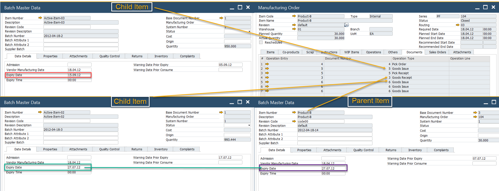

# Extended Batch Expiry Evaluation

The Extended Batch Expiry Evaluation feature in CompuTec ProcessForce ensures that batches are consumed or sold before their expiration, thereby maintaining product quality and complying with industry standards. This feature allows companies to:

- Configure batch expiry logic based on manufacturing or receipt dates.
- Use evaluation templates for dynamic, formula-driven expiry date determination.
- Define alerts and intervals for inspections and usage timelines.

It plays a vital role in regulated industries such as food, pharma, and chemicals where shelf life and traceability are critical.

---

## Settings

:::info Path
    Administration → System Initialization → General Settings → ProcessForce tab → Inventory tab
:::

The Expiry Evaluation Type determines how expiry dates are calculated. Options include:

- **Manufacturing Order related date**: Uses the Start Date of the Manufacturing Order.
- **Expiry Evaluation Template**: Uses a predefined template (for Goods Receipt PO, the current date is considered).

**Other key settings include**:

| Setting | Description |
| --- | --- |
| **Expiry Date** and **Consume Date** | Defines the final date for safe item usage, with slight differences in meaning depending on customer preferences. |
| **Warning Prior Expiry Days** and **Warning Prior Consume Days** | Allow alerts to be set up before a batch expires, ensuring timely usage (commonly used by companies to plan using the oldest Batches first). |
| **Shelf Life Interval** | Shelf life is the period during which food keeps its desirable or acceptable characteristics under specified handling and storage conditions. Automatically calculates expiry/consume dates using the formula: (Selected Expiry Eval Type Date) + (Shelf Life Interval) = Expiry/Consume Date |
| **Inspection Interval** | Defines how frequently an item should be inspected post-production, triggering alerts when due. e.g., every ten days after batch record. |

## Levels of Assignment

Expiry Evaluation Type, like other Batch settings, can cover three different levels:

- all Batches,
- specific Item Group Batches,
- specific Item Batches.

➡️ Refer to [Batch Control General Settings](./batch-control-general-settings.md) to check how to assign the Expiry Evaluation method to the specific level.

## Creation of Expiry Evaluation Template

:::info Path
    Administration → Setup → Inventory → Expiry Date Evaluation Template
:::

:::caution
This template only applies to items with the Manual Issue type. Batches must be issued to production for the template to function.
:::

If Expiry Eval Template is selected as the Expiry Eval Type, the corresponding template field becomes active, allowing users to choose a predefined evaluation method. This feature enables users to define advanced expiry date calculations using predefined formula elements or manual entry. The Validate Formula option allows users to test the formula on a specific document before applying it.

### Example

The following SQL formula ensures that the expiry date of a Finished Item matches the earliest expiry date of any associated Child Item Batch. This is useful when multiple child items have varying expiry dates.

#### MS SQL

    ```sql
    select
     isnull(min(t4.ExpDate ),getdate())
    from
     [@CT_PF_OMOR] t0
     left outer join [@CT_PF_MOR5] t1 on t0."DocEntry"=t1."DocEntry"
     left outer join oitl t2 on t1.U_OperEntry =t2.DocEntry and t1.U_OperType=t2.DocType
     left outer join itl1 t3 on t2.LogEntry=t3.LogEntry
     left outer join obtn t4 on t3.ItemCode=t4.ItemCode and t3.SysNumber=t4.SysNumber
    where
     t0.DocNum = %MORDN% and t4.ExpDate is not null, and t1.U_OperType='60'
    ```

#### HANA

    ```sql
    SELECT IFNULL(MIN(T4."ExpDate"), NOW())
     FROM "@CT_PF_OMOR" T0
     LEFT JOIN "@CT_PF_MOR5" T1 on T0."DocEntry" = T1."DocEntry"
     LEFT JOIN OITL T2 ON T1."U_OperEntry" = T2."DocEntry" AND T1."U_OperType" = T2."DocType"
     LEFT JOIN ITL1 T3 ON T2."LogEntry" = T3."LogEntry"
     LEFT JOIN OBTN T4 ON T3."ItemCode" = T4."ItemCode" AND T3."SysNumber" = T4."SysNumber"
     WHERE cast (T0."DocNum" as nvarchar(11)) = %MORDN%
     AND T4."ExpDate" IS NOT NULL
     AND T1."U_OperType" = '60'
    ```

An example result of this formula is shown below:



---
