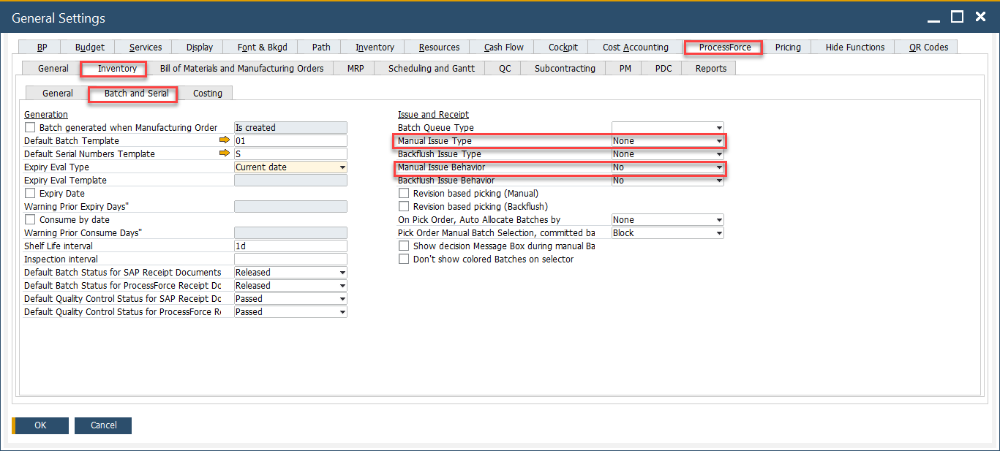
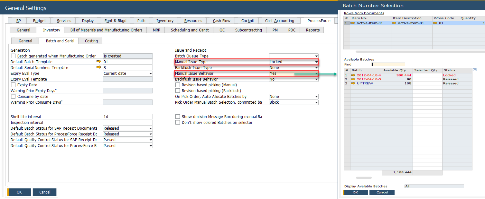
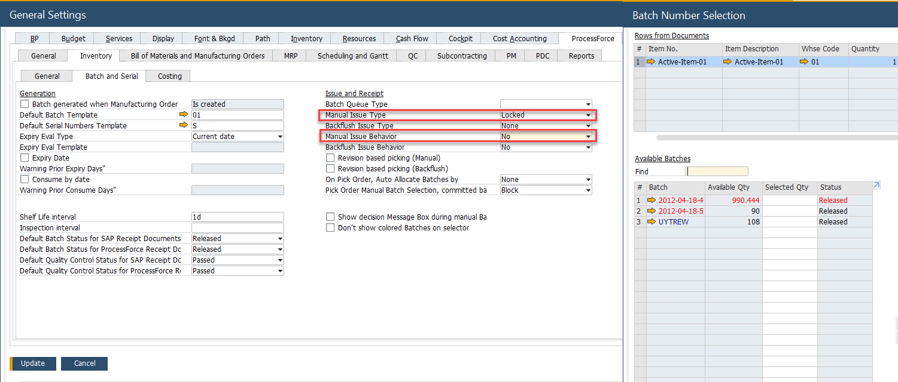
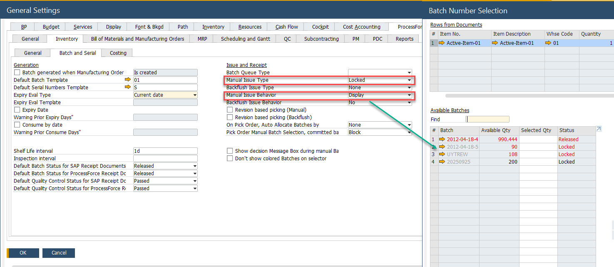
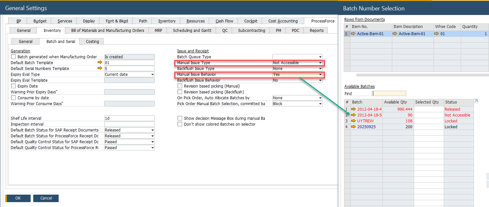
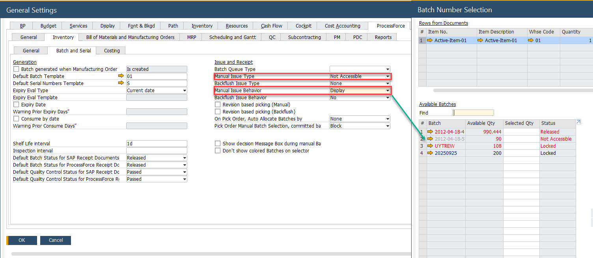
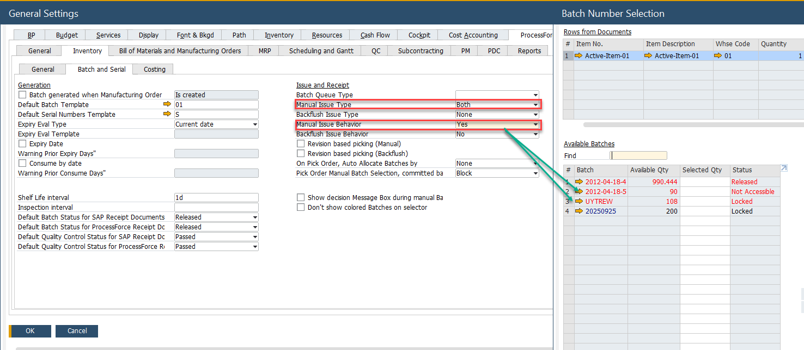
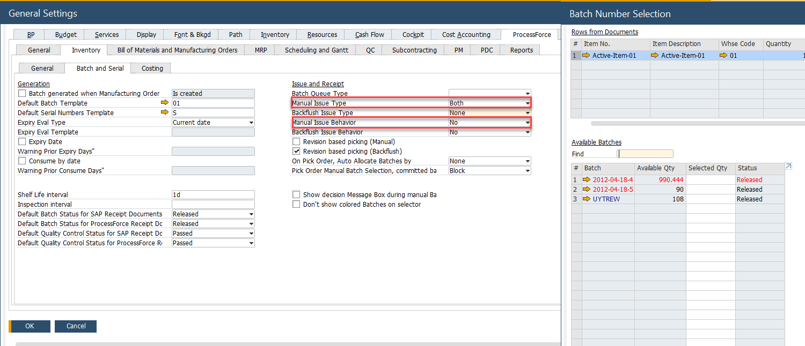
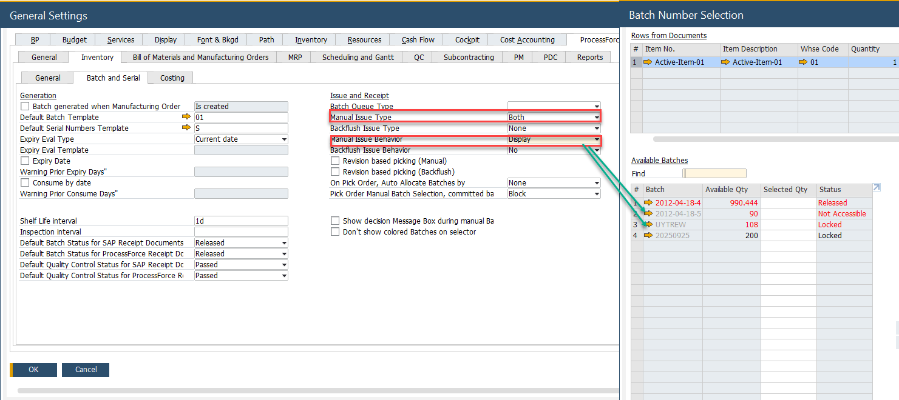

# Manual and Backflush Issue Type Configuration

Configuring issue types correctly in inventory management ensures smooth handling of materials in production and warehouse operations. This guide explains the behavior of different issue types - Manual and Backflush - and how they influence batch selection and processing. Understanding these settings helps streamline operations and maintain accurate inventory tracking.

---

## Manual Issue Method

The table below illustrates the interaction between Issue Type and Issue Behavior:

- **Locked**: Restricts access strictly based on rules.
- **Non-Accessible**: Hides or blocks issue even when visible.
- **Both**: Combines restrictions for stronger control.
- **Yes**: The batch is listed within the Batch Number Selection form.
- **No**: The batch is not listed within the Batch Number Selection form.
- **Display**: The batch is visible but cannot be issued within the Batch Number Selection form.

|   Issue Type   | Issue Behavior |   Issue Behavior   | Issue Behavior |    Issue Behavior    |     Issue Type     |     Issue Type     |
| :------------: | :------------: | :----------------: | :------------: | :------------------: | :----------------: | :----------------: |
|                |                |                    |                |                      |   Not Accessible   |       Locked       |
|                |                |        Yes         |       No       |       Display        |                    |                    |
|     Locked     |      Yes       | :heavy_check_mark: |                |                      | :heavy_check_mark: |                    |
|                |       No       |                    |      :x:       |                      | :heavy_check_mark: |                    |
|                |    Display     |                    |                | :information_source: | :heavy_check_mark: |                    |
| Non Accessible |      Yes       | :heavy_check_mark: |                |                      |                    | :heavy_check_mark: |
|                |       No       |                    |      :x:       |                      |                    | :heavy_check_mark: |
|                |    Display     |                    |                | :information_source: |                    | :heavy_check_mark: |
|      Both      |      Yes       | :heavy_check_mark: |                |                      |                    |                    |
|                |       No       |                    |      :x:       |                      |                    |                    |
|                |    Display     |                    |                | :information_source: |                    |                    |

### Locked – Yes

### Locked – No

### Locked – Display

### Non-Accessible – Yes

### Non-Accessible – No

### Non-Accessible Display

### Both - Yes

### Both - No

### Both - Display

## Backflush Issue Method

The same principles that apply to manual issue types also apply to batch back-flushing.

- **Yes**: The batch is included in backflush.
- **No**: The batch is excluded from backflush.
- **Display**: The batch is shown but cannot be consumed.

---
