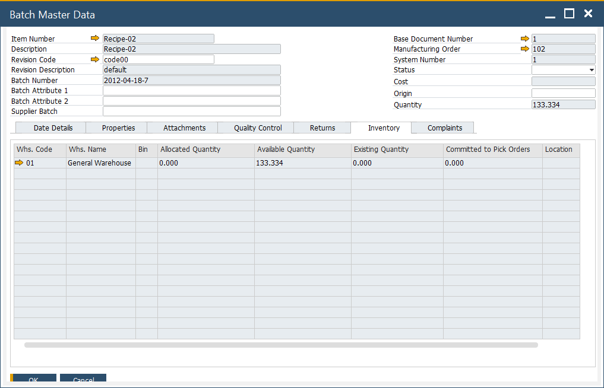

# Batch Inventory tab

The **Batch Inventory** tab provides a warehouse-wise overview of where a batch is stored and how its quantities are distributed. It enables better visibility into stock levels for each batch across all storage locations.

---

## How-to: View Batch Quantities by Warehouse

1. Open the **Batch Master Data** form.
2. Navigate to the **Batch Inventory** tab.
3. Review the batch’s inventory distribution across warehouses.

You can check Allocated, Available and Existing quantities in each location where the Batch is stored.

- **Existing Quantity**: Sum of all quantities of an Item across all warehouses.
- **Allocated Quantity**: Sum of all quantities of an Item that has already been used in sales and inventory documents.
- **Available Quantity**: Sum of all quantities that is available to be used. Existing Quantity - Allocated Quantity = Available Quantity.

---
