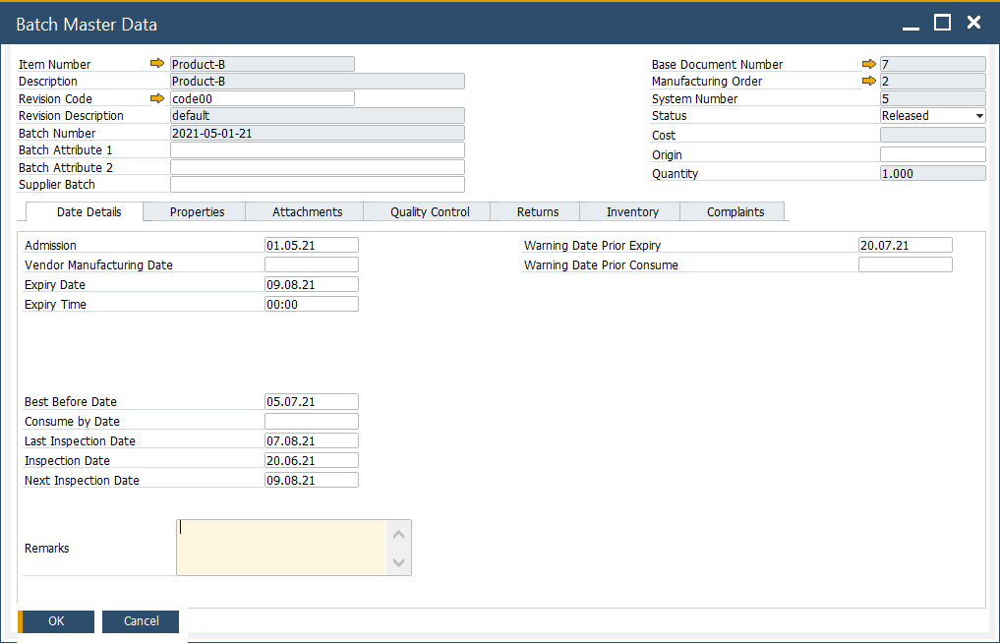

# Date Details tab

In SAP Business One integrated with ProcessForce, the Date Details tab within the Batch Master Data form allows users to manage critical batch-related dates, ensuring effective tracking and quality control throughout the product lifecycle.

---

## Key Settings

On this tab, you can set details about Batch dates, e.g., date of admission, expiry, consumption, and inspection dates.

- **Admission**: The date when the batch enters the warehouse. For manufactured items, this is the production date, while for purchased items, it corresponds to the Goods Receipt PO date.
- **Vendor Manufacturing Date**: The production date provided by the vendor for purchased items.
- **Expiry Date**: The last valid date the product is considered safe or effective to use.
- **Expiry Time**: Specific time of day when the batch expires.
- **Best Before Date**: Indicates the date until which the product retains its optimal quality
- **Consume by Date**: The recommended last date to use or consume the product for safety.

    ➡️ Learn more about their calculation [here](../batch-control-settings/extended-batch-expiry-evaluation.md).
- **Last Inspection Date**: The most recent date on which this batch underwent a quality or compliance inspection. Helps track periodic inspection records.
- **Inspection Date**: A general record of any previous inspection date.
- **Next Inspection Date**: The upcoming scheduled inspection date for the batch.
- **Warning Date Prior Expiry**: A system-defined alert date that falls before the expiry date. It helps the team take action (like use, sell, or recheck the batch) before it actually expires.
- **Warning Date Prior Consume**: A system-defined alert date that falls before the “Consume by” date. Useful for planning usage or disposal. (Not defined in this batch.)
- **Remarks**: Free-text field where users can add notes, instructions, or findings related to the batch.
these dates help maintain batch validity and quality control. 

---
