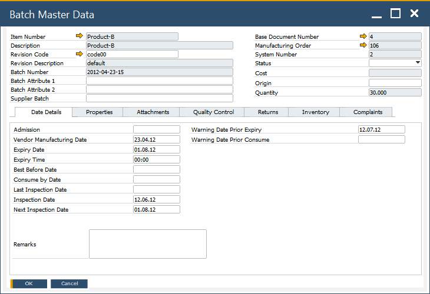

# Overview

In SAP Business One integrated with CompuTec ProcessForce, batch information is managed through a unified **Batch Master Data** form. This consolidated interface brings together the standard SAP Business One Batch Details and the CompuTec ProcessForce Batch Master Data, allowing users to access all batch-related information directly from SAP and CompuTec ProcessForce documents, transactions, and reports.

This unified design improves navigation, reduces duplication and ensures that all batch details including dates, quality control, returns, complaints and attachments - are maintained in a single location.

:::note
If you add User-Defined Fields (UDFs) to the SAP Business One Batch Details table, you must create the same UDFs using identical names, data types and lengths - in the corresponding CompuTec ProcessForce batch tables. This ensures consistent data flow and prevents synchronization issues.
:::

---

To access the Batch Master Data form, navigate to:

:::info Path
    Item Management → Batches → Batch Master Data
:::

## Key Features

The Batch Master Data window is divided into several tabs, each designed to present a specific aspect of batch information:

 

- [Date Details](date-details-tab.md): Manages key batch-related dates such as admission, expiry, shelf life, quarantine and inspection dates.
- [Properties](/docs/processforce/user-guide/inventory/batch-control/batch-master-data/properties-tab/): Displays item-specific properties defined in the SAP Item Master. These properties help categorize or classify batches.
- Attachments: Allows users to upload, view, or remove documents related to the batch.
  Common attachments include certificates, analysis documents, and regulatory records.
  You can also associate Business Partners and record certificate numbers and validity dates.
- [Quality Control](/docs/processforce/user-guide/inventory/batch-control/batch-master-data/quality-control-tab/): Shows the quality status of the batch, including test results, actions taken, linked complaints and non-conforming material reports.
- [Returns](/docs/processforce/user-guide/inventory/batch-control/batch-master-data/returns-tab/): Lists all SAP return documents associated with the batch. This supports traceability and return-related analysis. Learn more about [Returns tab](returns-tab.md) to find out more.
- [Inventory](/docs/processforce/user-guide/inventory/batch-control/batch-master-data/batch-inventory-tab/):  Displays total available batch quantity and all warehouse/bin locations where the batch is stored.
- Complaints: Shows all complaints raised against the batch along with relevant tracking information.

---

## Adding UDFs to Batch Master Data

When extending batch data using UDFs, it is essential that the fields are replicated consistently across all relevant tables. Every UDF must have the same name, data type and length in the following locations:

- SAP Batch Details (OBTN)
- CompuTec ProcessForce Additional Batch Details / Serial–Batch Number Object (@CT_PF_OABT)  
- PickReceipt: Picked Items

Maintaining identical UDF structures ensures:

- seamless synchronization between SAP and CompuTec ProcessForce  
- accurate data mappings during transactions  
- consistency in batch‐level reporting and traceability  

This is critical because CompuTec ProcessForce mirrors data from the SAP Batch table, and mismatched UDF definitions may result in data inconsistencies.

---
