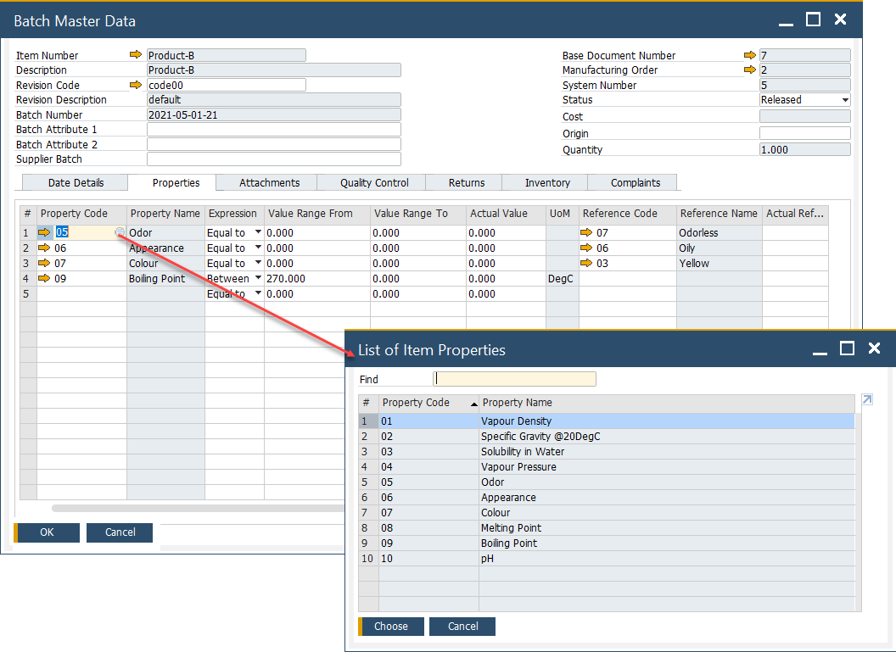

# Properties tab

he **Properties** tab enables users to associate predefined item properties with a specific batch. This functionality supports enhanced classification, filtering, and reporting across various inventory and production processes.

Assigning relevant properties ensures that batches can be tracked and analyzed based on meaningful business attributes—such as material grade, origin, compliance category, or any custom-defined classification.

➡️ To learn how to define and manage item properties, refer to the [Item Properties guide](../../../item-details/item-properties.md).

---
