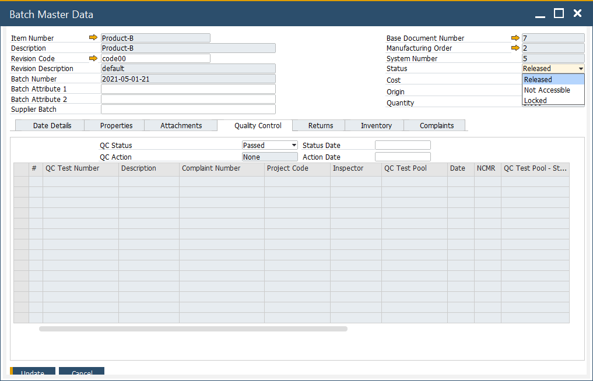
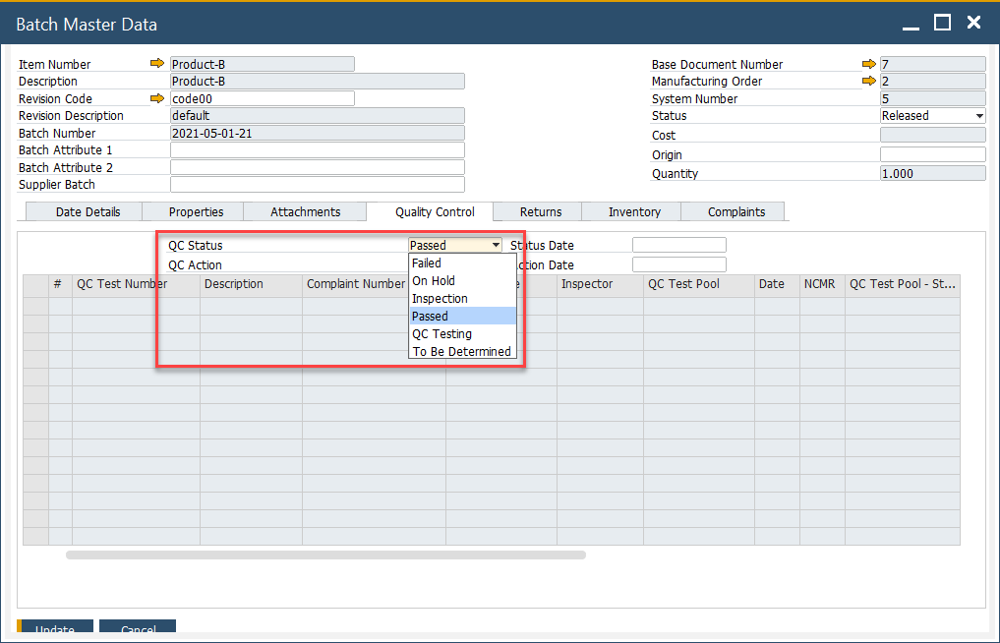
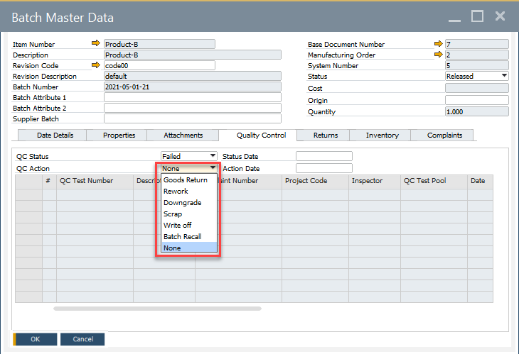
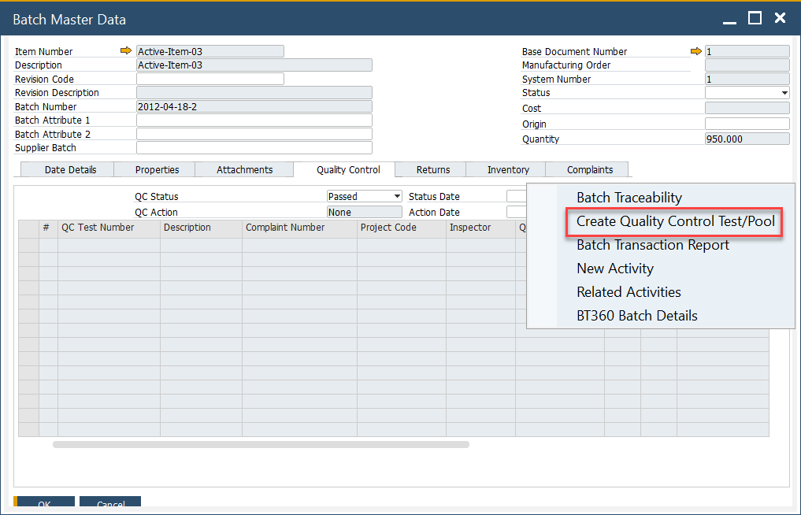

# Quality Control tab

The Quality Control tab in the Additional Details Form provides a centralized view of all Quality Control (QC) tests associated with a batch. It includes key information such as the Compliant Number and Non-Conforming Materials Report, ensuring effective batch monitoring and compliance management.

---

## Status

Displays the SAP Business One Status field, with a default status set based on [configuration settings](../batch-control-settings/configuration-batch-and-quality-control-status.md).

## QC Status

Indicates the batch’s quality status, determined by predefined [configuration settings](../batch-control-settings/configuration-batch-and-quality-control-status.md).

## QC Action

Used to define corrective actions if the batch fails the quality control test.

## Creating a Quality Control Test

A Quality Control Test can be initiated from the menu if a Test Protocol is assigned to the item. More details can be found [here](../../../quality-control/quality-control-test/overview.md).

---
The Quality Control tab plays a crucial role in ensuring batch quality, regulatory compliance, and process efficiency. By maintaining accurate QC records and actions, businesses can uphold high-quality standards and effectively manage non-conforming batches.
