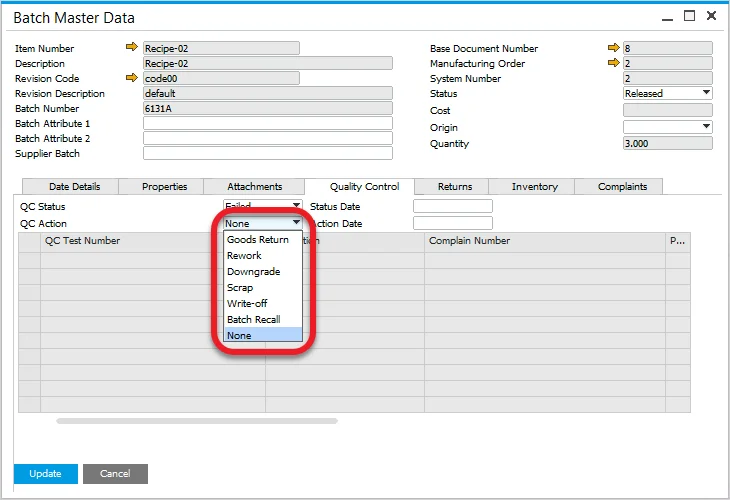

# Quality Control tab

The **Quality Control** tab, located in the **Additional Details** form of a batch, provides a centralized interface to manage all Quality Control (QC) tests linked to that batch. It helps ensure regulatory compliance and enables proactive quality monitoring through test tracking, status updates, and corrective actions.

---

## How-to: Manage Quality Control in the Batch

### 1. Review Batch Status

- View the **SAP Business One Status** field, which reflects the overall processing state of the batch.
- The default status is defined through system configuration.

➡️ Learn how to [Configure Status Settings](../batch-control-settings/configuration-batch-and-quality-control-status.md)

### 2. Check the QC Status

- The **QC Status** displays the outcome of the quality evaluation.
- It is automatically assigned based on preconfigured rules.

➡️ [Learn about QC Status Configuration](../batch-control-settings/configuration-batch-and-quality-control-status.md)

### 3. Define QC Actions

If a batch fails a QC test, use the **QC Action** field to specify required corrective measures or process adjustments.

---

### 4. Create a Quality Control Test

- If a **Test Protocol** is assigned to the item, a QC Test can be created directly from the menu.
- This links the test to the batch for traceability and reporting.

➡️ [How to Create QC Tests](../../../quality-control/quality-control-test/overview.md)

---
