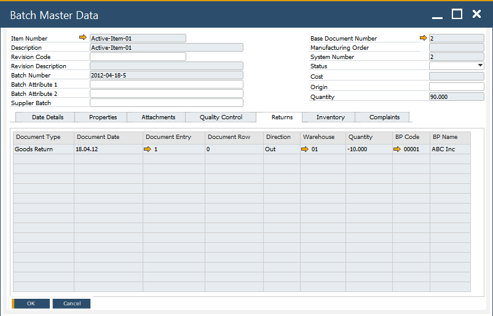

# Returns tab

The Returns tab provides visibility into all return-related transactions associated with a specific batch. It helps users monitor returned quantities—both from sales and purchase processes—ensuring accurate inventory tracking and traceability across the supply chain.

To access Returns tab, navigate to:

:::info Path
Inventory → Item Management → Batches → Batch Master Data → Returns tab
:::

---

## Purpose

The Returns tab serves as a central point for viewing all documents that reference returns for a batch. It allows users to verify whether a batch has been involved in any return transactions, helping maintain correct stock balances and ensuring audit readiness.

---

## Displayed Documents

Depending on whether the batch item has been sold, purchased, or both, the system displays the relevant return documents available in SAP.

### For Delivered Items

If the batch has been sold, the following documents (if available in the system) are listed:

- Returns
- A/R Credit Notes

### For Purchased Items

If the batch has been purchased, the following documents (if available) are displayed:

- Goods Returns
- A/P Credit Notes

### For Purchased and Delivered Items

If the batch has been both purchased and sold, all applicable documents are shown:

- Goods Returns
- A/P Credit Notes
- Returns
- A/R Credit Notes

---

## Additional Notes

:::info
In certain countries, **Corrective Invoices** are used to manage return transactions instead of traditional credit notes.  
If such documents exist and are linked to a batch, they will also appear in the Returns tab.
:::

---
