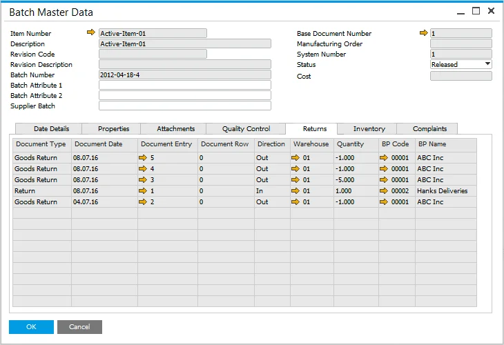

# Returns tab

The Returns tab in the Batch Master Data form provides a comprehensive view of all return-related documents linked to a specific batch. This ensures efficient tracking of returned items, whether they are purchased or sold, and helps maintain accurate inventory records.

---

---

For delivered Items, the following documents (if there are any in the system) are displayed for the Batches which have been sold:

- Returns,
- A/R Credit Notes.

For purchased Items, the following documents are displayed (if there are any in the system) for Batches that have been purchased:

- Goods Returns,
- A/P Credit Notes.

For purchased and delivered Items, the following documents are displayed (if there are any in the system) for the Batches which have been purchased and sold:

- Goods Returns,
- AP Credit Notes,
- Returns,
- AR Credit Notes.

:::info
    Additionally, in some countries, Corrective Invoices are used to manage returns. If applicable, such documents linked to a specific batch will also be displayed.
:::

---
