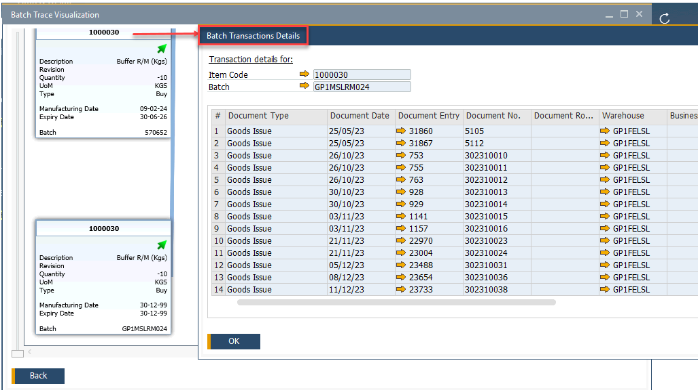

# Batch Traceability

Batch traceability is a critical requirement in industries where quality control, regulatory compliance, and full production transparency are essential. CompuTec ProcessForce provides a powerful Batch Traceability feature that enables end-to-end tracking of item batches - from purchase or production, through internal manufacturing usage, and finally to customer delivery.

This functionality supports complaint handling, product recalls, audits, and overall quality assurance by giving users instant access to detailed batch histories.

---

## Access

Users can access Batch Traceability feature through multiple navigation paths:

- To access from **Modules Menu**, navigate to:

  :::info Path
  Inventory → Item Management → Batches → Batch Traceability
  :::

- To access from the **Complaint form**: Right-click on a batch within the Transaction tab.

  

  ➡️ Learn more about [Complaints](../../complaint-management/complaint.md).

- To access from the **Batch Master Data**: Access Batch Traceability via the context menu.

    

  ➡️ Learn more about [Batch Master Data](../batch-control/batch-master-data/overview.md).

## Opening the Batch Trace Visualization Form

Upon opening the Batch Traceability function, the Selection Criteria window appears.

1. Choose an Item Code from the available list:

    

2. Select a Batch related to the chosen item:

    

3. Click "OK" to confirm. The Batch Trace Visualization form will be displayed.

## Batch Trace Visualization

The Batch Trace Visualization form provides a graphical representation of batch movement and usage.

- Each Batch is displayed as a box containing key details.
- Boxes can be rearranged using drag-and-drop.
- Zoom in/out using the mouse wheel or scroll bar.

Data included on Batch boxes:

- Batch status icon:

    | icon | Description |
    | --- | --- |
    | arrow | released |
    | x | not accessible |
    | exclamation mark | locked |

- Details:

  | Details | Meaning |
  | --- | --- |
  | Quantity | Negative quantities indicate consumption in production |
  | UoM | Unit of Measurement |
  | Type | Indicates if an item was produced or purchased |
  | Manufacturing Date | Indicates if the Item was produced (not purchased) |
  | Expiry Date | Date of Expiry |
  | Batch | Name of the Batch |

## Transactions

Users can review all activities and transactions associated with a batch:

1. Right-click on a specific box to see all activities and transactions connected to the Batch:

    

2. Click the yellow arrow in a specific document row to get more information about it.

## Going Forward

Batch Trace Visualization supports both backward and forward tracking:

- Backward tracing shows which batches were used to create an item.
- Forward tracing shows where a batch has been used in subsequent production or sales.

To view forward usage:

- Hold Ctrl and right-click the selected batch.
  
  

- The system will highlight all downstream batches or documents.

  

---
