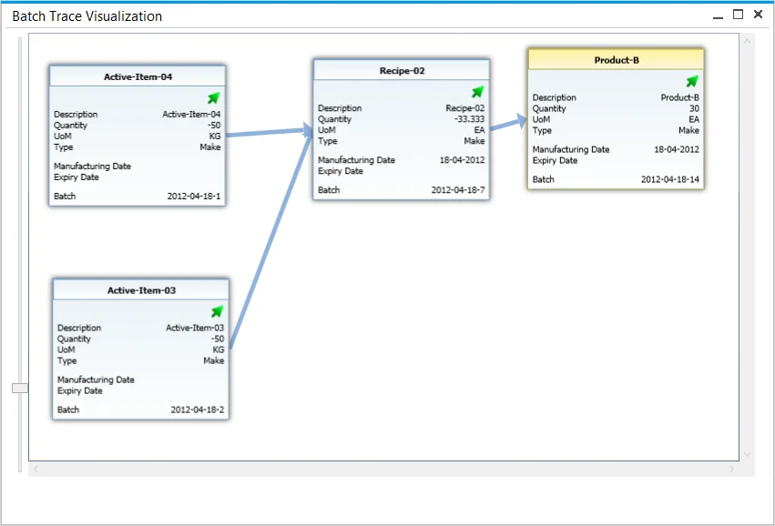
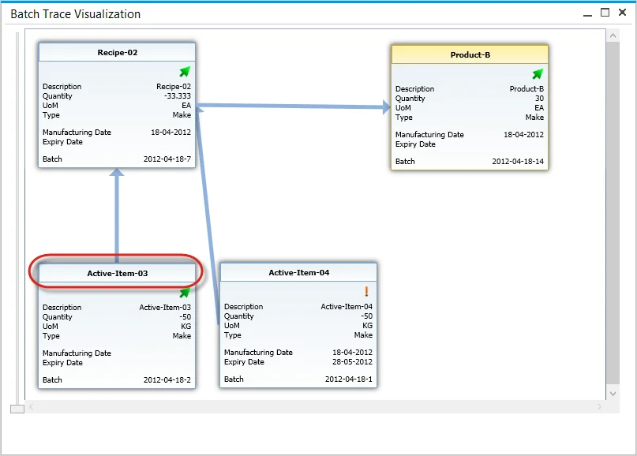
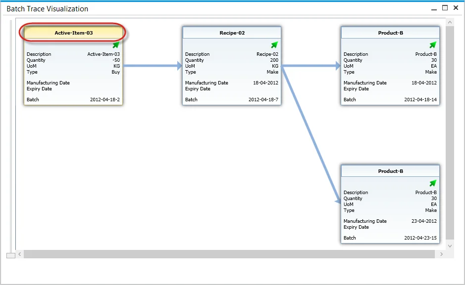

# Batch Traceability

In industries where product quality and regulatory compliance are critical, batch traceability is an essential function. ProcessForce's Batch Traceability feature provides comprehensive tracking of item batches throughout their lifecycle - from production or purchase to their use in manufacturing and final delivery to customers. This function plays a crucial role in complaint management, product recalls, and overall quality assurance by offering instant access to batch records.

---

## Access

Users can access the ProcessForce Batch Traceability feature through multiple navigation paths:

- **Modules Menu**: navigate through Inventory → Item Management → Batches → Batch Traceability.
- **From the Complaint Form**: right-click on a batch within the Transaction tab.

  

  Click [here](../../complaint-management/complaint.md) to find out more about the Complaint function.

- **From Batch Master Data**: Access Batch Traceability via the context menu.

  

  Click [here](../batch-control/batch-master-data/overview.md) to find out more about Batch Master Data.

## Opening Batch Trace Visualization Form

Upon opening the Batch Traceability function, the Selection Criteria window appears.

1. Select an Item Code from the available list:

    

2. Choose a Batch associated with the selected item:

    

3. Click "OK" to confirm. The Batch Trace Visualization form will be displayed.

## Batch Trace Visualization

The Batch Trace Visualization form provides a graphical representation of batch movement and usage.

On this chart, specific Batches are represented by boxes with their details. Boxes can be moved by drag-and-drop.

You can zoom in or out of the view using a mouse roll or a scroll bar.

Data included on Batch boxes:

- Batch status icon:
  - arrow – released,
  - x – not accessible,
  - exclamation mark – locked.

- Description:
  - Quantity – if it is negative, it indicates the quantity that was used in a production process,
  - UoM – Unit of Measurement,
  - Type – indicates if an item was produced or purchased,
  - Manufacturing Date – if the Item was produced (not purchased),
  - Expiry Date,
  - Batch – Batch name.

## Transactions

Users can review all activities and transactions associated with a batch:

1. Right-click on a specific box to see all activities and transactions connected to the Batch:

    

2. Click the yellow arrow in a specific document row to get more information about it.

## Going Forward

The visualization provides insight into the composition of a specific item by tracing back through all batches involved in its production process.

To track where the items from a specific batch have been used, hold Control and right-click on the desired batch.

---
The Batch Traceability function in ProcessForce provides end-to-end visibility into batch movement, ensuring quality control, compliance, and efficient recall management. By enabling both backward and forward tracking, businesses can maintain transparency and quickly address issues related to production, inventory, and customer deliveries.
