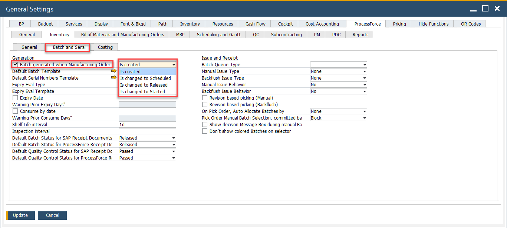
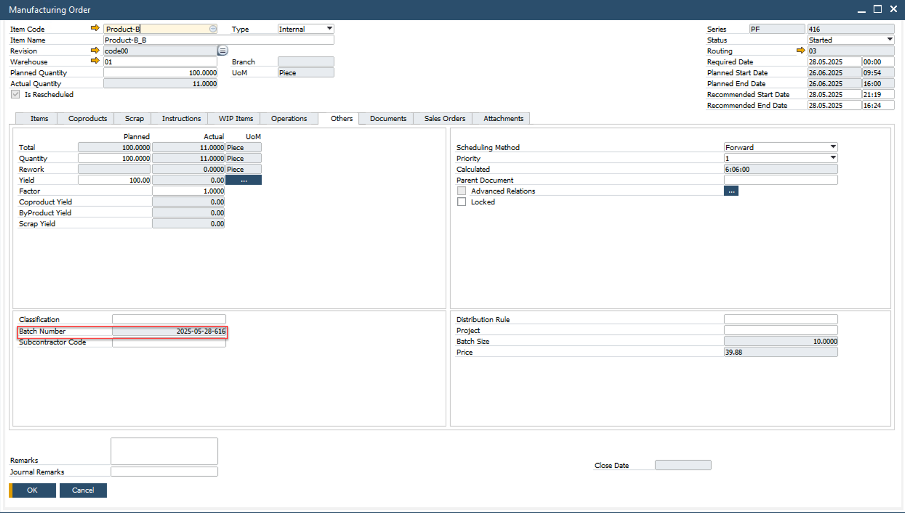
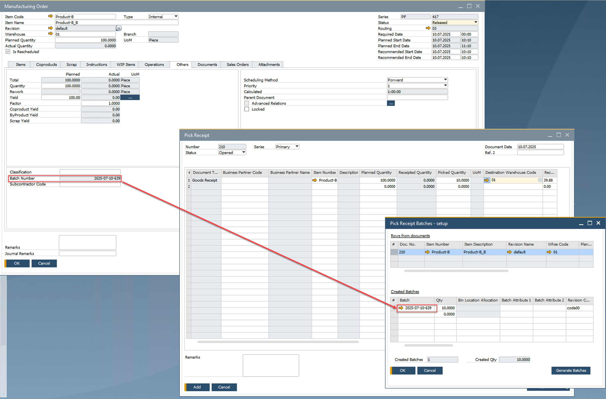

# Preallocation of a Batch Number

Preallocating batch numbers helps manufacturers maintain consistency, traceability, and efficiency across production and inventory processes. This functionality ensures that a batch number is automatically generated and assigned to a manufacturing order either upon creation or when its status changes, and is consistently reused throughout the production lifecycle.

---

## Purpose and Overview

- Ensures accurate batch tracking from production planning to goods receipt.
- Eliminates manual batch number entry by automating assignment at key stages.
- Maintains consistency across multiple receipts for the same production order.

---

## Configuration

This is a global setting, meaning it applies to all batch-traced items used in production.

To set up batch number preallocation:

- Create a batch template using the [Batch Template Definition](../../item-details/batch-serial-template-definition.md).
- Enable the checkbox: **Batch Number generated at the MOR**.
- Select when the batch number should be created:
  - When the manufacturing order is created.
  - Or upon a specific **status change** of the order.

    

> **Note:**  
> When the Batch Number is generated when the MOR option is enabled, the Classification and MOR Number options in a **Batch Template cannot be used**.

---

## Manufacturing Order

Once a manufacturing order is created with the configured batch template:

- The assigned batch number will appear under the **Others** tab of the manufacturing order.

    

:::note
>The batch number will not be visible in the **Additional Batch Details** object at this stage, as the record hasn't yet updated that section.
:::

---

## Receipt from Production

During the **Receipt from Production** process:

- The same batch number assigned to the manufacturing order is used automatically.
- If multiple receipts are done for the same MO, the **same batch number is consistently reused**.

The batch number assigned to the manufacturing order will be used in the production transaction receipt.

---
