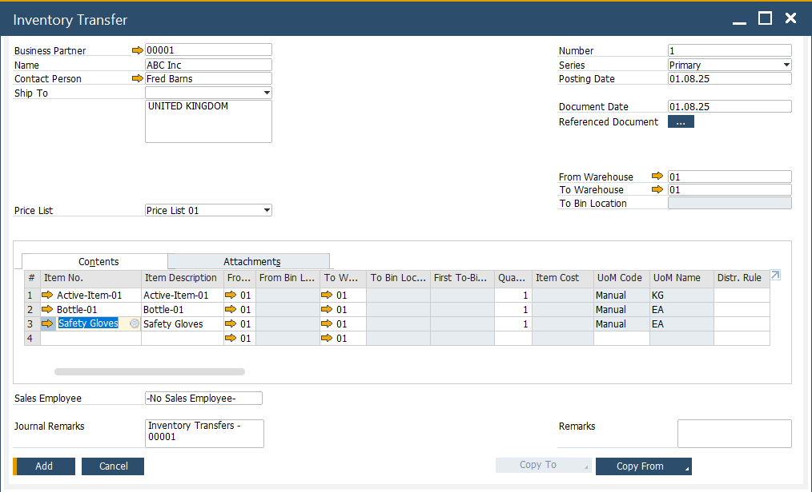
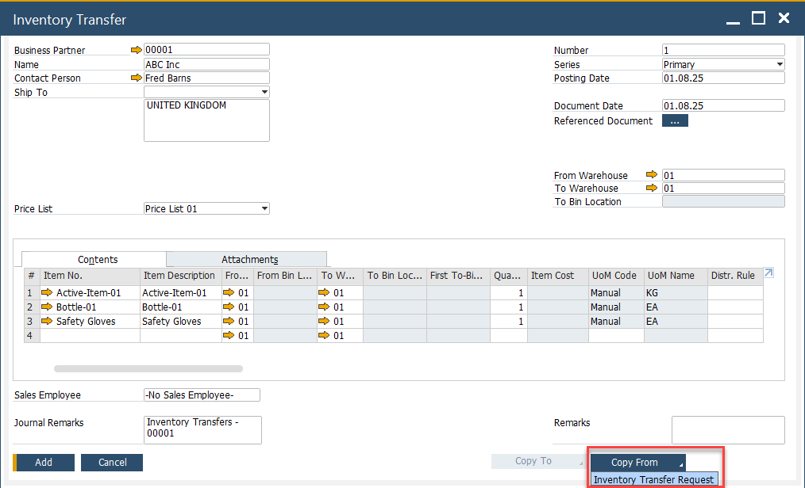
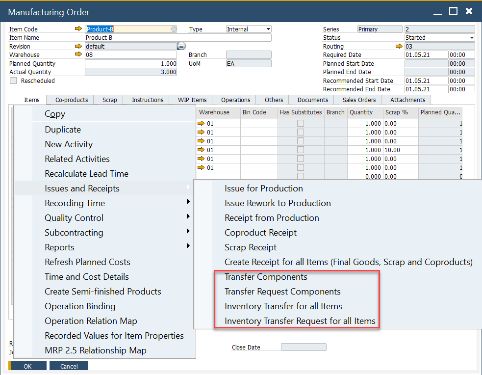
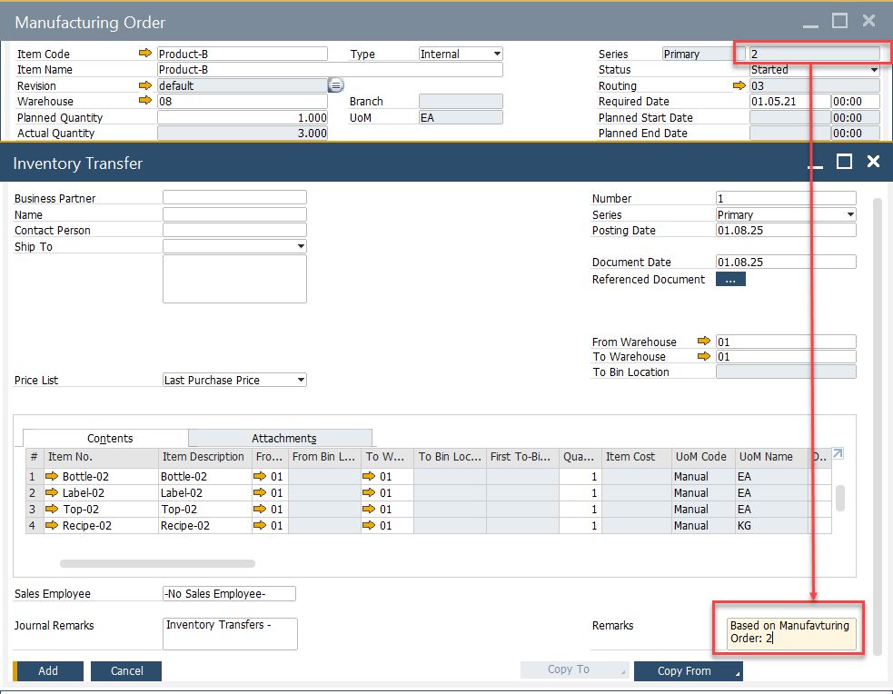

# Inventory Transfer Request and Inventory Transfer

Efficient inventory movement between warehouses is essential for maintaining accurate stock levels and supporting production workflows. SAP Business One provides two core documents to manage these internal logistics:

- **Inventory Transfer Request** – to plan stock movement  
- **Inventory Transfer** – to execute the physical transfer

To access Inventory Transactions, navigate to:

:::info Path
    Inventory → Inventory Transactions
:::

**Difference Between the Two Documents**

| Feature | Inventory Transfer Request | Inventory Transfer |
| --- | --- | --- |
| Triggers stock movement  | ❌ No | ✅ Yes |
| Affects inventory levels | ❌ No | ✅ Yes |
| Used for planning        | ✅ Yes | ❌ No |
| Can be linked to MOs     | ✅ Yes | ✅ Yes |

---

## Inventory Transfer

To access Inventory Transfer, navigate to:

:::info Path
    Inventory → Inventory Transactions → Inventory Transfer
:::

The **Inventory Transfer** document is used to record the physical movement of items from one warehouse to another. Once this document is added, it updates inventory balances accordingly and reflects the stock movement in the system. Use this document when the physical transfer is being executed and needs to be recorded in real-time.

---

## Inventory Transfer Request

To access Inventory Transfer Request, navigate to:

:::info Path
    Inventory → Inventory Transactions → Inventory Transfer Request
:::

The **Inventory Transfer Request** is a planning document used to initiate internal stock movement without immediately affecting inventory levels. It allows users to outline required transfers which can later be converted into an Inventory Transfer document.

- Use this document for approvals or when planning material availability ahead of time.
- Once reviewed and approved, the request can be copied into an Inventory Transfer document to complete the process.

---

## Manufacturing Order Based Document

Inventory Transfers and Transfer Requests can be directly linked to a **Manufacturing Order**. This enables users to manage material movement in alignment with production requirements.

From the Manufacturing Order screen:

- Right-click to generate either a Transfer Request or an Inventory Transfer.
- Choose to generate the document for individual components or all required items.

This connection helps ensure material readiness for production and traceability in stock handling.

The generated documents automatically reference the Manufacturing Order in the **Remarks** field, allowing easy tracking of source transactions.

---
