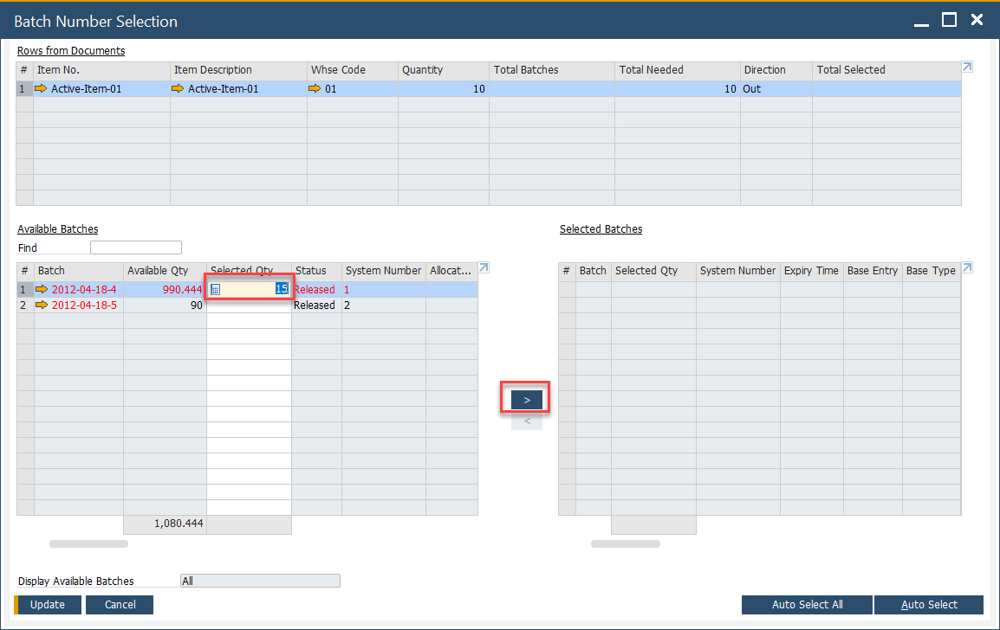
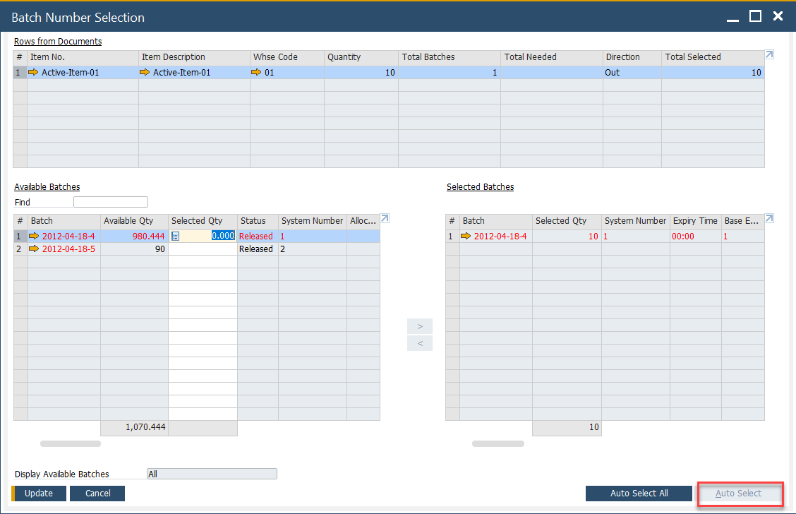
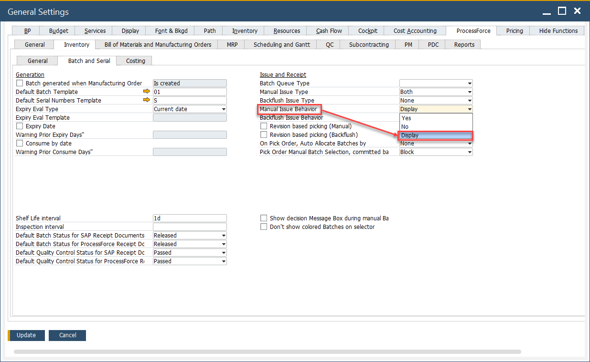

# Batch Controlled Items

Effective Batch Management ensures accurate inventory tracking and optimized stock movement within a warehouse. This guide explains two methods for handling batch-controlled items during picking:  

- **Manual Picking** (user-driven control)  
- **Auto Select Picking** (system-driven allocation)  

---

## Manual Picking

With manual picking, the user specifies the required quantity and confirms selection:

1. Enter the **required quantity**.  
2. Press the **right arrow**.  
3. The system automatically assigns bin allocation based on predefined **bin allocation rules**.  

This method offers flexibility—ideal when warehouse staff need to override system recommendations.

## Auto Select Picking

The **Auto Select** function streamlines picking by allowing SAP Business One to choose batches automatically. The system applies allocation rules such as:

- **FIFO**: First In, First Out  
- **FEFO**: First Expired, First Out  
- **FMFO**: First Manufactured, First Out  

When a user clicks **Auto Select**, the system:

    - Calculates the required quantity.  
    - Allocates bins and batches according to the selected rule.  

>**Note**: If Manual Issue Behavior (General Settings → Inventory tab) is set to **Display**, the system does not complete the auto-pick. Instead, it prompts the user to confirm batches manually.

    

:::tip
    - Use **Auto Select** for efficiency when allocation rules are well-defined.  
    - Use **Manual Picking** when exceptions or special business cases require user judgment.  
:::

---
