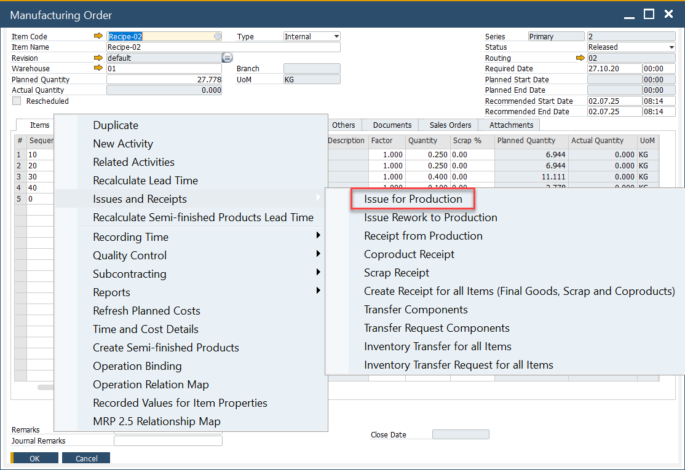

# Non-Batch Controlled Items

Non-batch controlled items are inventory items that do not require batch or serial number tracking.  
This guide explains how to handle **Bin Locations and Allocations** for such items during the **Pick Order** and **Production Goods Issue** processes.

---

## Pick Order

### Issue for Production

The Issue for Production process is used to move raw materials, components, or sub-assemblies from the warehouse into Work in Progress (WIP) so they can be consumed during manufacturing.

- Reduces inventory levels of issued items.  
- Creates a Production Goods Issue document.  
- Automatically posts the financial journal entry, recording the material consumption.  
- Ensures accurate inventory tracking and cost allocation from inventory to WIP.

From the context menu, navigate to:

:::info Path
Issues and Receipts → Issue to Production.
:::

### Allocating Non-Batch Controlled Items

Steps to pick and allocate inventory:

- Enter the amount of inventory to be picked within the Picked Quantity field
- Click the "yellow arrow" next to Bin Location Allocation to select Bin Location.  
- The Bin Location Allocation - Pick Order form opens.  
- Either:  
  - Manually enter a value in **Allocated**, or  
  - Use one of the **Automatic Allocation** functions.

## Production Goods Issue

After picking, complete the transaction:  

1. Open the context menu and select "Production Goods Issue".  
2. Click "Add" to confirm.  

**Result**:

- Items are removed from the warehouse.  
- They are issued to Work in Progress (WIP).  
- The system generates the corresponding financial journal entry automatically.  

---
