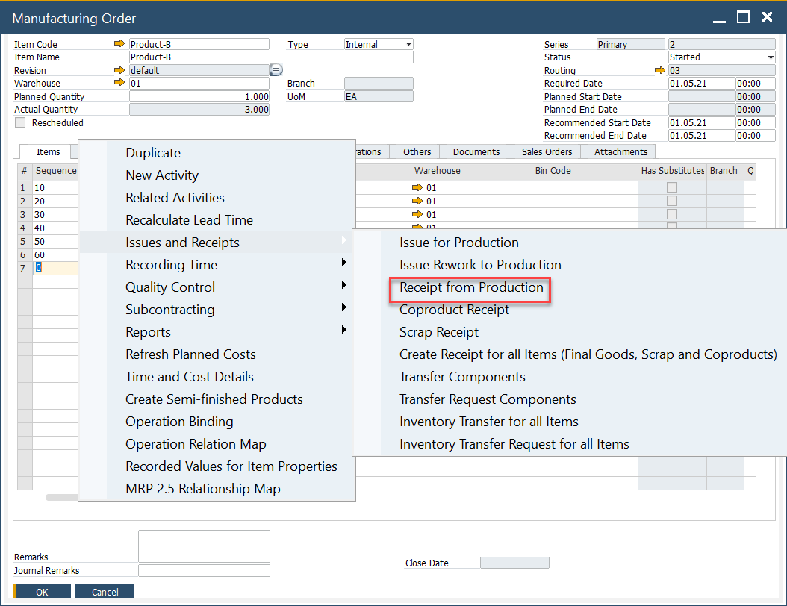
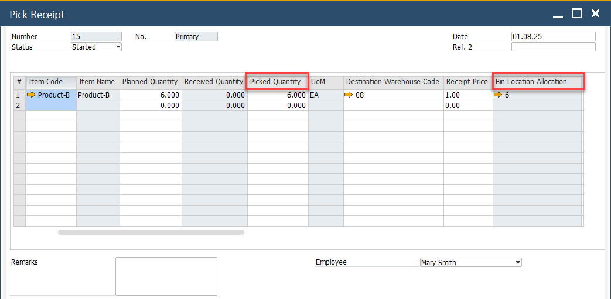
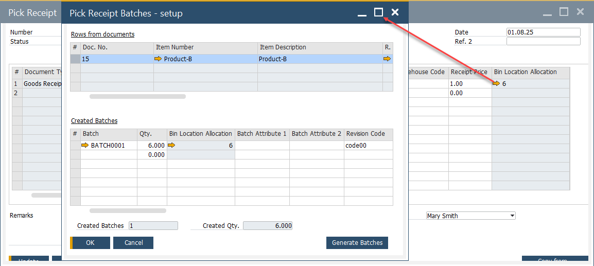
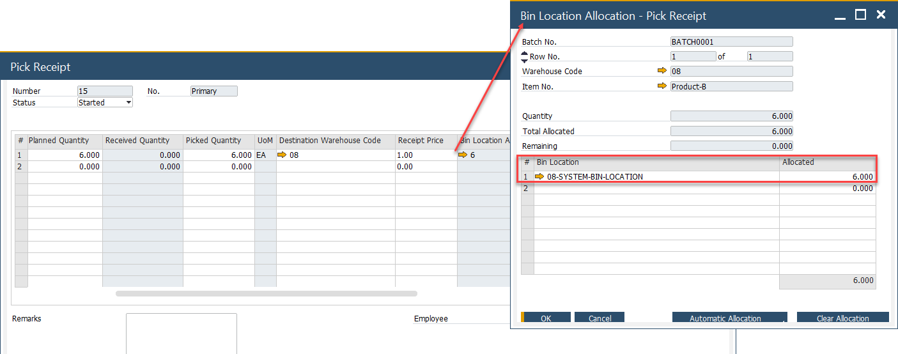
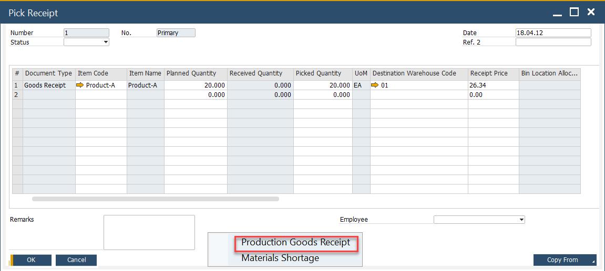
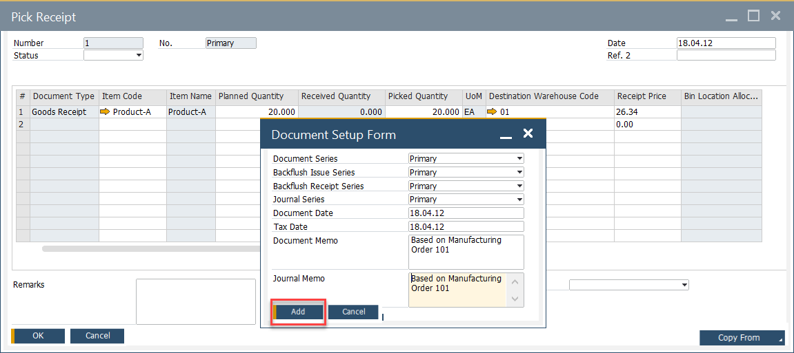
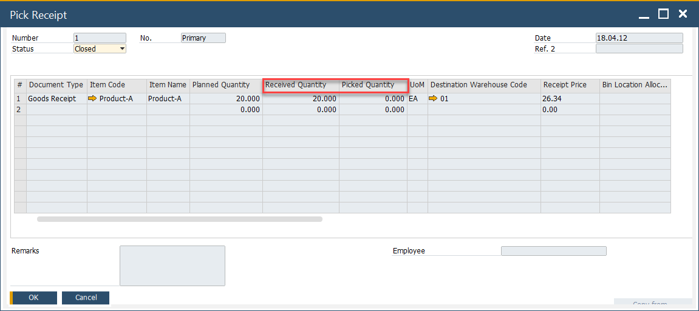
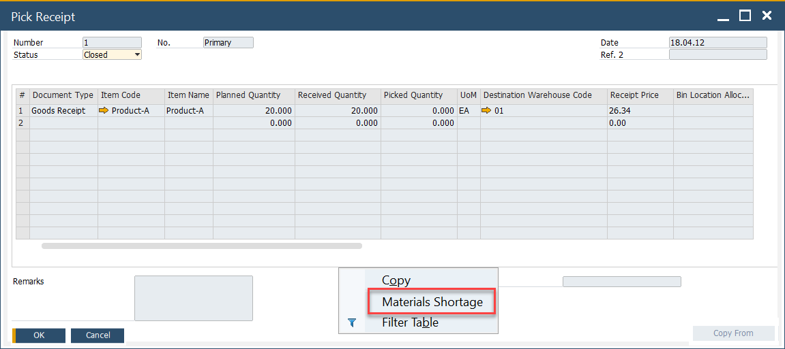
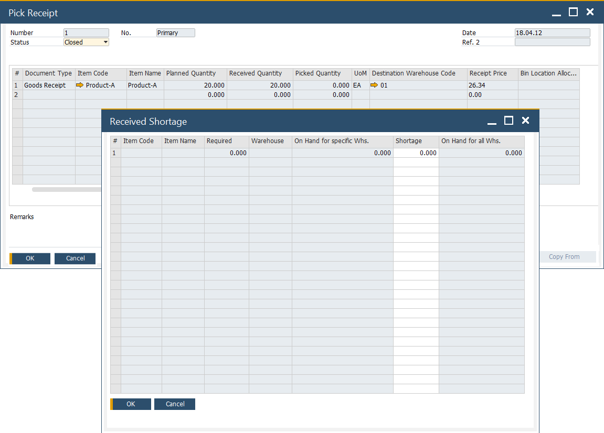

# Pick Receipt Bin Locations and Allocations

This page explains how to manage **Bin Location Allocation** on **Pick Receipt** documents in CompuTec ProcessForce. Efficient bin allocation helps optimize warehouse inventory flow, minimize stock errors, and ensure accurate traceability of production receipts.

---

## Pick Receipt

The Pick Receipt process ensures that goods received from production are correctly assigned to bin locations in the warehouse. This allows users to enter received quantities, allocate them to bins, and split quantities across multiple bin locations when required.

### Receipt from Production Process

The Pick Receipt process can be accessed from the context menu on the Manufacturing Order form under Issues and Receipts, selecting Receipt from Production.

### Full Quantity entered into Bin

When a full quantity is received:  

1. Enter the quantity in the Pick Receipt form.  
2. The system automatically assigns it to the Default Bin Location.  
3. Press Update to save the transaction.

  

### Split Quantity across Several Bins

If the received quantity needs to be distributed into multiple bins:

1. Click the yellow arrow in the **Bin Location Allocation** field.  
   - The Pick Receipt Batches form opens.  
     
2. Click the yellow arrow in the Bin Location Allocation field again.  
   - The Bin Location Allocation - Pick Receipt form opens.  
3. Enter the Bin Location and the allocated quantity.  
4. Press Update to confirm.  

    

## Production Goods Receipt

After allocating bins, the received goods must be posted as a Production Goods Receipt:

1. From the context menu of the Manufacturing Order, select Production Goods Receipt.  
   

2. Enter the required details and press Add.  
   

3. The quantity moves from Picked Quantity to Receipted Quantity.  
   

### Backflush Materials

If the Manufacturing Order includes **backflushed materials**, it is important to check for shortages before completing the Production Goods Receipt:

1. From the context menu, select "Materials Shortage".  
   
  
2. If shortages exist, they are displayed in the Receipt Shortage form.  
   

---
