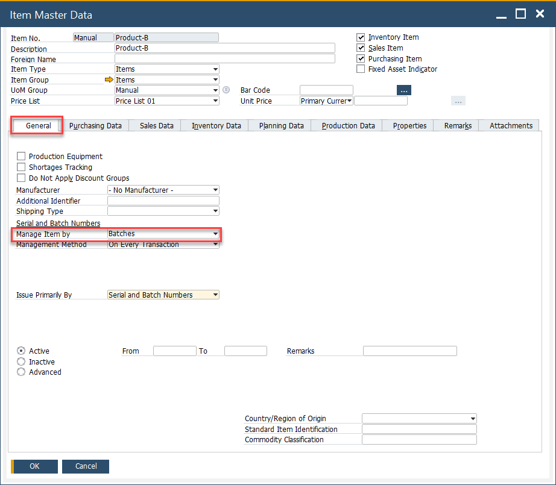
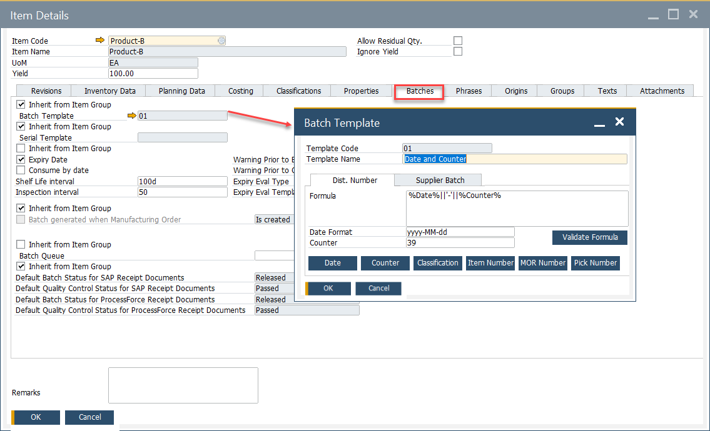
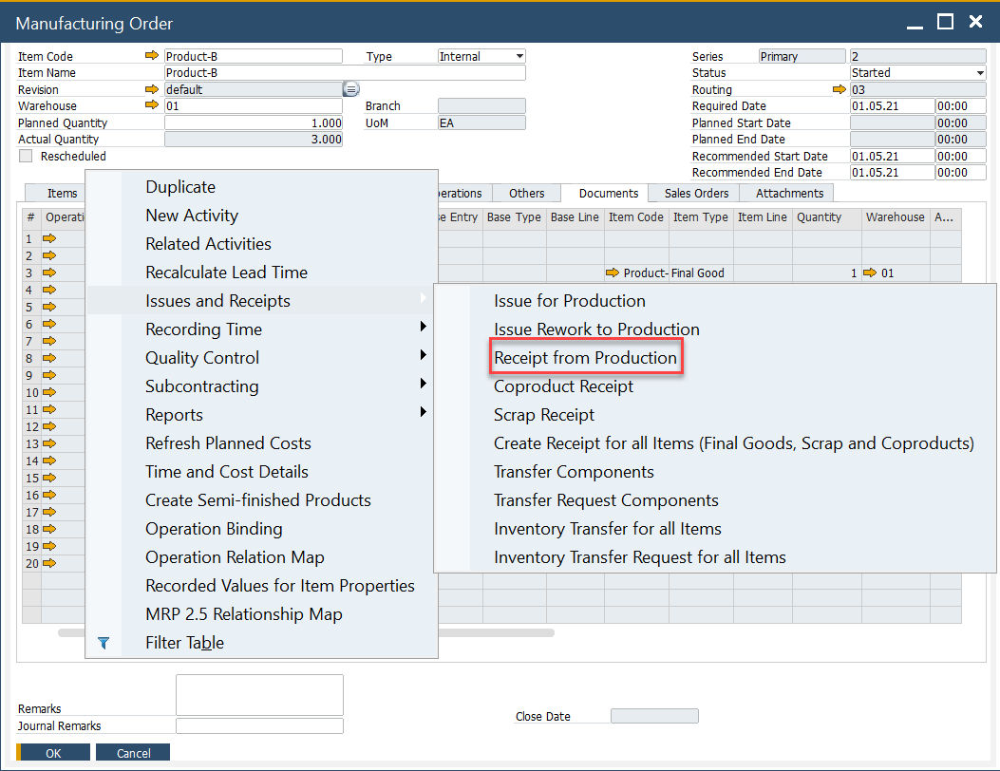
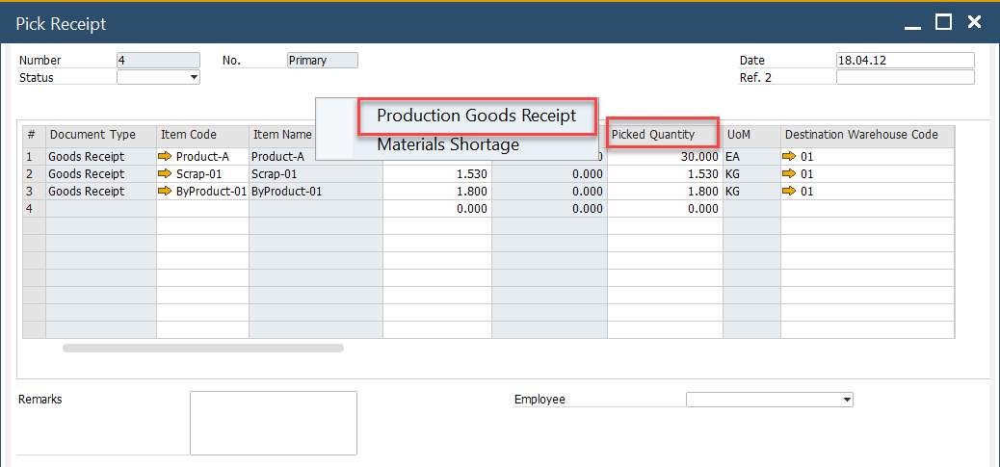
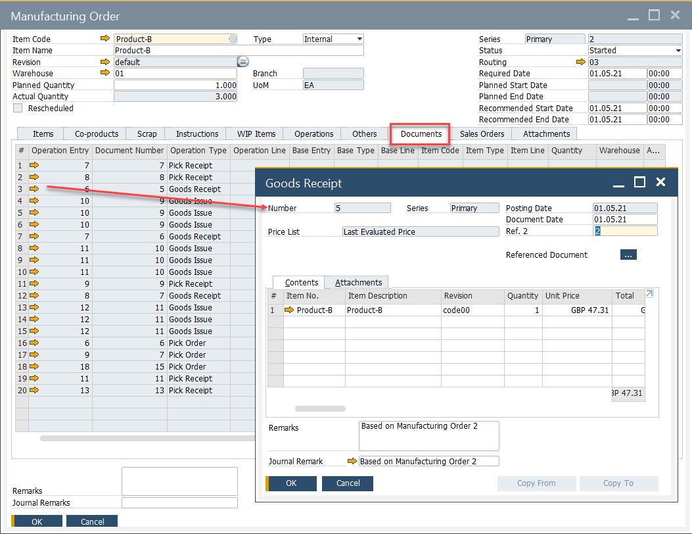
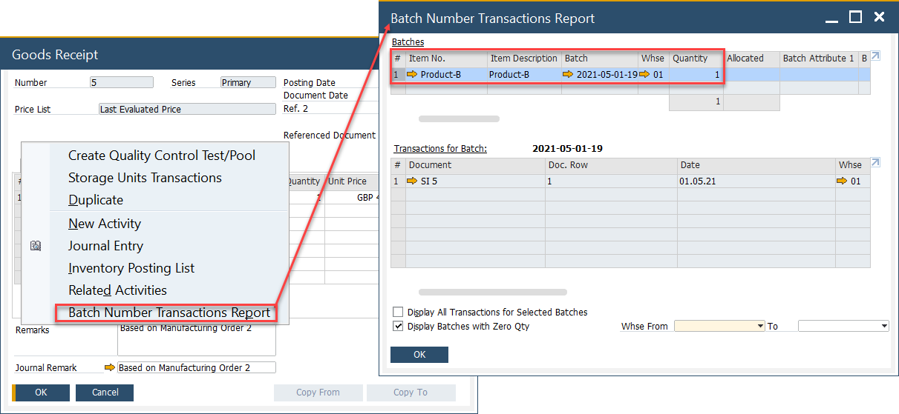
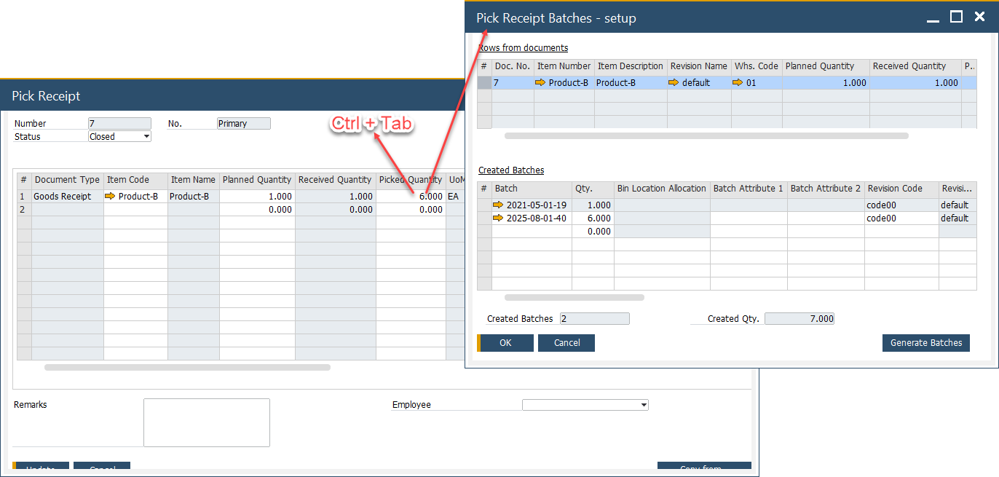
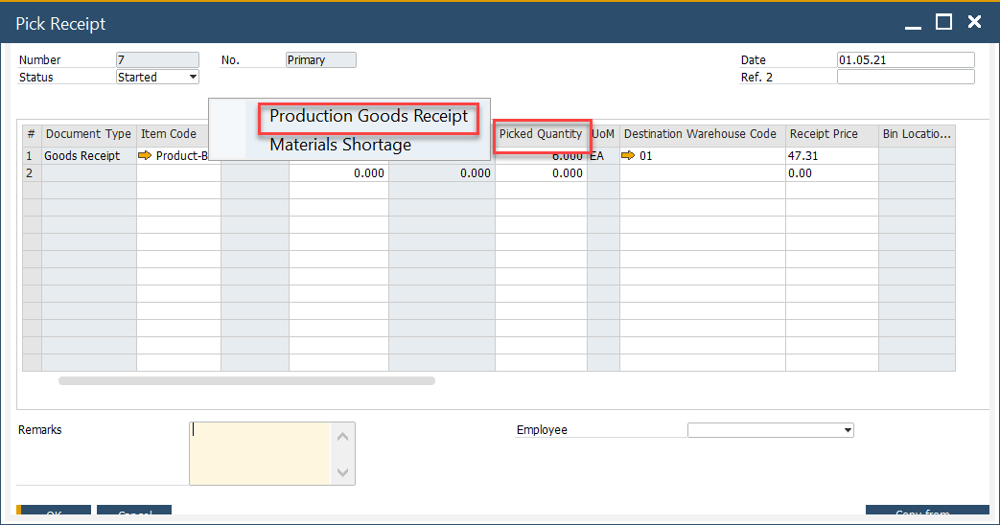
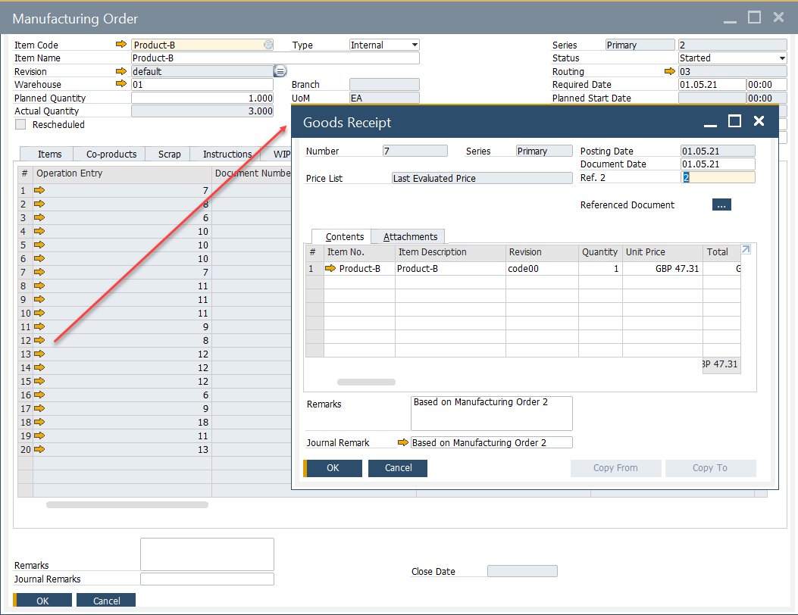
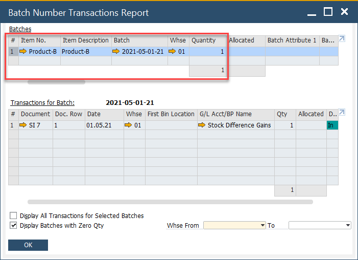

# Pick Receipt for Batch Managed Items

Managing batch-controlled inventory is crucial for industries requiring traceability and precision in stock management. In this guide, we will demonstrate how to perform a Pick Receipt for items managed by batches in a manufacturing environment. This ensures accurate tracking of inventory and enhances operational efficiency.

---

## Prerequisites

### Item Master Data

To proceed, ensure that the item is managed by batches.
To access Item Master Data, navigate to:

:::info Path
    Inventory → Item Master Data
:::

### Item Details

Define a batch template (e.g., with date and counter) to automate batch number creation.
To access Item Details, navigate to:

:::info Path
    Inventory → Item Details
:::

## Scenario no. 1

- Create a Pick Receipt using the context menu option on a Manufacturing Order:

    

- Set the picked quantity, click "update", and choose Production Goods Receipt from the context menu. A batch number is generated automatically and can be verified in the Batch Number Transaction Report.

    

- Open the created Goods Receipt from Manufacturing Order under the Documents tab:

    

- View the Batch Number Transaction Report to verify the generated batch number based on the Batch Template for the picked quantity.(5 in this example):

    

---

## Scenario no. 2

- Create a Pick Receipt using the context menu option on a Manufacturing Order:

    

- Set the Quantity to 6. Pressing "Ctrl+Tab" in Picked Quantity field leads to Pick Receipt Batches - setup form (you can also reach the option by choosing Batch/Serial Numbers from a row's context menu – right-click on a first column):

    

- Here, we can either check generated Batch number or allocate receipt goods into different batches:

    

- Generate a Production Goods Receipt using the Pick Receipt context menu option.

    

- Open the created Goods Receipt from the Manufacturing Order under the Documents tab.

    

- Select the Batch Number Transactions Report from the Goods Receipt context menu to verify the batch allocations.

    

    As shown above, the batches allocated in the Pick Receipt Batches setup were successfully recorded in the Production Goods Receipt.

---
