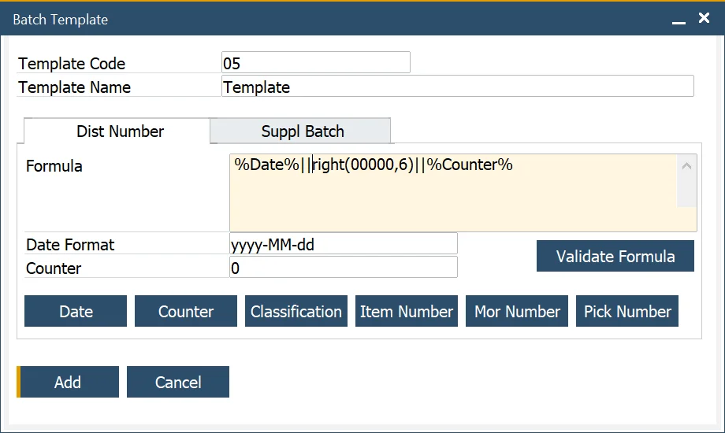
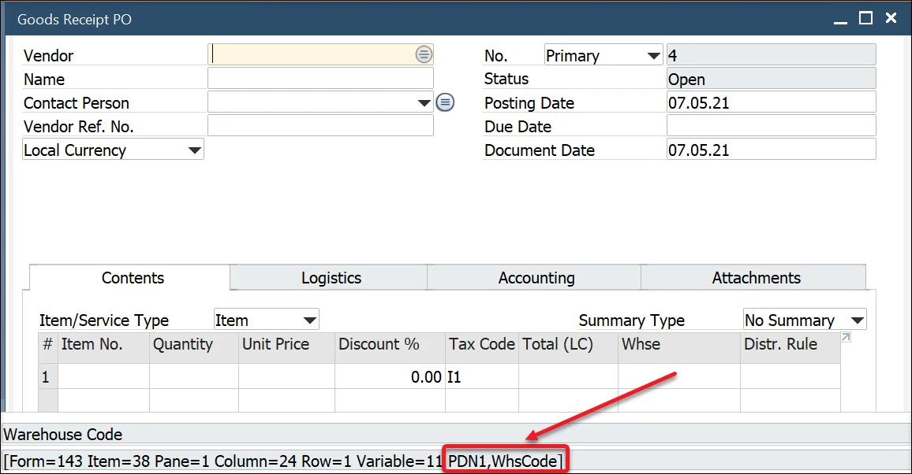
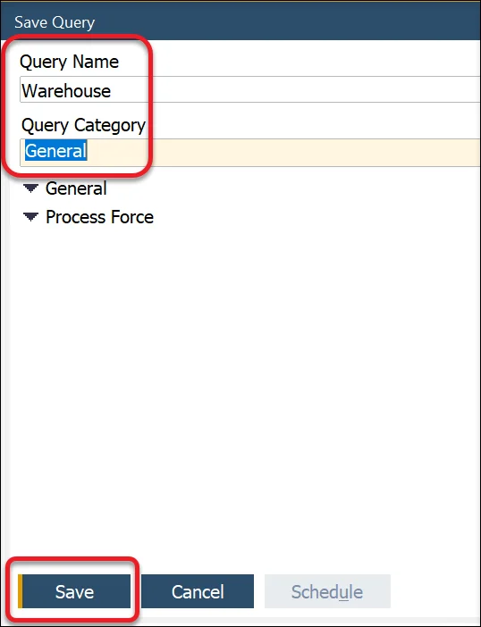

# Batch Template, Serial Template Definition

Batch and Serial Templates define the default format used to generate unique batch or serial numbers during the receipt of Purchase Orders and Production Orders. These templates help streamline tracking, ensure traceability, and simplify batch/serial number management across the system. The number-generating template can include essential details such as date, time, item number, or prefix.

To access Batch Template Definition, navigate to:

:::note Path
    Administration → Setup → Inventory → Batch Template Definition
:::

Here, you can configure the format of the serial number generator for creating serial numbers.

:::note Path
    Administration → Setup → Inventory → Serial Template Definition
:::

---

## Batch/Serial Template Allocation

The Batch Template form is used to define the Batch number for products that are Batch traceable. The formula is based on TSQL statements, providing a flexible Batch Number creation.


Batch templates (as well as Serial templates) can be set on three different levels:

- [general](#general-level): for all Batch-traced Items
- [for Item Group](#item-group-level): applied to all items within a specific group
- [for a specific Item](#item-level): defined for an individual item

If a template is not specified at a lower level, the system will inherit the template from the next higher level in the hierarchy.

### General level

To access Batch and Serial, navigate to:

:::info Path
    Administration → System Initialization → General Settings → ProcessForce tab → Inventory tab → Batch and Serial
:::


At the general level, you can control when and how batch numbers are generated in relation to the Manufacturing Order (MOR) process.

To enable automatic batch number creation:

- Check the “Batch Number Generated at MOR” option.
- Select the desired triggering status from the dropdown list.

The system will then generate a batch number either:

- When the Manufacturing Order is created with the specified status, or
- Upon status change to the selected value.

:::caution
    Please remember that when the Batch Number generated at the MOR option is checked, it is impossible to use Classification options on a [Batch Template](#defining-batch-template).
:::

## Item Group level

To access Item Group level, navigate to:

:::info path
    Administration → Setup → Inventory → Item Groups → ProcessForce tab
:::

At the Item Group level, you can define default Batch or Serial templates that apply to all items within the group, depending on the inheritance settings.

- If the inheritance checkboxes are unchecked, you can assign a specific Batch or Serial template directly to the Item Group.
- If the checkboxes are checked, the system will use the Batch or Serial template defined in General Settings instead.

    

## Item Level

To access Batch Details tab, navigate to:

:::info
    Inventory → Item Details → Batch Details tab
:::

At the item level, you can control whether a batch or serial template is inherited from the item group or defined individually for the item.

- If the inheritance checkboxes are unchecked, you can assign a custom batch or serial template directly to the item.
- If the checkboxes are checked, the item will inherit the batch or serial template defined at the Item Group level.

    

## Defining Batch Template

To access Batch Template, navigate to:

:::info Path
    Administration → Setup → Inventory → Batch Template Definition
:::

It is possible to define a Batch Template as a distribution number or a Batch Template assigned for suppliers. You can assign a batch template to one of two categories:
    - Dist Number – for distribution batches
    - Suppl Batch – for supplier-related batches

    

It is possible to define a Serial Number Template as a distribution number, a number for manufacturing items, or a Lot Number. To do that, pick the desired category (Dist Number, Manufacturing, or Lot Number tab).

To access Serial Template Definition, navigate to:

:::info Path
    Administration → Setup → Inventory → Serial Template Definition
:::


When adding a new Batch/Serial template, the date and counter fields have the following default values:

- Date = yyyy-MM-dd i.e. year-month-day
- Time = hh:mm:ss, i.e., hours:minutes:seconds
- Counter = 1. This is the starting value of the counter; it will increase starting with this value
- Maximum batch number = 32 characters, as per SAP Business One.

:::caution
    The Formula field supports a maximum of 255 characters. Longer formulas may not function as expected. For complex logic, consider using database procedures or scalar-valued functions instead.
:::


<details>
    <summary>How to reach Batch Number Transation Report from Goods Receipt PO</summary>
    <div>
        
    </div>
</details>

### Example 1: Date and Counter

To generate a batch number that includes the current date, a separator (such as a dash), and an incremental counter:

- Select the date function
- To string another element of data enter '+' sign for MS SQL version and '||' for HANA version
- To enter text or other symbols, enter the value between ‘ and ', e.g. '-'
- Select the counter function
- Click the Validate Formula button to check the Batch template syntax
- Click the Add button.


### Example 2: Date and Time

To create a batch number that includes the current date, time (hours and minutes), and a counter, follow these steps:

- Select the date function
- To string another element of data enter '+' sign for MS SQL version and '||' for HANA version
- Select the counter function
- Add the hours and minutes notions to the date. To do this, add the : separator, hh = hours, the : separator, and mm = minutes after the date format
- Click the Validate Formula button to check the Batch template syntax
- Press OK.


### Example 3: Adding a prefix

- To enter text or other symbols as a prefix to the batch number, use `[value]`, in this example, `PF` to get the PF prefix
- To string another element of data enter the + sign for MS SQL version and || for HANA version
- Select the date function
- To string another element of data enter '+' sign for MS SQL version and '||' for HANA version
- Select the counter function
- Click the Validate Formula button to check the Batch template syntax
- Click the Add button.


### Example 4: Embedding Item number

To include the first two letters of the item number in your batch name, follow these steps:

- enter left,
- followed by (
- select the item code function
- followed by a ,
- followed by the number of item code digits
- followed by )
- To string another element of data enter the + sign for MS SQL version and || for HANA version
- Select the date function
- To string another element of data enter the + sign for MS SQL version and || for HANA version
- Select the counter function
- Click the Validate Formula button to check the Batch template syntax
- Click the Add button.


### Example 5: Incremental Batch Number starting with five zeros, and a maximum length of 6

To configure a batch number that includes an incremental counter starting with five leading zeros, follow these steps:

- Select the date function
- To string another element of data enter the + sign for MS SQL version and || for HANA version
- To add an increasing number starting with five leading zeros
  - enter right,
  - followed by (
  - enter five zeros
  - followed by a ,
  - followed by the length of the total batch number
  - followed by )
- To string another element of data, enter + sign
- Select the counter function
- Click the Validate Formula button to check the Batch template syntax
- Click the Add button.



To see related video content click [here](https://www.youtube.com/playlist?list=PLtT6kgaz5YnfAO8B4ux_lXkmQyHmPCuR-).

### Example 6: Using a specific value from a document in the Batch generation template

Sometimes, you may want to include values in your batch number that aren’t directly supported in the Batch Template field list - such as a warehouse code. Although batch template formulas can’t pull such values directly, SAP Business One offers a workaround by using User-Defined Values (UDVs) to dynamically populate the Classification field with data like the warehouse code. This allows you to indirectly integrate the value into your batch naming logic.

1. Create a new query in Query Generator (Tools → Queries → Query Generator), and type in $[PDN1,WhsCode] (the name of the warehouse field) in the Select field.

    

    **To check a field name**:

    1. navigate to Upper Menu → View → System Information and check the option (or click Ctrl + Shift + I):

    2. point the field with a cursor – the name of the field will be displayed in System Messages Log:

        

    3. Choose the name and Query Category and click Save:

        

2. Click the Classification field on Goods Receipt PO and go to Tools → Customization Tools → User-Defined Values - Setup:

    

    Choose the previously created query, set other values, and click Update.

3. From now on Classification field will be set on the Whse value on every change on the Whse field. Now, if you use Classification in Batch Template, a value for a warehouse will be incorporated in the template.

   In the same way, you can set values from a different field in the classification field and use them in a batch template.

### Example 7: Current date + shelf interval

In manufacturing and inventory management, it’s common to generate batch numbers that reflect the product’s expiration or shelf life. This example demonstrates how to calculate a batch name by adding the shelf life interval to the current date dynamically, using SQL in SAP HANA.

#### SAP HANA Studio – test

To use the query for a specific Item, use the following data:

    ```sql
    SELECT cast(ADD_DAYS(TO_DATE(CURRENT_DATE), (SELECT TO_INTEGER (RTRIM (T0."U_ShelfTime", 'd'))
    FROM "@CT_PF_OIDT" T0 WHERE T0."U_ItemCode" = 'your item code')) as NVARCHAR(36)) FROM DUMMY
    ```

#### Batch Template formula

The full query result has to be converted/cast as text:

    ```sql
    cast(ADD_DAYS(TO_DATE(CURRENT_DATE), (SELECT TO_INTEGER (RTRIM (T0."U_ShelfTime", 'd')) FROM "@CT_PF_OIDT" T0 WHERE T0."U_ItemCode" = %ItemCode%)) as NVARCHAR(36))
    ```

The result of the formula has to be a text value (NVARCHAR type, 36 characters; it is performed using the 'cast' command).

## Defining Serial Template

A Serial Template defines how serial numbers are generated for manufactured items. Much like Batch Templates, Serial Templates use stored procedures to create structured serial number formats, incorporating fields like item codes, dates, and manufacturing details.

Serial Templates are critical in production environments where traceability, compliance, and structured identification of products are required.

### Generate serial numbers using custom procedure

To define a custom serial template:

- Ensure the procedure accepts the required parameters in the correct order and type.
- Verify that the procedure returns the expected output columns.

#### <u>Requirements</u>

**Fields (order and types are important)**:

@NumberOfSerials int, @Counter int, @Date nvarchar(30), @Classification nvarchar(10), @ItemCode nvarchar(50), @MORNumber nvarchar(10), @PickNumber nvarchar(10)

**Procedure must generate 3 columns**

"SerialNumber" nvarchar(36) , "LotNumber" nvarchar(36), "ManufacturingSerialNumber" nvarchar(36)


---
