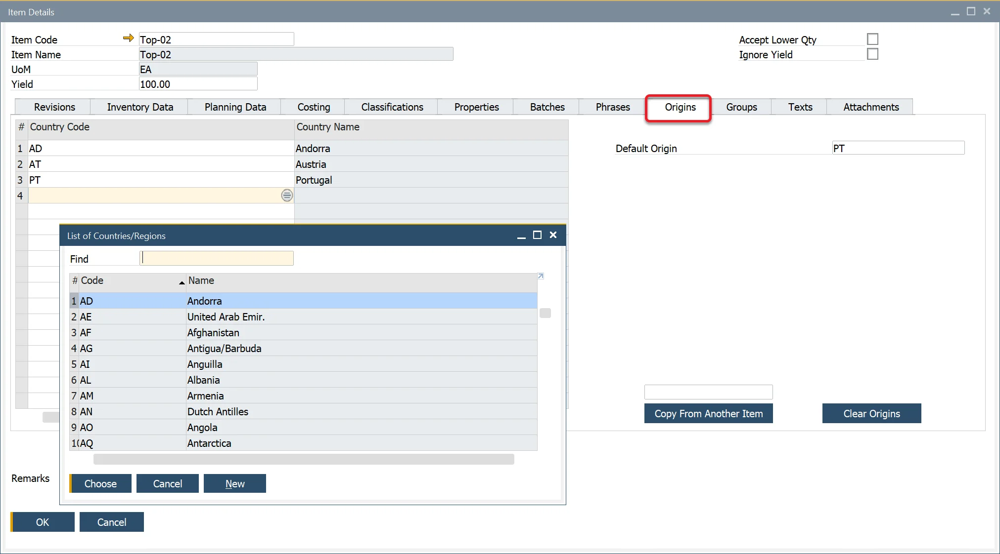
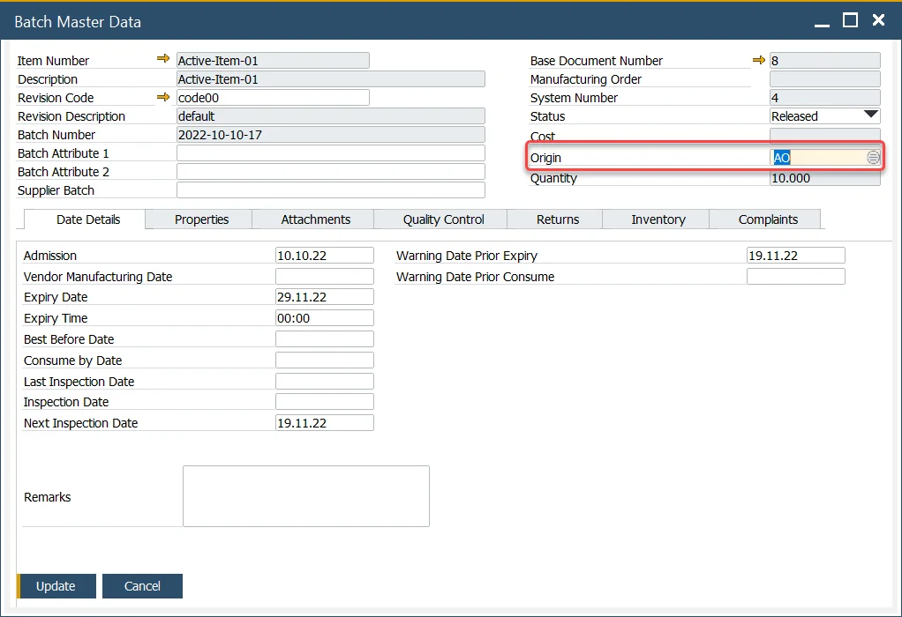
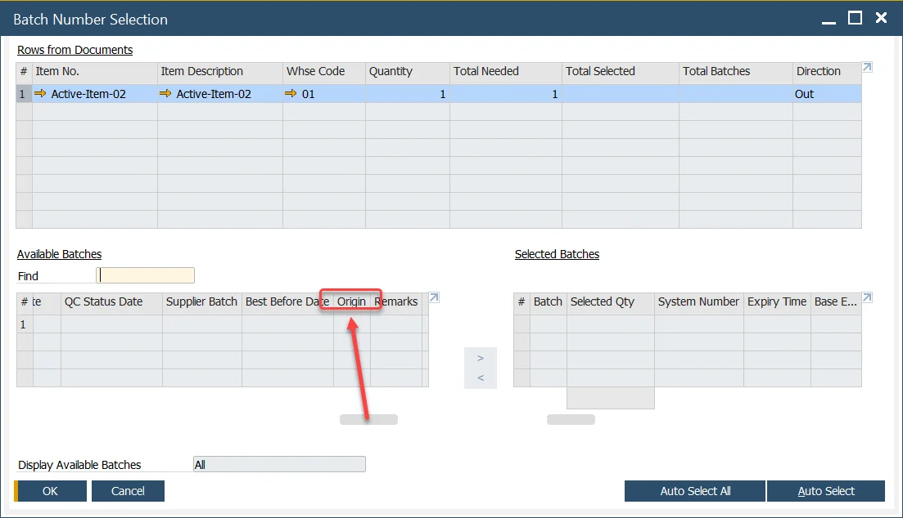

# Country of Origin

Country of Origin (COO) refers to the country where a product is manufactured, produced, or grown. This information plays a vital role in labeling (COOL - Country of Origin Labeling), traceability, and ingredient tracking for compliance with regulatory requirements and customer specifications.

To manage COO effectively, the associated master data is maintained within the Item Details form.

----

To access Origins tab, navigate to:

:::note Path
    Inventory → Item Details → Origins tab
:::

## Origins tab

In the Origins tab, users can:

- Assign a default country of origin.
- Define multiple alternative countries.
- Copy country-of-origin data from another item record.
- Clear existing country-of-origin entries.

## Batch Creation

During the Goods Receipt PO process, the default Country of Origin is automatically assigned to the batch/lot record. If needed, this can be modified to one of the alternative origins.

To change the Country of Origin during batch creation:

1. Select an Item line in the Goods Receipt PO form.
2. Right-click and choose Generate Batches.
3. In the Created Batches table, navigate to the Origin column.
4. The default country (as set in the Item Details form) is displayed.
5. Click the magnifier icon to view the list of alternative countries and select a different one if necessary.

## Batch Record

The Batch Master Data Header displays the assigned Country of Origin. If required, this can be updated to one of the alternative origins defined in the Item Details form.

## Batch Selection

When selecting a batch for processing or shipment, the Origin column is visible, ensuring accurate traceability and compliance.

----
