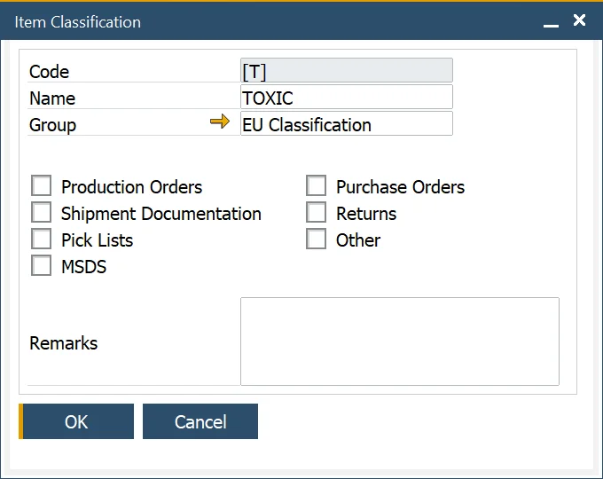
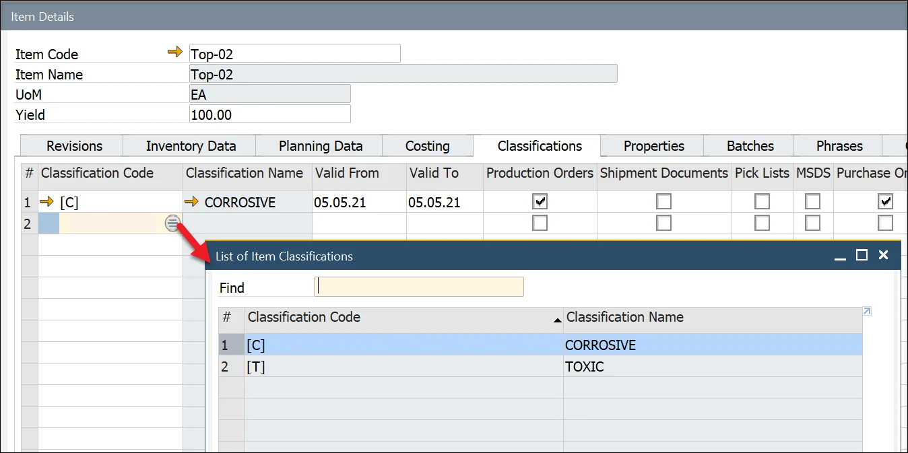

# Item Classifications

In inventory management, item classifications help categorize products based on specific attributes such as corrosive, toxic, or non-toxic. This feature enables better organization, compliance, and streamlined processes. Additionally, classifications can be grouped for enhanced management and reporting.

---

## Item Classifications

To access Item Classifications, navigate to:

:::note Path
    Administration → Setup → Item Details → Item Classification
:::

Item classifications allow users to define unique names and codes for categorizing items. Users can also specify which documents a classification applies to by selecting the corresponding checkbox.

## Item Classification Groups

To access Item Classification Groups, navigate to:

:::note Path
    Administration → Setup → Item Details → Item Classification Groups
:::

To further streamline inventory organization, users can group related classifications under Item Classification Groups. For example, regulatory frameworks like EU Classifications can be structured into predefined groups for easy reference.

## Item Classification Assigning

Once created, classification can be assigned to an item in the Item Details form, Classifications tab.

**Steps to Assign a Classification**:

1. Navigate to the second column.
2. Click the circle icon that appears in the field.
3. Choose the appropriate classification from the list.

Classifications can also be linked to specific document types by selecting the checkbox in the related column, ensuring seamless integration into various workflows.

---
