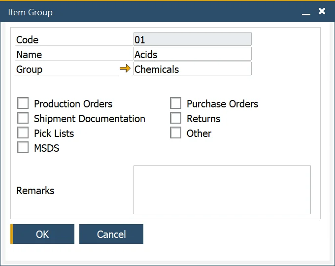
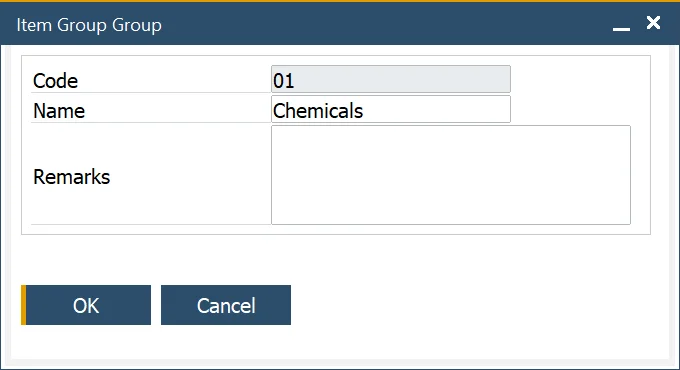
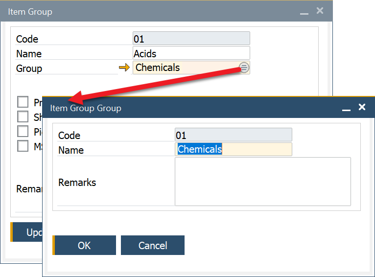

# Item Groups

Effective inventory management requires proper categorization of products to streamline reporting, analysis, and operational efficiency. Item Groups help classify similar products, such as acids, solvents, boxes, and bottles, while Item Group Groups provide a higher-level classification by grouping multiple item groups. This hierarchical structure improves organization and simplifies data management.

---

## Item Groups

The Item Group function allows users to categorize similar products for easier tracking and management.

To access Item Groups, navigate to:

:::note Path
    Administration → Setup → Item Details → Item Groups
:::

## Item Group Groups

To access Item Group Groups, navigate to:

:::note path
    Administration → Setup → Item Details → Item Group Groups
:::

For enhanced classification, Item Group Groups allow users to group multiple item groups under a broader category. This helps in structured reporting and analysis.

For example, an item may belong to the Boxes group while also being classified under Packaging at a higher level.

## Item Group Assigning

Once an Item Group is created, it can be assigned to an item in the Item Details form under the Groups tab.

**Steps to Assign an Item Group**:

1. Navigate to the second column.
2. Click the circle icon that appears in the field.
3. Select the appropriate Item Group.

## Item Group Group Assigning

An Item Group Group can be assigned to an Item Group to establish a structured classification hierarchy.

**Steps to Assign an Item Group Group**:

1. Click the Group field.
2. Select the Choose From List icon.
3. Choose the required Item Group Group.

