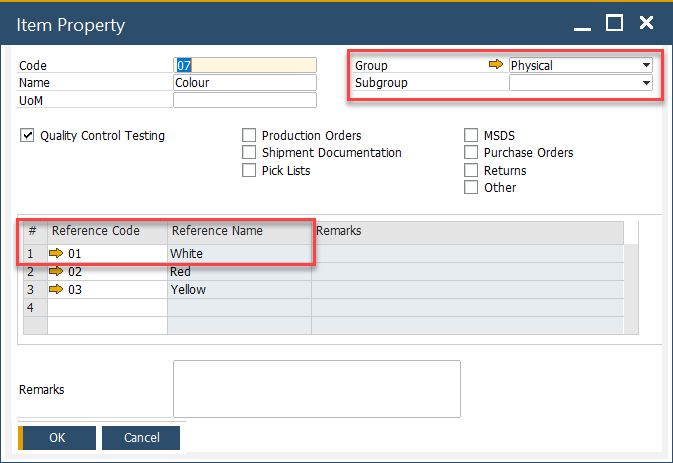
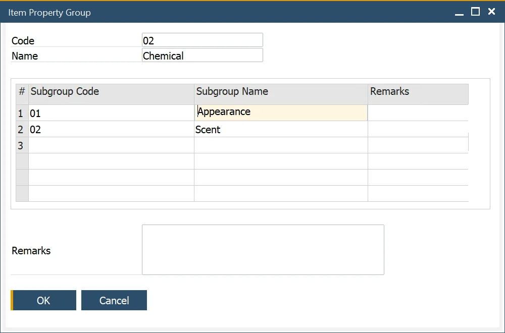
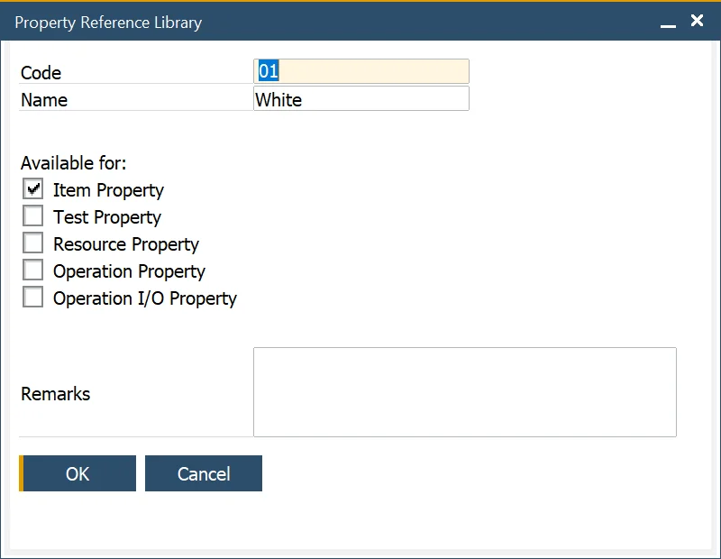
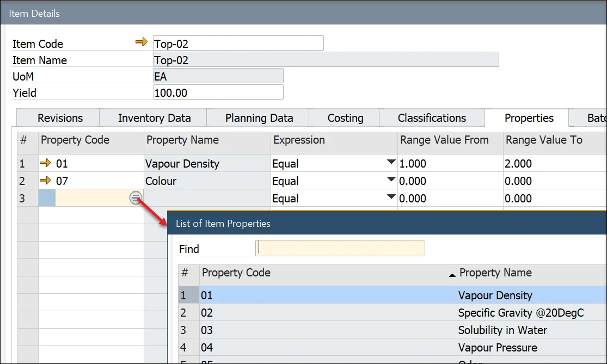

# Item Properties

Managing item properties effectively is crucial for ensuring consistency and accuracy in inventory management, quality control, and production processes. In SAP, item properties allow users to define specific characteristics - both physical and chemical - such as color, appearance, and scent. A list of valid values may also be defined from the reference library. For example, color has valid values of yellow, blue, red, and green. These properties help categorize items, improve traceability, and streamline operations.

This guide covers how to set up item properties, organize them into groups, reference valid values, and assign them to items and batches within SAP.

---

## Item Properties

To access Item Properties, navigate to:

:::note Path
    Administration → Setup → Item Details → Item Property
:::

## Item Property Groups

To access Item Property Groups, navigate to:

:::note Path
    Administration → Setup → Item Details → Item Property Groups
:::

Item properties can be categorized into groups and subgroups for better organization. For example, a "Chemical Properties" group may contain subgroups like "Appearance" and "Scent." Each group and subgroup can be defined with a name, code, and remarks.

For example, chemical properties can be divided into properties related to appearance or scent.

## Property Reference Library

To access Property Reference Library, navigate to:

:::note Path
    Administration → Setup → Item Details → Property Reference Library
:::

To ensure standardization, a Property Reference Library can be created. This library contains valid values that can be used across different property types, such as those related to items, resources, operations, and operation inputs and outputs.

## Property Assigning

### Item Details

Once item properties are created, they can be assigned to specific items in the Item Details form under the Properties tab. By clicking a second column and then a circle displayed within a field, a property can be chosen:

A chosen item group can be assigned to a specific type of document by checking a proper check-box:

### Batch Master Data

To access Batch Master Data, navigate to:

:::note Path
    Inventory → Item Management → Batches → Batch Master Data
:::

Item properties can also be assigned to specific batches of a product, ensuring batch-level tracking of key attributes.

---
