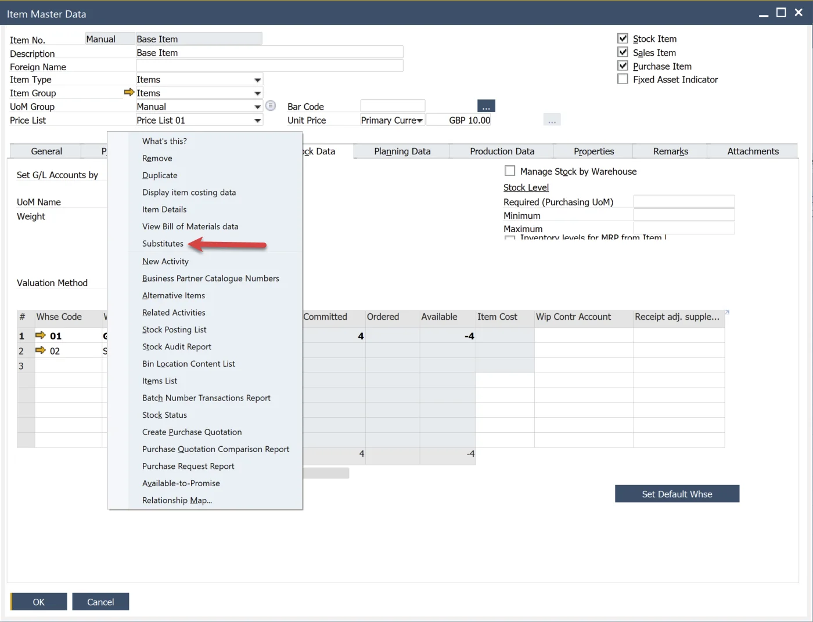

# Item Substitutes

Item substitution is a crucial feature in inventory management, allowing businesses to maintain seamless operations even when specific items are unavailable. By defining substitutes, organizations can ensure that production and order fulfillment processes continue without disruption. This guide provides a detailed overview of how to configure and manage item substitutes within the system.

---

## Overview

To access Substitutes, navigate to:

:::note Path
    Main Menu → Inventory → Substitutes
:::

Item substitutes allow for the assignment of a replacement for any item. If a specific item is unavailable in warehouses, it can be replaced on a Pick Order by a predefined substitute.

The following settings can be configured for a substitute:

**Upper table: Item's revisions and their substitutes**:

- Item Revision
- Substitute Code
- Substitute Name
- Substitute Revision
- For all Bill of Materials (1)
- Valid From; Valid To – time range of a Substitute validity
- Ratio – value expressed in decimal setting a ratio of replacement, e.g.:
  - 1.00 = 100%,
  - 0.5 = 50%,
  - 1.50 = 150%.
- Replace with Items/Coproducts/Scraps – determines whether a specific Substitute Item can be used to replace Items/Coproducts/Scraps

By default, a substitute is available for all BOMs where the substituted item or revision is used. The checkbox For all Bill of Materials (1) is selected by default.

Suppose you want to exclude substitution for a specific Bill of Materials or use different parameters than in the upper table only for a specific Bill of Materials. In that case, exclude substitution for a particular Bill of Materials or use other parameters than in the upper table only for specific Bill of Materials; it is possible in the bottom one – List of Bill of Materials where the substitution is excluded or parameters are changed.

1. Unselect checkbox (1).
2. Choose a Bill of Material from the list (2) – appears list with all BOMs where the substituted Item is used.
3. To exclude substitution for the Bill of Material, select the checkbox Disable Substitution.
4. To use different substitution parameters for selected Bill of Material, leave the checkbox (3) not selected.

## Item Master Data

Substitutes can be accessed from the Item Master Data context menu:

## Bill of Materials

To edit substitutes for a Bill of Material, right-click on the first column of a selected item and choose Edit Substitutes:

## Manufacturing Order

There are two options available from the Manufacturing Order context menu. Right-click on a selected item's first column and choose "Substitutes":

- **Edit Substitutes**: functions similarly to the BOM substitute editing option.
- **Substitute Report**: displays available quantities of substitutes.

### Substitute Report

Please note that the following Substitutes are not listed in the Report:

- Substitutes out of stock for a given Warehouse,
- Substitutes invalid for a current day,
- Substitutes not defined for a given Warehouse,
- Substitutes excluded from a _BOM \_used for creating a \_Manufacturing Order_.

## Usage

A specific item can be substituted in a Pick Order by selecting Choose From List:

  

---
