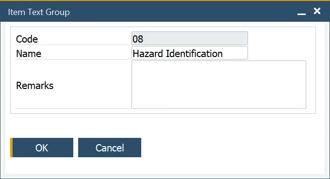
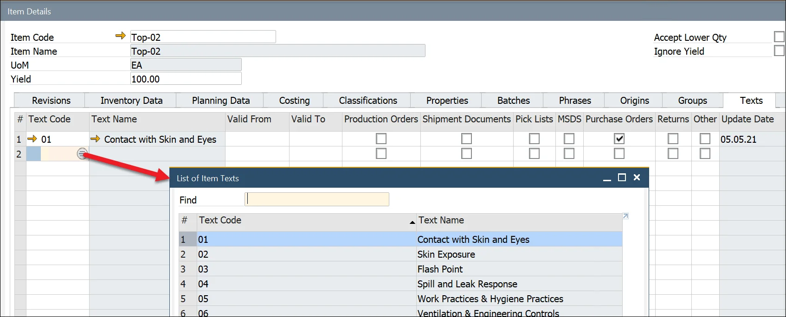

# Item Texts

In inventory and compliance management, Item Texts help standardize descriptions and instructions for various products. These texts can include hazard instructions, safety guidelines, and cleaning procedures in case of spills or accidents. Users can also specify which documents should display specific Item Texts by selecting the appropriate checkbox.

---

## Item Texts

To access Item Texts, navigate to:

:::note Path
    Administration → Setup → Item Details → Item Texts
:::

## Item Text Groups

To access Item Text Groups, navigate to:

:::note Path
    Administration → Setup → Item Details → Item Text Groups
:::

The Item Text Group function allows the user to define an Item Text Group, which is used to group similar item texts. This makes it easier to apply and categorize standardized information.

## Item Text Assigning

Once an Item Text is created, it can be assigned to an item in the Item Details form under the Texts tab.

**Steps to Assign an Item Text**:

1. Navigate to the second column.
2. Click the Choose From List icon.
3. Select the required Item Text.

Users can also specify which documents should include the selected Item Text by checking the corresponding checkbox in the relevant column.

---
