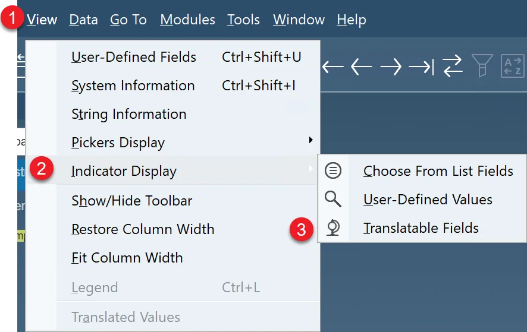
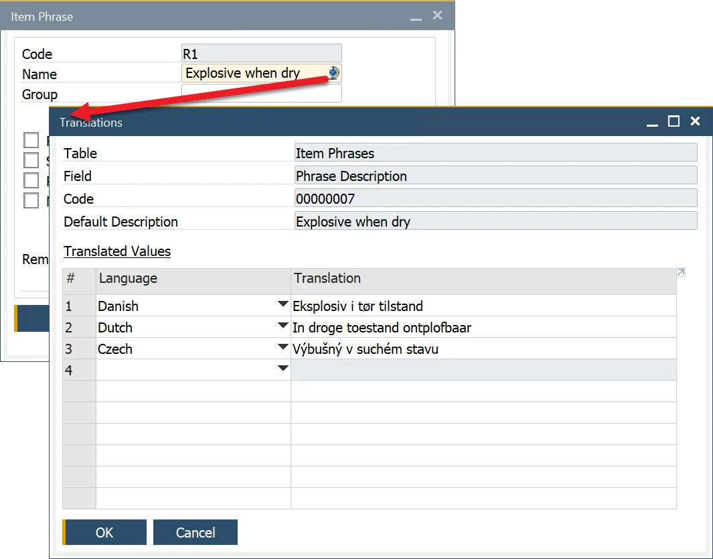

# MSDS, Labels and Documentation

## Compliance Data

In industries that manufacture and distribute products locally and internationally, compliance with safety regulations is crucial. Companies must provide essential documentation, such as Material Safety Data Sheets (MSDS), in the required languages to support shipping and regulatory requirements.

By utilizing the following forms, users can configure MSDS master data:

- Classification
- Phrases
- Texts
- Groups
- Properties.

---

## Configuration

:::note Path
    Administration → System Initialization → Company Details → Basic Initialization Tab
:::

To ensure documentation is available in multiple languages, follow these steps:

1. Check the Multi-Language Support checkbox:

    

2. Navigate to the upper menu → Within View → Indicator Display, select Translatable Fields:

## Example

The Phrases form allows users to define regulatory phrases, such as those from EU Safety and Risk Phrases. While the code remains the same across countries, translations ensure accurate documentation in different languages. Data source: [Chemical Risk & Safety Phrases](http://schoolscout24.de/cgi-bin/rsp/rspinput.cgi).

*Czech* **R1** Výbušný v suchém stavu.

*Dansk* **R1** Eksplosiv i tør tilstand.

*Dutch* **R1** In droge toestand ontplofbaar.

---
