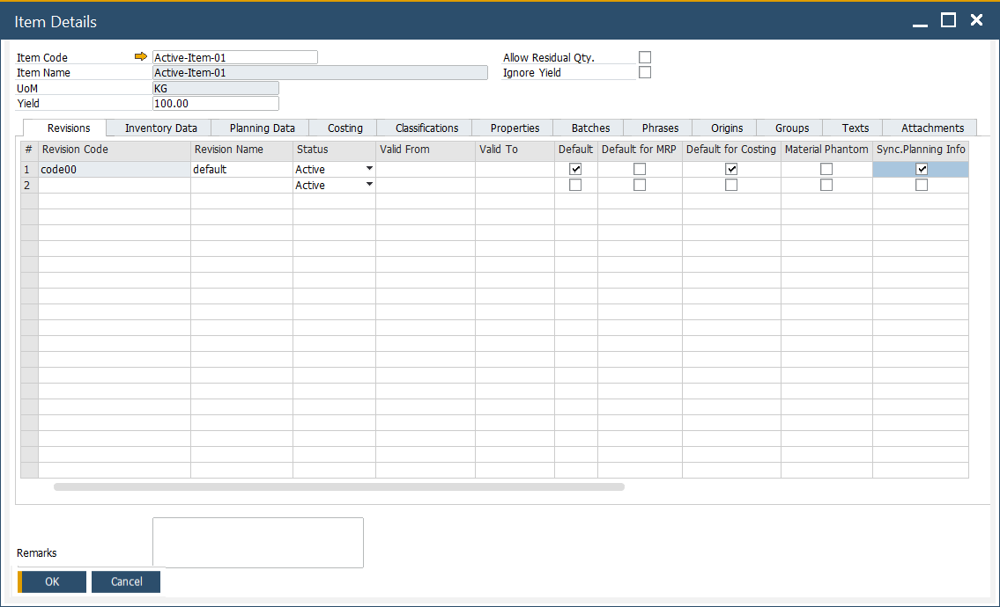
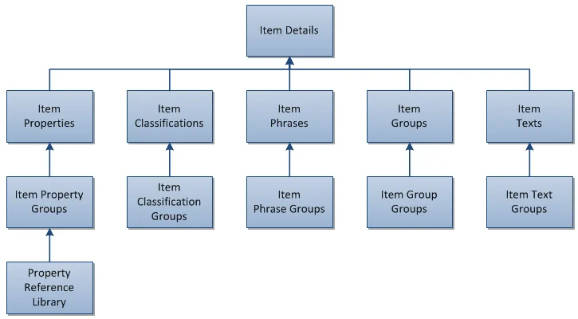
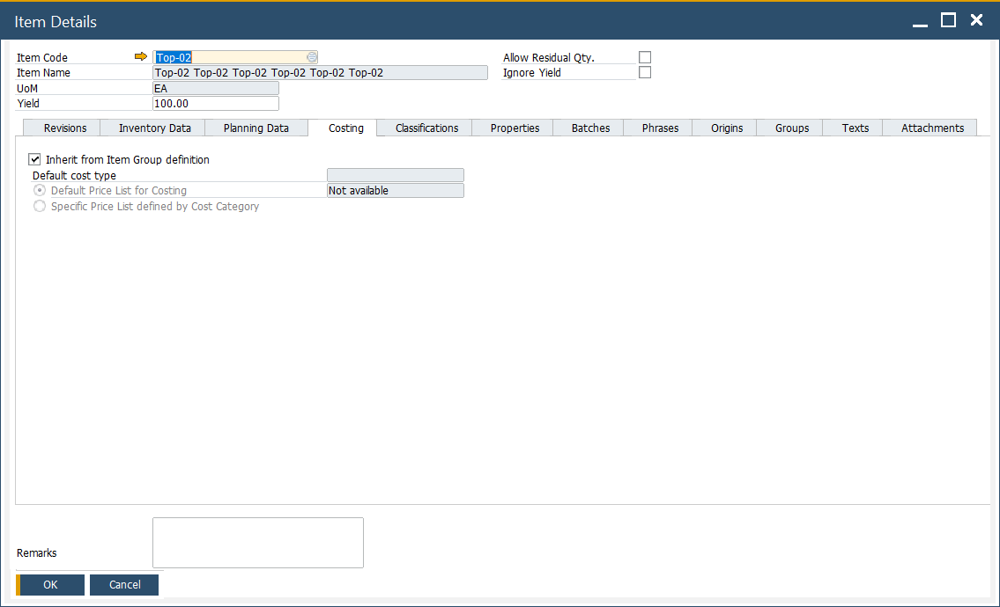
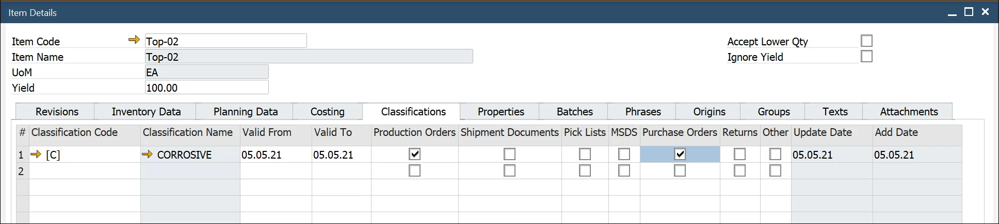
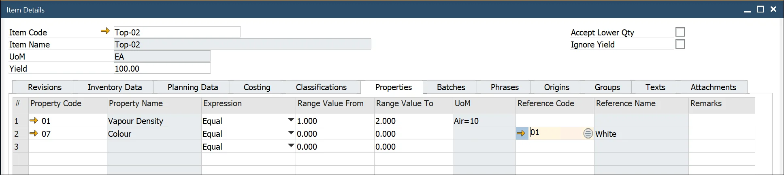
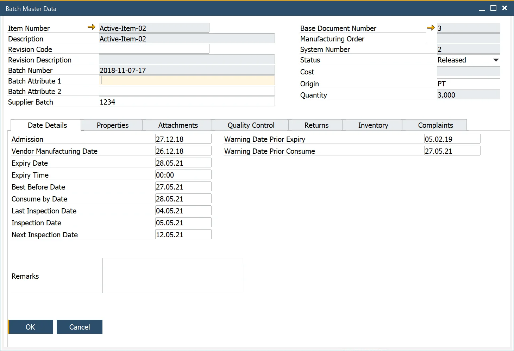
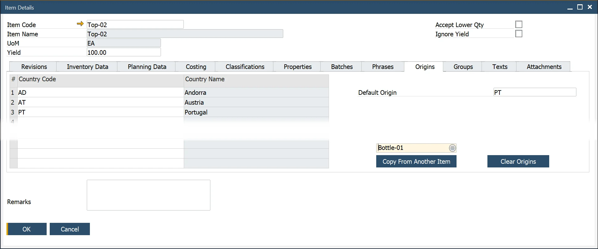

# Overview

The Item Details form is used to define and manage the product master data associated with an item. CompuTec ProcessForce allows for an extended and detailed product definition, making item-related activities more efficient, such as ingredient and allergen declarations, batch tracking, and file attachments.

An Item Details record is automatically created when an Item Master Data entry is generated. However, if an Item Master Data was created before installing CompuTec ProcessForce, a restore procedure must be performed to link the Item Details with the Item Master Data.

➡️ Learn about [data restore](../system-initialization/data-restore).

To access Item Details, navigate to:

:::note Path
    Inventory → Item Details
:::

---

## Introduction

The Item Details form defines the master data associated with an item. These data elements include the following:

- **Revisions**: Define valid from/to dates for item versions.
- **Inventory Data**: Stores inventory-related configurations such as warehouse info, reorder levels, and bin locations.
- **Planning Data**: Includes settings for production planning, lead times, and procurement methods.
- **Costing**: Used to define costing methods (Standard, Moving Average, FIFO, etc.) and set up cost elements or price lists.
- **Classifications**: Helps categorize products, for example, toxic, non-toxic, hazard and non-hazard.
- **Properties**: Define properties, for example, physical, chemical definitions, and nutritional details.
- **Batches**: Contains batch-related configuration – important for industries that track product lots for compliance or quality.
- **Phrases**: Include safety and hazard phrases for MSDS., covering, for example, safety, hazard, and clean-up.
- **Origins**: May indicate item origin, supplier info, or traceability details (e.g., country of origin).
- **Groups**: Group similar products together, for example, acids and solvents.
- **Texts**: Add text/define, for example, hazard instructions, safety text, and cleaning information in case of a product spillage.
- **Attachments**: Links essential documents such as MSDS, work instructions, safety sheets, and production videos.

*To view video content to set these up, please refer to the following topics:*

- [Revision Control](https://www.youtube.com/watch?v=VyQuaG6O_pc&amp;index=5)
- [Sales to Manufacturing Order](https://www.youtube.com/watch?v=OKbj2r9jC3s)
- [Batch Configuration](https://www.youtube.com/playlist?list=PLtT6kgaz5YnfAO8B4ux_lXkmQyHmPCuR-)
- [MSDS - Properties, Classifications Phrases, Groups, Text](https://www.youtube.com/playlist?list=PLtT6kgaz5YncNO9ZDZissERE9sJdjRKsm)

---

## Header

The header contains key fields such as Item Code, Item Name, UoM, Yield, and the following checkboxes:

- **Allow Residual Qty**: If enabled and backflush is active, manufacturing orders will allow issuing less quantity without error. The shortfall will be issued in the next available posting.

    ➡️ Related Settings: [Issue Residual Quantity on the following Goods Receipt when possible](/docs/processforce/user-guide/system-initialization/general-settings/inventory-tab/)

- **Ignore Yield**: For more details, refer to [Yield Master Data](/docs/processforce/user-guide/item-details/yield-master-data/) to find out more.

---

## Key Settings

Below is a detailed breakdown of the key settings available in this tab.

## Revisions

The Revisions form enables users to define and track the revisions of an item throughout its lifecycle.

Revisions help document changes in a product's structure within a Bill of Materials (BOM), allowing variations in product design for the same item.

Revisions can be applied to the following documents:

- Sales Orders
- Manufacturing Orders
- Test Protocols and Quality Control Tests
- Complaints
- Item Costing
- Additional Batch Details

Revisions are not visible within Inventory.

**Revisions Overview**

Each Revision in CompuTec ProcessForce has a status that reflects its current lifecycle stage. These statuses, defined on the Item Details form, allow for effective control and management of each Revision within the system. The available Revision Statuses include:

| Status | Description |
| --- | --- |
| Active (ACT) | Fully operational; can be used across all functions and documents. |
| Being Phased Out (OUT) | Cannot be used in new BOMs or sales/purchase documents. Still available for inventory transactions. |
| Engineering (ENG) | Under testing/development. Limited to internal inventory use. |
| Obsolete (OBS) | Retired Revisions that are no longer in active use. |

Click here to find out more

According to the Revision Status, specific restrictions are applied as outlined below:
1. Active (ACT)

    Restrictions: None. 
    
    Revisions marked as Active are fully usable across all system functions.
2. Being Phased Out (OUT)

    Restrictions:
    - As Header in Bill of Materials (BOM): New BOMs cannot be created with this Revision.
    - As Component in BOM: Cannot be selected in BOM through the Choose From List (CFL) option.
    - Globally: Not available for use in sales and purchase documents. However, this status is available for Goods Issue, Goods Receipt, and Inventory Transfer documents.
3. Engineering (ENG)

    Restrictions: Similar to the "Being Phased Out" status:
    - Not available for use in sales and purchase documents.
    - Available for Goods Issue, Goods Receipt, and Inventory Transfer documents.
4. Obsolete (OBS)

    Restrictions:
    - Setting the Status:
        - The “Obsolete” status can only be applied if there are no active Manufacturing Orders (MORs) for the Revision.
        - The “Obsolete” status cannot be applied if the Revision is a component in an open Manufacturing Order or exists in a BOM with an Active, Being Phased Out, or Engineering status.
    - In BOMs and MORs:
        - Cannot add or update BOMs that include this Revision, either as final goods, components, coproducts, or scrap.
        - Cannot create or select an MOR if the Revision is used in either the Header or as a component.
        - Documents: The "Obsolete" status restricts the use of this Revision across all documents, except in some reports.

### Default

When multiple Revisions exist for an Item, one must be marked as "Default." This default Revision will automatically populate all Revision fields in documents where the related Item is added.

### Default for MRP

The "Default for MRP" field is set within the Bill of Materials form to designate the primary Revision used for MRP planning.

If the "Default for MRP" field is grayed out, ensure that a Bill of Materials exists for the required Item Code and Revision. Then, reload the Item Details form.

CompuTec ProcessForce Revisions follow the same behavior as SAP:

- if both dates are empty – revision is valid all the time,
- if Valid From date is set up – revision is valid from this data,
- if Valid To date is set up – revision is valid to this date,
- if both dates are set up – revision is valid between these dates.

Revisions can have one of four statuses:

- **Active**: Revision is set and ready to work with
- **Being Phased Out**: Is being prepared and is not ready to be used
- **Engineering**: Is ready but waiting to be accepted
- **Obsolete**: Is not in use anymore

### Default for Costing

This setting applies only to items using the Standard Valuation method and is specifically used during Cost Roll-Over.

When Cost Roll-Over is executed for such an item, and the selected Revision has the 'Default for Costing' checkbox enabled, an [Inventory Revaluation](http://localhost:3000/docs/processforce/user-guide/costing-material-and-resources/cost-categories#inventory-revaluation--standard-costing/) document is automatically created if there’s a change in item cost.

In this case, the Inventory Item Cost is synchronized with the Item Costing of the selected Revision. If the Revision includes multiple Routings, the system uses the one marked as "Roll-up default" in the Production Process for the synchronization.

If there’s a difference between the current Inventory Item Cost and the cost defined in the “Default for Costing” Revision and its Roll-up default Routing, an Inventory Revaluation document will be generated during the roll-over process under category 000.

Alternatively, if an Inventory Revaluation document is created manually, the new cost is applied to the corresponding Revision and Routing.

### Material Phantom

Material Phantom is used to control how an item behaves in the Bill of Materials (BOM), specifically during the explosion of components in production and planning processes.

➡️ Learn more about [Material Phantom](../formulations-and-bill-of-materials/bill-of-materials/multi-level-bill-of-materials/phantom-item.md) in detail.

### Sync. Planning Info

The Sync. Planning Info ensures MRP and costing synchronization with the selected revision. This aligns planning operations with the intended item version.

---

## Planning Data

This tab is primarily used for configuring how the item is planned and procured in the manufacturing and material requirements planning (MRP) processes.

- **Revision Code / Name**: Indicates the item revision configuration being used. Revisions allow for version control of items, such as updated BOMs or production parameters.
- **Planning Method**: Defines how the item is planned. Example: MRP (Material Requirements Planning) indicates automated planning based on demand and supply.
- **Procurement Method**: Specifies whether the item is:
        - **Make** – to be manufactured internally.
        - **Buy** – to be purchased externally.
- **Component Warehouse**: Determines where components will be sourced from. Example: From Bill of Materials Line means the warehouse is defined at the BOM level.
- **Order Interval**: Specifies the frequency of ordering or production runs (e.g., daily, weekly). Helps avoid overproduction or frequent small batches.
- **Order Multiple**: Orders must be placed in multiples of this quantity. Useful in bulk or batch production.
- **Lead Time**: The number of calendar days required to procure or manufacture the item.
- **Tolerance Days**: Buffer days added to the lead time to account for possible delays.
- **Internal Lead Time**: Time required for internal processing before the item is ready (e.g., quality checks, internal transport).
- **Minimum/Maximum Order Quantity**: Controls the quantity constraints for production or procurement, helping to optimize batch sizes and storage.
- **Internal Lead Time Scope**: Defines whether the internal lead time applies to Purchase, Production, or both (Purch./Prod.).

## Costing

This tab is used to define the default costing parameters for the selected item. Costing settings are crucial for determining how the system calculates and records costs related to inventory, production, and procurement processes.

- **Inherit from Item Group definition**: When checked, the system will automatically inherit the costing settings from the item group to which the item belongs. This simplifies setup by ensuring consistency across similar items.
- **Default cost type**: Allows users to define how the system should determine the item's cost:
        - **Default Price List for Costing**: Uses a standard price list for costing calculations. In this image, it's marked as "Not available," indicating it might not be defined or accessible at the moment.
        - **Specific Price List defined by Cost Category**: This option lets users choose a cost category-specific price list for more granular control. It's currently disabled (greyed out), likely due to the inheritance setting being enabled.
- **Remarks**: A free-text area at the bottom of the screen, allowing users to enter notes or comments related to the costing setup of the item.

## Classifications

The yellow arrow navigates to:

:::info Path
Administration → Setup → Item Details → Item Classifications
:::

This form allows users to add and delete classification codes for the item master. Classifications categorize products (e.g., toxic or non-toxic). By selecting the required checkbox, classifications can be linked to specific document types.

## Properties

The yellow arrow navigates to:

:::info Path
    - Administration → Setup → Item Details → Item Property Groups
    - Administration → Setup → Item Details → Property Reference Library
:::

This form enables users to add and remove properties for the item master. Properties define the physical and chemical characteristics of an item.

Users can select from multiple expressions to record values, such as specific values or a range (from/to), depending on the selected expression.

## Batch Details

The yellow arrow navigates to:

:::info Path
    - Administration → Setup → Inventory → Batch Template Definition
    - Administration → Setup → Inventory → Serial Template Definition
:::

This form allows the user to choose [a batch or serial template for an item](/docs/processforce/user-guide/item-details/batch-serial-template-definition/). Templates can be selected manually from the available list or inherited from the assigned Item Group.

Additionally, users can also define the [expiry date or consume by date (or inherit from the item group)](/docs/processforce/user-guide/inventory/batch-control/batch-control-settings/extended-batch-expiry-evaluation/). When such a date is set, a warning period (in days) can also be specified. This warning period is used in alert queries to notify users about batches nearing expiry.

During batch creation, the expiry date is automatically calculated based on the shelf life interval.

Within the Batches tab of the Item Details form, users can configure the Batch Queue Type and set Default Batch / Quality Control Status for SAP and CompuTec ProcessForce receipt documents.

The Inspection Date is also auto-calculated and displayed in the Batch Master Data form, as shown below.

➡️ To get more information on this subject, click [here](https://learn.computec.one/docs/processforce/user-guide/quality-control/quality-control-test/creating-qc-test-from-batch-record)

## Phrases

The yellow arrow navigates to:

:::info Path
Administration → Setup → Item Details → Item Phrases
:::

Item Phrases refer to [safety or risk phrases](#phrases) used to generate a Material Safety Data Sheet. By selecting the required checkbox, phrases can be linked to specific documents.

## Origins

The Country of Origin refers to the country where a product is manufactured, produced, or grown. This information is critical for Country of Origin Labeling (COOL), traceability, and determining specific ingredients in a customer’s rec

➡️ Learn more about [Country of Origin](/docs/processforce/user-guide/item-details/country-of-origin).

## Groups

The yellow arrow navigates to:

:::info Path
Administration → Setup → Item Details → Item Groups
:::

This form allows users to add and delete groups for the item master. [Group](item-groups.md) describes similar products, e.g., acids.  By selecting the required checkbox, groups can be linked to specific documents.

## Texts

The yellow arrow navigates to:

:::info Path
Administration → Setup → Item Details → Item Texts
:::

This form allows the user to add and delete [item text](item-texts.md) for the item master. Users can add any text, such as hazard instructions or safety texts. Texts can be linked to specific documents by selecting the required checkbox.

## Attachments

Use this form to upload essential documents such as MSDS, SOPs, safety sheets, production videos, etc. Works similarly to SAP Business One's attachment function.

---
