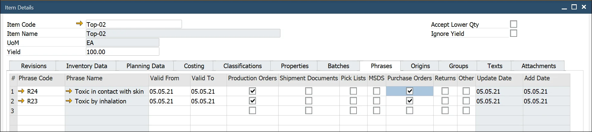
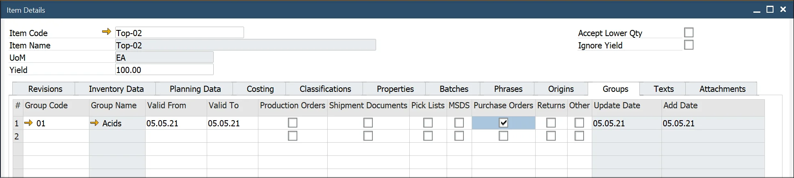
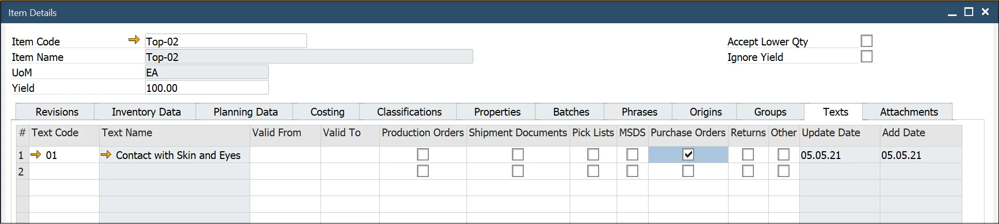

# Overview

The Item Details form is used to define and manage the product master data associated with an item. ProcessForce allows for an extended and detailed product definition, making item-related activities more efficient, such as ingredient and allergen declarations, batch tracking, and file attachments.

An Item Details record is automatically created when an Item Master Data entry is generated. However, if an Item Master Data was created before installing ProcessForce, a restore procedure must be performed to link the Item Details with the Item Master Data. You can find the restore procedure [here](../system-initialization/data-restore).

:::note Path
    Inventory → Item Details
:::

## Introduction

The Item Details form defines the master data associated with an item. These data elements include the following:

- Revisions: to define valid to and from dates
- Batch Details: to choose a batch template or serial template and define expiry/consume date and shelf life/inspection interval
- Properties: to define properties, for example, physical, chemical definitions, and nutritional details
- Classification: to categorize products, for example, toxic, non-toxic, hazard and non-hazard
- Phrases: to define, for example, EU phrases as part of MSDS, covering, for example, safety, hazard, and clean-up
- Groups: to group similar products together, for example, acids and solvents
- Text: to define, for example, hazard instructions, safety text, and cleaning information in case of a product spillage
- Item Property Reference Library: defines acceptable values for a property (e.g., color options: white, black, blue).
- Attachments: links essential documents such as MSDS, work instructions, safety sheets, and production videos.

All the above forms, except the Item Reference Library, contain tick boxes for production orders, shipment documentation, pick lists, MSDS, purchase orders, returns, and others.

These relationships not only document within the system where these data elements are intended to be used but also can be used as a reference when building reports and documents.

*To view video content to set these up, please see the following topics:*

- [Revision Control](https://www.youtube.com/watch?v=VyQuaG6O_pc&amp;index=5)
- [Sales to Manufacturing Order](https://www.youtube.com/watch?v=OKbj2r9jC3s)
- [Batch Configuration](https://www.youtube.com/playlist?list=PLtT6kgaz5YnfAO8B4ux_lXkmQyHmPCuR-)
- [MSDS - Properties, Classifications Phrases, Groups, Text](https://www.youtube.com/playlist?list=PLtT6kgaz5YncNO9ZDZissERE9sJdjRKsm)

## Header

In the header, you can find the Item Code, Item Name, Unit of Measurement, and Yield fields, along with two checkboxes:

**Accept Lower Qty** – if it is checked on Manufacturing Order Items and this Item has issue type set to backflush, and there are not enough Items on stock, it will issue less than required without any error. On the next issue, the system will issue all previously missing quantities if there is enough in stock.

Please also check the following option to use it: [Issue Residual Quantity on the following Goods Receipt when possible](/docs/processforce/user-guide/system-initialization/general-settings/inventory-tab/)

**Ignore Yield** – click [here](/docs/processforce/user-guide/item-details/yield-master-data/) to find out more.

## Revisions

The Revisions form enables users to define and track the revisions of an item throughout its lifecycle.

Revisions help document changes in a product's structure within a Bill of Materials (BOM), allowing variations in product design for the same item.

Revisions can be applied to the following documents:

- Sales Orders
- Manufacturing Orders
- Test Protocols and Quality Control Tests
- Complaints
- Item Costing
- Additional Batch Details

Revisions are not visible within Inventory.

### Revisions Overview

Each Revision in CompuTec ProcessForce has a status that reflects its current lifecycle stage. These statuses, defined on the Item Details form, allow for effective control and management of each Revision within the system. The available Revision Statuses include:

- Active (ACT): Revisions that are fully operational and available for use in Manufacturing Orders.
- Being Phased Out (OUT): Revisions that are in the process of being phased out and will soon become obsolete.
- Engineering (ENG): Revisions undergoing refinement and testing.
- Obsolete (OBS): Retired Revisions that are no longer in active use.

:::note
The validations and restrictions outlined below are applicable starting from **CompuTec ProcessForce version 10.0 R26**. Please ensure your system is updated to R26 or later to access these features, as earlier versions may not support these functionalities.
:::

Click here to find out more

According to the Revision Status, specific restrictions are applied as outlined below:
1. Active (ACT)

    Restrictions: None. 
    
    Revisions marked as Active are fully usable across all system functions.
2. Being Phased Out (OUT)

    Restrictions:
    - As Header in Bill of Materials (BOM): New BOMs cannot be created with this Revision.
    - As Component in BOM: Cannot be selected in BOM through the Choose From List (CFL) option.
    - Globally: Not available for use in sales and purchase documents. However, this status is available for Goods Issue, Goods Receipt, and Inventory Transfer documents.
3. Engineering (ENG)

    Restrictions: Similar to the "Being Phased Out" status:
    - Not available for use in sales and purchase documents.
    - Available for Goods Issue, Goods Receipt, and Inventory Transfer documents.
4. Obsolete (OBS)

    Restrictions:
    - Setting the Status:
        - The “Obsolete” status can only be applied if there are no active Manufacturing Orders (MORs) for the Revision.
        - The “Obsolete” status cannot be applied if the Revision is a component in an open Manufacturing Order or exists in a BOM with an Active, Being Phased Out, or Engineering status.
    - In BOMs and MORs:
        - Cannot add or update BOMs that include this Revision, either as final goods, components, coproducts, or scrap.
        - Cannot create or select an MOR if the Revision is used in either the Header or as a component.
        - Documents: The "Obsolete" status restricts the use of this Revision across all documents, except in some reports.

### Default

When multiple Revisions exist for an Item, one must be marked as "Default." This default Revision will automatically populate all Revision fields in documents where the related Item is added.

### Default for MRP

The "Default for MRP" field is set within the Bill of Materials form to designate the primary Revision used for MRP planning.

If the "Default for MRP" field is grayed out, ensure that a Bill of Materials exists for the required Item Code and Revision. Then, reload the Item Details form.

ProcessForce Revisions follow the same behavior as SAP:

- if both dates are empty – revision is valid all the time,
- if Valid From date is set up – revision is valid from this data,
- if Valid To date is set up – revision is valid to this date,
- if both dates are set up – revision is valid between these dates.

Revisions can have one of four statuses:

- Active – revision is set and ready to work with
- Being Phased Out – is being prepared and is not ready to be used
- Engineering – is ready but waiting to be accepted
- Obsolete – is not in use anymore

### Default for Costing

This setting is relevant only for Items with the Standard Valuation method and is used for Cost Roll-Over. When you perform Cost Roll-Over on an Item with the Standard Valuation method on Revision that has the 'Default for Costing' checkbox checked, [Inventory Revaluation](http://localhost:3000/docs/processforce/user-guide/costing-material-and-resources/cost-categories#inventory-revaluation--standard-costing/) is created on a price change.

For these items, the Inventory Item Cost is automatically synchronized with the Item Costing of the selected Revision. If multiple Routings exist for this Revision, the Routing marked as "Roll-up default" in the Production Process will be used for synchronization.

Suppose the Inventory Item Cost differs from the one in the "Default for Costing" Revision and "Roll-up default" Routing. In that case, the Inventory Revaluation document will be created during Roll-over to category 000.

On the other hand,  if an Inventory Revaluation document is manually created, the new Item Cost will be updated accordingly for the specified Revision and Routing.

## Batch Details

The yellow arrow navigates to:

- Administration → Setup → Inventory → Batch Template Definition
- Administration → Setup → Inventory → Serial Template Definition

This form allows the user to choose [a batch or serial template for an item](/docs/processforce/user-guide/item-details/batch-serial-template-definition/). Users can select a template from the list or inherit it from the Item Group.

The user can also define the [expiry date or consume by date (or inherit from the item group)](/docs/processforce/user-guide/inventory/batch-control/batch-control-settings/extended-batch-expiry-evaluation/). If an expiry or consume-by date is set, a warning period (in days) can be specified. This warning data is used within an alert query to notify users of batches approaching their expiry date.

When creating a batch record, the expiry date is auto-calculated based on the shelf life interval.

Batch Queue Type and Default Batch / Quality Control Status for SAP / ProcessForce Receipt Documents options are available to set in the Batches tab in the Item Details form. Default batch and quality control status can be set for SAP Business One and ProcessForce receipt documents.

The Inspection date is also auto-calculated for the batch and is displayed within the Batch Master Data form (see below).

To get more information on this subject, click [here](/docs/processforce/user-guide/quality-control/quality-control-test/creating-qc-test-from-batch/).

## Properties

The yellow arrow navigates to:

- Administration → Setup → Item Details → Item Property Groups
- Administration → Setup → Item Details → Property Reference Library

This form enables users to add and remove properties for the item master. Properties define the physical and chemical characteristics of an item.

Users can select from multiple expressions to record values, such as specific values or a range (from/to), depending on the selected expression.

## Classifications

The yellow arrow navigates to:

- Administration → Setup → Item Details → Item Classifications

This form allows users to add and delete classification codes for the item master. Classifications categorize products (e.g., toxic or non-toxic). By selecting the required checkbox, classifications can be linked to specific document types.

## Phrases

The yellow arrow navigates to:

- Administration → Setup → Item Details → Item Phrases

Item Phrases refer to [safety or risk phrases](#phrases) used to generate a Material Safety Data Sheet. By selecting the required checkbox, phrases can be linked to specific documents.

## Origins

The Country of Origin refers to the country where a product is manufactured, produced, or grown. This information is critical for Country of Origin Labeling (COOL), traceability, and determining specific ingredients in a customer’s rec

Click [here](/docs/processforce/user-guide/item-details/country-of-origin) to find out more.

## Groups

The yellow arrow navigates to:

- Administration → Setup → Item Details → Item Groups

This form allows users to add and delete groups for the item master. [Group](item-groups.md) describes similar products, e.g., acids.  By selecting the required checkbox, groups can be linked to specific documents.

## Texts

The yellow arrow navigates to:

- Administration → Setup → Item Details → Item Texts

This form allows the user to add and delete [item text](item-texts.md) for the item master. Users can add any text, such as hazard instructions or safety texts. Texts can be linked to specific documents by selecting the required checkbox.

## Attachments

This form enables users to attach documents to the item master.

Attachments function similarly to those in SAP Business One.

---
