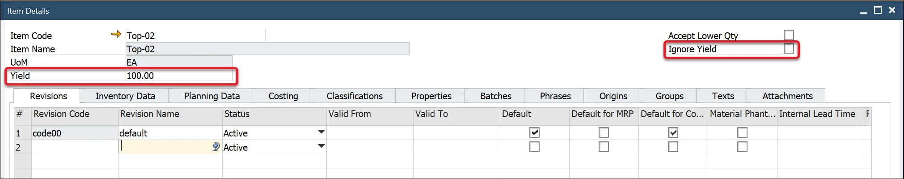
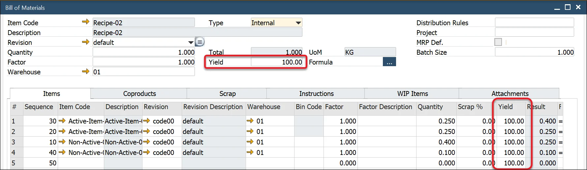

# Yield Master Data

Managing Yield Percentage is crucial in production planning and material management. Yield represents the expected output from a manufacturing process, helping businesses optimize material usage and reduce waste.

In the Item Details form, users can define a default Planned Yield Percentage for each item. This value is initially set to 0.00% when a new item record is created. If the Yield Percentage is not required for a Bill of Materials (BOM), users can select the Ignore Yield checkbox to bypass yield calculations.

If the item is a Parent Item, its Yield Percentage is automatically copied to the BOM Header. Additionally, when the item is added to the Items, Coproducts, and Scrap tab, its Yield Percentage is populated in the corresponding table.

- If Ignore Yield is checked, the system will set the yield to 100% for all materials in the BOM.
- Yield values remain editable, allowing users to adjust them as necessary.

---
