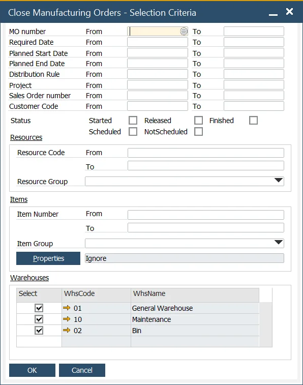
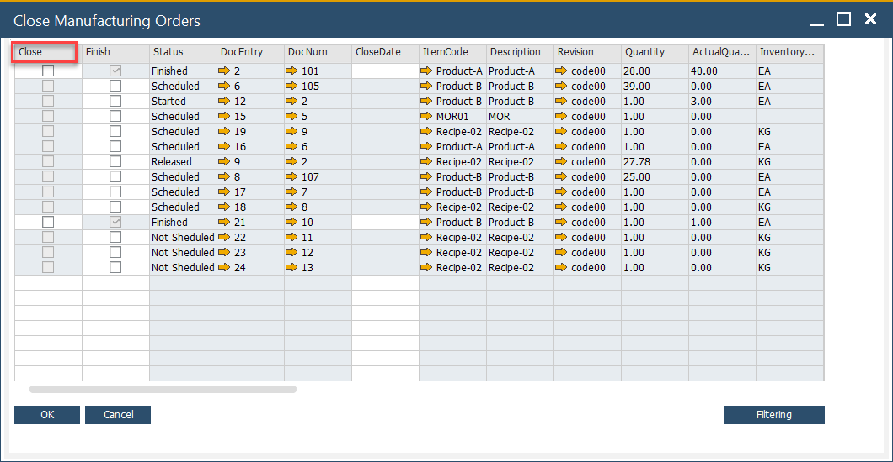
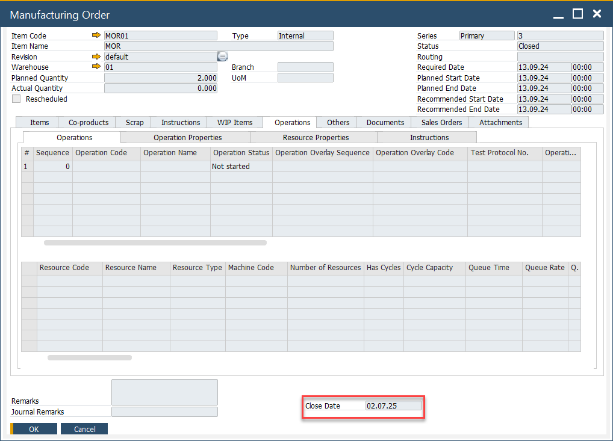

# Close Manufacturing Orders

The process of closing manufacturing orders is an essential step in managing production workflows within SAP Business One. It enables users to efficiently finalize and close multiple manufacturing orders in one go, streamlining the end-of-process tasks and ensuring accurate financial reporting. This function provides a convenient interface for managing and tracking the completion of manufacturing processes.

---

To close Manufacturing Orders, navigate to:

:::info Path
    Production → Manufacturing Order → Close Manufacturing Order
:::

From here, users can apply multiple selection criteria to filter and select the required manufacturing orders.

    

Once selected, you can check the Close column for each individual manufacturing order, or quickly select all orders by clicking the header of the Close column.

For organizations using a Standard Costing System or Moving Average (instead of dynamic costing), the system calculates and posts any Work in Progress (WIP) variance if the option is enabled under General Settings → ProcessForce Tab → Costing Tab → Post Variance on Manufacturing Order Closure.

    

Once a manufacturing order is marked as closed, the Close Date field is automatically populated with the current date. This helps track the exact closure time for each manufacturing order, ensuring accurate records for auditing and reporting purposes. Close Date is displayed on Manufacturing Order:

## Filtering option

The function also includes filtering options to help users narrow down the manufacturing orders that need to be closed. These filtering options align with the standard SAP Business One filtering criteria, enabling users to easily identify and manage relevant orders.

---
