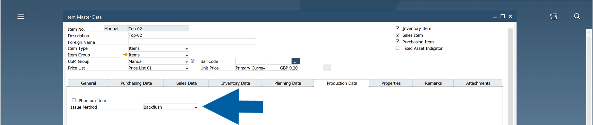
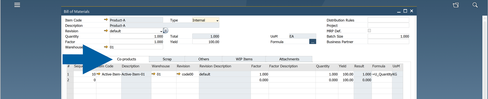
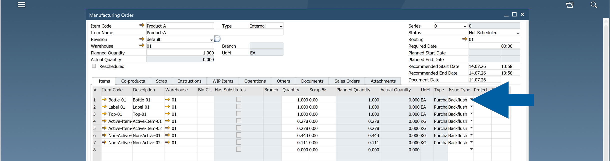
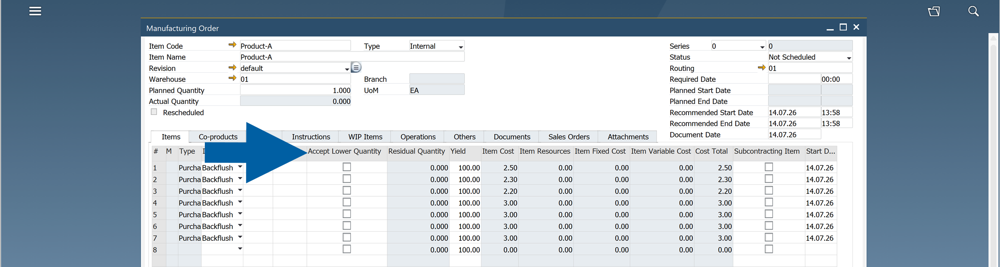

# Configure Backflushing

Backflushing automatically issues component materials from inventory during production. Instead of manually creating a **Goods Issue** for each component, **CompuTec ProcessForce** deducts the required quantities when a production receipt is created.

Use backflushing to simplify inventory transactions and reduce manual data entry during manufacturing.

## Before you start

:::caution[important]
Use **Backflush** only when it matches your production process.

Backflush automatically calculates and issues component quantities based on the **Bill of Materials**, the production quantity being received, and any previously issued or residual quantities. Because the issued quantity is calculated automatically, it is best suited for production processes where the actual material consumption closely matches the planned quantity.

Backflush is **not recommended** for production processes that require manual quantity adjustments or rounding—for example, when raw materials must always be issued in full boxes, bags, or packages. In these cases, use the **Manual** issue method instead.

For technical details about the backflush calculation algorithm and the underlying formula, see the [Developer Guide](https://learn.computec.one/docs/processforce/2.0/developer-guide/processforce-api/processforce-api-tt/general/#:~:text=Caution%20when%20Using%20Backflushing%3A).
:::

Before enabling backflushing, verify that:

- the **Bill of Materials** is complete and accurate,
- the correct issue type is configured,
- the production quantities are reported correctly.

## Best practices for using Backflush

Use **Backflush** when:

- Material consumption follows the Bill of Materials.
- The issued quantity should be calculated automatically.
- No manual selection of quantities or batches is required.

Use **Manual Issue** instead when:

- Materials must always be issued in fixed quantities (for example, full boxes, bags, or pallets).
- The issued quantity needs to be rounded up or down.
- Operators must manually decide which quantity or batch to issue.

> **Example**
>
> If a raw material is supplied only in full boxes and a box cannot be partially issued, configure the component with the **Manual** issue method instead of **Backflush**.

## Backflushing methods

CompuTec ProcessForce supports the following backflushing methods:

| Method | Description |
| --- | --- |
| **Coproduct** | Issues components based on the parent Receipt transaction. |
| **Byproduct and Scrap** | Issues components based on the parent Receipt transaction. |
| **Bill of Material / Item / Warehouse** | Backflushes components defined for a specific Bill of Materials, Item, and Warehouse combination. |
| **Manufacturing Order / Item / Warehouse** | Backflushes components defined for a specific Manufacturing Order, Item, and Warehouse combination. |
| **Batch Trace** | Issues batch-managed components using the FIFO (First In, First Out) method. |
| **Time** | Reserved for future support of Production Time and Labor backflushing. |

## Configure Backflushing

You can configure Backflushing at several levels.

### Item Master Data

The default backflushing method is defined in the **Item Master Data**.

To configure backflushing in **Item Master Data**, follow these steps:

1. In **SAP Business One**, go to: **Inventory** > **Item Master Data**.
2. Navigate to **Production Data** tab.
3. In **Issue Method** field, choose ``Backflush``.

    

4. Save your changes.

### Bill of Materials

When you create a **Bill of Materials**, the **Issue Type** is automatically copied from the **Item Master Data**.

You can change the default value for a specific:

- **Bill of Materials**
- **Item**
- **Warehouse**

The selected **Warehouse** determines where components are issued during backflushing.

### Manufacturing Order

The same configuration is available on the **Manufacturing Order** > **Items** tab, allowing you to override the default settings for a specific production order.

## Accept Lower Quantity

The **Accept Lower Quantity** option allows production to continue even when there is not enough inventory to fully backflush all required components.

When this option is enabled:

- If the available inventory is lower than the required quantity, **CompuTec ProcessForce** issues the available quantity.
- The remaining quantity is recorded in the **Residual Quantity** field.
- During the next backflush, the residual quantity is issued automatically when sufficient inventory becomes available.

This helps keep production moving while ensuring that missing material is issued later.

## Result

After you configure backflushing:

- Component materials are issued automatically during production.
- Manual **Goods Issue** transactions are reduced.
- Any missing quantities can be tracked using the **Residual Quantity** field when **Accept Lower Quantity** is enabled.