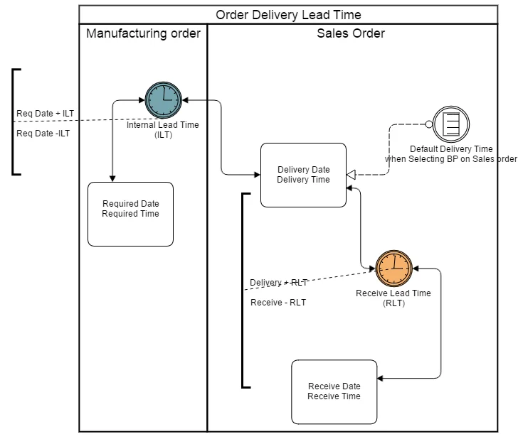
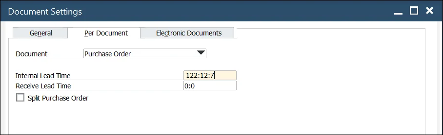
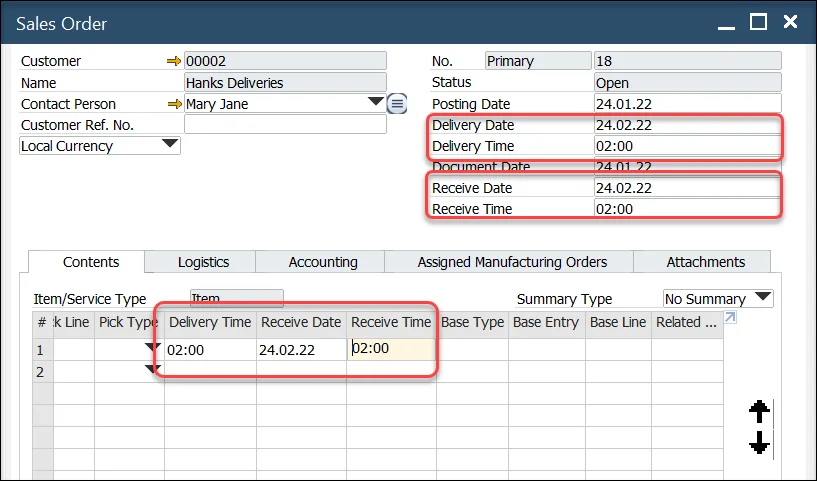
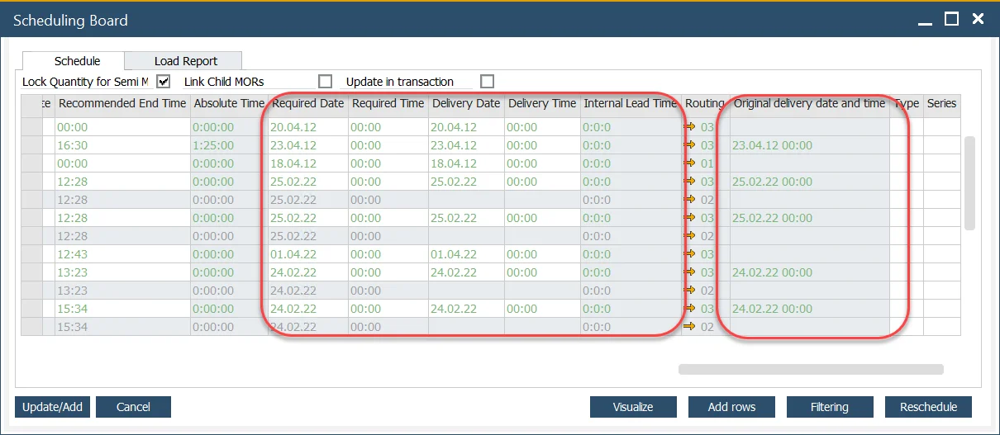

# Delivery, Receive and Required Date

In a dynamic manufacturing environment, accurate scheduling is crucial to ensuring timely product delivery. The Delivery, Receive, and Required Date framework allows businesses to calculate the exact production start date necessary to meet customer delivery commitments. By integrating lead times into Manufacturing Orders and Sales Orders, companies can enhance efficiency, reduce delays, and optimize resource planning.

---

## Business Logic

The relationship between Required Date, Delivery Date, Receive Date, and Lead Times follows a structured approach, as illustrated below:

    

The following data are being used for calculations:

- **Required Date, Time**: the deadline for completing the production of items in a specific Manufacturing Order.
- **Internal Lead Time\***: the duration required for post-production activities such as sorting, assembling, packing, and transferring goods to the shipping area. Formula: Required Date + Internal Lead Time = Delivery Date.
- **Delivery Date, Time**: the scheduled moment when the finished goods leave the company. Formula: Delivery Date + Receive Lead Time = Receive Date.
- **Receive Lead Time\***: the estimated transit time between shipment and receipt by the Business Partner.
- **Receive Date, Time**: the expected moment when the Business Partner receives the shipment.
- **Delivery Time Slot\***: the preferred delivery window specified by the Business Partner, e.g., 5 PM.

---

\* These values can be set up to calculate values of other dates.

## Configuration

### Internal Lead Time

Internal Lead Time can be defined in the following format: [1-3 digit number of days]:[1-2 digit number of hours]:[1-2 digit number of minutes].

<u>Example:</u>

Internal Lead Time can be defined in the following places:

1. Business Partners → Business Partner Master Data → Addresses tab

    If Business Partner has more than one address defined, different Internal Lead Times can be defined for each address.

2. Business Partners → Business Partner Master Data → General tab
3. Inventory → Item Details → Revisions tab
4. Inventory → Item Master Data → Planning Data tab
5. Inventory → Warehouses → General tab
6. Administration → System Initialization → Document Settings → Per Document (for Sales Order)

Internal Lead Time taken under consideration on specific documents (Manufacturing Orders and Sales Orders) is taken from the above hierarchy: if defined in 1. it is taken from there. If not, it is taken from 2. and so on.

### Receive Lead Time

Receive Lead Time can be defined in the following format: [1-3 digit number of days]:[1-2 digit number of hours].

1. Business Partners → Business Partner Master Data → Addresses tab
    If Business Partner has more than one address defined, different Delivery Times can be defined for each address.
2. Business Partners → Business Partner Master Data → General tab
3. Inventory → Warehouses → General tab
4. Administration → System Initialization → Document Settings → Per Document (for Sales Order)

Receive Lead Time taken under consideration on specific documents (Manufacturing Orders and Sales Orders) is taken from the above hierarchy: if defined in 1. it is taken from there. If not, it is taken from 2. and so on.

### Delivery Time Slot

Delivery Time is filled with a default value on Sales Order when selecting Business Partner on this type of document if it is defined in one of the following places:

1. Business Partners → Business Partner Master Data → Addresses tab
    If Business Partner has more than one address defined, a Different Delivery Time can be defined for each address.

2. Business Partners → Business Partner Master Data → General tab

Delivery Time taken under consideration on Sales Orders is taken from the above hierarchy: if defined in 1. it is taken from there. If not, it is taken from 2.

## Usage

### Sales Order

#### Header

- Delivery Time is predefined (check Configuration section).
- Delivery Date and Receive Date can be set up manually. When one value is set up, the other value is calculated based on it. Changing one of the values changes the other one.
- Receive Time is calculated using different values (check the Business Logic section).

#### Contents tab

- Delivery Time is predefined (check Configuration section).
- Receive Date and Time are taken from the document header. It can be changed: different Receive Date and Time can be set up for each document line.

### Manufacturing Order

:::info Path
    Production → Manufacturing Order → Manufacturing Orders
:::

The required Date and Time can be set up manually on the Manufacturing Order header.

### Scheduling Board

:::info Path
    Production → Manufacturing Order → Scheduling → Scheduling - Manufacturing Orders → Scheduling Board
:::

- Changing the Required Date or Time affects the Delivery Date and Time.
- Changing Delivery Date or Time affects Required Date and Time.
- Internal Lead Time is predefined (check Configuration section).

#### Original Delivery Date and Time

Data from a specific Manufacturing Order populate this field. When some data are changed on this form (changing Delivery Date or Time, or changing other data which results in changes in Delivery Date and Time), this value turns red and bold, informing users that the current Delivery Date and Time differ from previously planned on Manufacturing Order.

Click [here](../scheduling/scheduling-board.md) to find out more about Scheduling Board.

## Receive Date Calculation

Sales Order Receive Dates consider holidays set in SAP Business One → System Initialization → Company Details → Accounting Data tab, ensuring accurate scheduling.

---
By leveraging the Delivery, Receive, and Required Date framework, businesses can streamline production scheduling, improve on-time delivery, and enhance customer satisfaction. Proper configuration of lead times ensures efficient order management, minimizes delays, and optimizes supply chain processes. Integrating these calculations into SAP Business One simplifies inventory planning and ensures seamless coordination between production and logistics teams.
