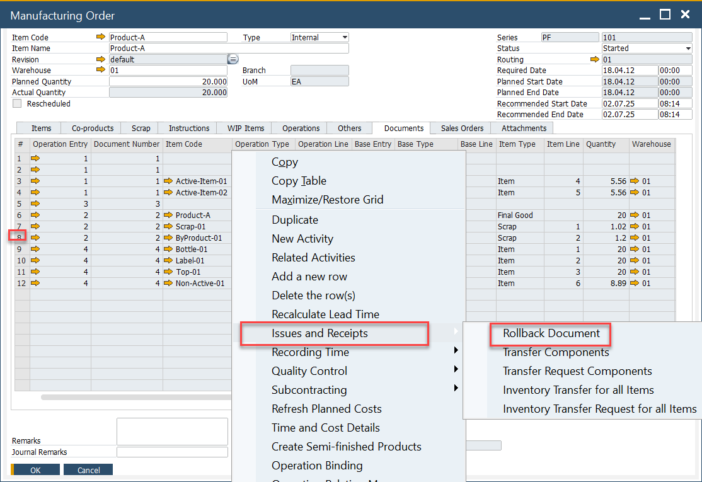
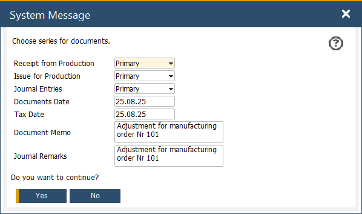
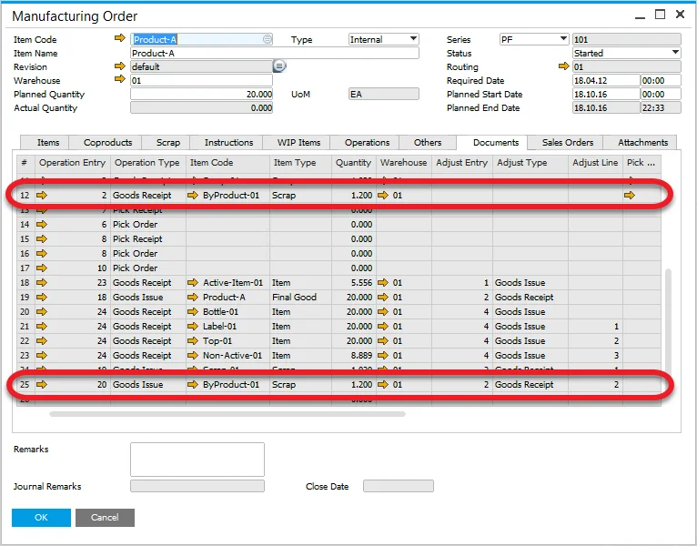

# Documents Rollback

In manufacturing operations, errors in Goods Issue or Goods Receipt documents can impact inventory accuracy and financial records. The Rollback Document feature in SAP Business One allows users to quickly correct such mistakes by reversing the transactions, ensuring data integrity and smooth production processes.

---
You can use the Rollback Document option to correct Goods Issue or Goods Receipt documents. To perform a rollback, follow these steps:

1. Open the relevant Manufacturing Order.
2. Right-click on the document line that needs correction.
3. Select Rollback Document from the context menu.

    

Rollback Details form will appear, where you can adjust the document series, dates, and add remarks before finalizing the rollback.

    

**What Happens During a Rollback?**

- **Goods Issue → Goods Receipt**: Rolling back a Goods Issue will automatically generate a corresponding Goods Receipt.
- **Goods Receipt → Goods Issue**: Rolling back a Goods Receipt will create a related Goods Issue.

    

If the original Goods Receipt was created using backflush, all associated documents will also be corrected accordingly.

---
The Rollback Document function in SAP Business One helps manufacturing businesses maintain accurate inventory and financial records by allowing seamless correction of document errors. This feature reduces manual effort, improves data accuracy, and ensures smooth operational workflows.
