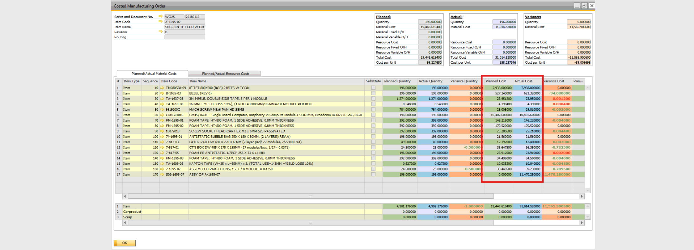

# Costed Manufacturing Order Report

The Costed Manufacturing Order report allows you to review and compare Planned and Actual quantities and costs for materials and resources used in production.

It provides full transparency into:

- What the production was expected to cost
- What it actually cost
- The variance between planned and actual values

This report is useful for production cost control, variance analysis, and financial reconciliation.



## Planned Costs

**Planned Costs** are retrieved at the time the **Manufacturing Order** is created.

They are sourced:

- From **Item Costing**
- From **Resource Costing**
- Using **Standard Cost category 000**

At creation time, the system copies these costs into **Item** and **Resource** lines.

This ensures that the **Manufacturing Order** stores a snapshot of the expected cost at the time of planning.

### Refresh Planned Costs

If standard costs change after the order is created, you can update the planned values.

To refresh planned costs:

1. Right-click inside the **Manufacturing Order**.
2. Select **Refresh Planned Costs**.

This updates the planned values based on the current standard cost.

## Actual Costs

**Actual Costs** reflect what truly happened during production. The system collects them from different sources depending on item type.

### Inventory Items

For inventory-managed items, actual costs are taken from:

- **Goods Issue** documents
- **Goods Receipt** documents

The cost is derived directly from the inventory transactions posted to the **Manufacturing Order**.

### Non-Inventory Items

For non-inventory items, the actual costs are recorded directly in **Journal Entry** lines linked to the order.

### Resources

For resources (labor, machine time, etc.), actual costs come from:

- **Time Booking** documents
- The most recent **Time Correction** document (if applicable)

These postings determine the final actual resource cost of the order.

## Technical details

Report uses SQL functions to collect details for planned and actual costs.

### Material Cost Function

This function collects planned and actual cost data for materials.

```bash
CT_PF_MaterialCostFunctionForCostedMor
```

Example for Manufacturing Order with ``DocEntry = 123``:

```bash
SELECT * FROM "CT_PF_MaterialCostFunctionForCostedMor"(123);
```

If you want to retrieve data for all Manufacturing Orders:

```bash
SELECT * FROM "CT_PF_MaterialCostFunctionForCostedMor"(-1);
```

### Resource Cost Function

This function collects planned and actual cost data for resources.

```bash
CT_PF_ResourceCostFunctionForCostedMor
```

Example for Manufacturing Order with ``DocEntry = 123``:

```bash
SELECT * FROM "CT_PF_ResourceCostFunctionForCostedMor"(123);
```

Example for all oders:

```bash
SELECT * FROM "CT_PF_ResourceCostFunctionForCostedMor"(-1);
```

### Manufacturing Order Transactions View

All actual transaction costs related to **Manufacturing Orders** can also be reviewed in the database view:

```bash
CT_PF_MOR_Transactions
```

This view contains the detailed transactional postings that build up the actual cost values. It can be useful for reconciliation, toubleshooting cost discrepancies, audit purposes, or advanced reporting.
