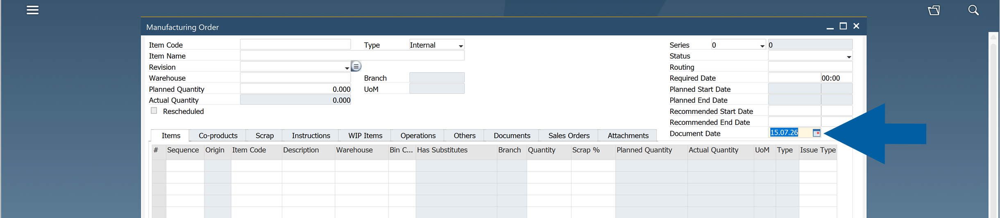

# Document Date

The **Document Date** defines the posting date of a **CompuTec ProcessForce** document. It is used to determine the appropriate posting period and the document series available in **SAP Business One**.

Using the **Document Date** ensures that documents follow the same posting-period rules as standard **SAP Business One**.

## Supported documents

The following **CompuTec ProcessForce** documents use this behavior:

| Document | Date used |
| --- | --- |
| Manufacturing Order | Document Date |
| Pick Order | Document Date |
| Pick Receipt | Document Date |
| Quality Control Test | Create Date |
| Time Booking | Document Date |
| Time Correction | Document Date |

### Manufacturing Orders

**Manufacturing Orders** include a **Document Date** field in the document header.

The selected **Document Date** determines which document series are available.

> **Example**: If the **Document Date** belongs to the ``2024`` posting period, the system displays the document series assigned to ``2024``, even if you create the document in a later calendar year.
